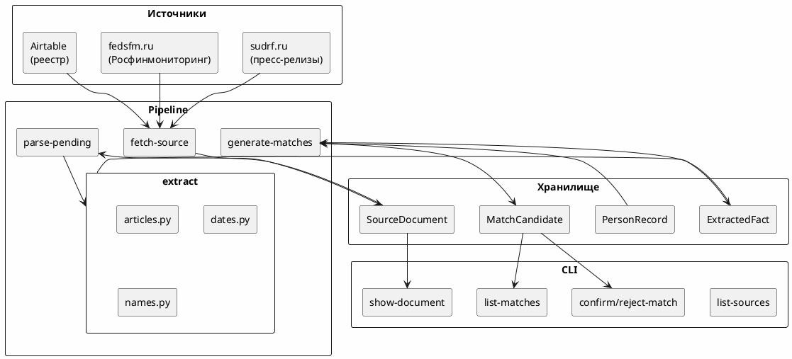

# court-monitor

Полуавтоматическая OSINT-система мониторинга уголовных дел по открытым источникам:
пресс-релизы судов на платформе `sudrf.ru`, перечень Росфинмониторинга, синхронизация
с Airtable. Все неоднозначные решения принимает оператор через очередь ручной проверки.

> Статус: MVP-каркас + вертикальный срез (Etap 0–3). Источники работают на
> сохранённых fixtures; live-доступ и запись в Airtable отключены до подтверждения.

## Принципы

- **Факт vs предположение.** Каждое значение поля — `ExtractedFact` со статусом
  (`confirmed` / `inferred` / `unverified` / `conflicting` / `rejected`), цитатой,
  источником и confidence.
- **Источник каждого факта** сохраняется (URL, дата, фрагмент, хеш).
- **Ничего опасного автоматически.** Создание/объединение/публикация — только
  через ручное подтверждение в очереди.
- **Fixtures-first.** Парсеры тестируются на сохранённых HTML, без live-сети.
- **Explainable matching.** Сопоставление людей с реестрами — детерминированное,
  объяснимое, с ручным подтверждением.

## Архитектура



## Быстрый старт

```bash
# 1. Зависимости (uv сам поставит Python при необходимости)
make install

# 2. Схема БД (SQLite по умолчанию, см. .env.example для PostgreSQL)
make init-db            # = court-monitor init-db (alembic upgrade head)

# 3. Проверка окружения
make doctor

# 4. Вертикальный срез: загрузить fixture пресс-релиз и распарсить
uv run court-monitor fetch-source 2zovs
uv run court-monitor parse-pending
uv run court-monitor show-stats
uv run court-monitor show-document 1

# 5. Импорт Росфинмониторинга
uv run court-monitor fetch-source fedsfm --file data.xml
uv run court-monitor list-person-records

# 6. Сопоставление людей
uv run court-monitor generate-matches
uv run court-monitor list-matches
uv run court-monitor show-match 1

# 7. Тесты и проверки
make lint typecheck test
```

## Источники

### sudrf.ru — пресс-релизы судов

Адаптер читает HTML-страницы пресс-релизов (fixtures или HTTP). Парсер
`sudrf_press.py` извлекает заголовок, дату, текст. Extraction-модули
извлекают статьи УК, даты, ФИО.

### fedsfm.ru — перечень Росфинмониторинга

Поддержка форматов: XML, DBF, ZIP, CSV (внутренний fixture). Оператор
скачивает файл вручную и импортирует через `--file`. Формат описан в
`docs/fedsfm-format-discovery.md`.

### Airtable — реестр источников

Публичное shared-view представление читается из fixture (JSON/CSV).
Live-доступ через API требует PAT.

## Извлечение фактов (Etap 3)

| Модуль | Что извлекает | Пример |
|---|---|---|
| `articles.py` | Статья, часть, пункт, кодекс | `п. «а» ч. 2 ст. 205 УК РФ` |
| `dates.py` | Дата + тип из контекста | `2026-04-02 (verdict_date)` |
| `names.py` | ФИО-кандидаты с confidence | `Иванов Иван Иванович (0.95)` |

Каждый факт хранится с цитатой, confidence и методом извлечения.

## Сопоставление людей (Explainable Matching)

Система сопоставляет факты `full_name_original` из судебных документов с
записями `PersonRecord` (Росфинмониторинг). **Никогда не подтверждает
автоматически** — только создаёт кандидатов для оператора.

### Формула score

| Правило | Вес |
|---|---|
| Полное совпадение ФИО | +0.70 |
| Совпадение фамилии и имени | +0.50 |
| Совпадение фамилии и инициалов | +0.35 |
| Совпадение даты рождения | +0.20 |
| Совпадение места рождения | +0.10 |
| Конфликт даты рождения | -0.50 |
| Конфликт имени | -0.40 |

Порог создания кандидата: `score ≥ 0.45`. Подробнее: `docs/person-matching.md`.

### CLI matching

```bash
uv run court-monitor generate-matches          # генерация кандидатов
uv run court-monitor list-matches              # список
uv run court-monitor list-matches --status pending  # фильтр
uv run court-monitor show-match <id>           # детали с объяснением
uv run court-monitor confirm-match <id> --comment "..."
uv run court-monitor reject-match <id> --comment "..."
```

## CLI

```bash
# Схема и миграции
court-monitor init-db
court-monitor migrate
court-monitor doctor

# Источники
court-monitor list-sources                           # список из Airtable fixture
court-monitor fetch-source <name>                    # загрузить и распарсить
court-monitor fetch-source <name> --no-parse         # только загрузить (pending)
court-monitor fetch-source fedsfm --file <path>      # импорт РФМ из файла
court-monitor fetch-source fedsfm --file <path> --dry-run  # предпросмотр
court-monitor fetch-all                              # все включённые источники

# Документы
court-monitor parse-pending                          # распарсить pending
court-monitor reprocess-document <id>                # перепарсить один
court-monitor list-documents                         # список документов
court-monitor show-document <id>                     # детали + факты
court-monitor show-stats                             # сводка по БД

# Росфинмониторинг
court-monitor list-person-records                    # список записей РФМ
court-monitor show-person-record <id>                # детали записи

# Сопоставление
court-monitor generate-matches                       # генерация кандидатов
court-monitor list-matches [--status pending]        # список
court-monitor show-match <id>                        # детали с объяснением
court-monitor confirm-match <id> --comment "..."     # подтвердить
court-monitor reject-match <id> --comment "..."      # отклонить

# Демо
court-monitor list-sources                           # список источников
court-monitor fetch-demo-source                      # скачать + извлечь текст
```

## Docker Compose

```bash
cp .env.example .env              # при необходимости отредактировать
make docker-up                    # postgres + app (FastAPI на :8000)
# или
docker compose up --build
```

После старта: `GET http://localhost:8000/health`, `GET /docs`.

## Переменные окружения

См. `.env.example`. Секреты (Airtable token, LLM key) **никогда** не коммитятся.
Префикс `CM_`. Минимум для старта: `CM_DATABASE_URL`.

## Добавление нового суда

1. Добавьте запись в `config/sources.yaml` (`type: sudrf`, `backend`, `paths`,
   `fixture_path` или live URL).
2. При нестандартной вёрстке — переопределите селекторы/парсер (см.
   `docs/source-adapters.md`, готовится).
3. Положите образец HTML в `tests/fixtures/html/` и добавьте regression-тест.

## Добавление статьи / ключевого слова

Отредактируйте `config/monitoring.yaml`. Перезапуск не требует изменения кода.

## Безопасная эксплуатация

- `CM_AIRTABLE_MODE=read_only` до валидации маппинга (`docs/airtable-discovery.md`).
- LLM отключена (`CM_LLM_MODE=disabled`); regex-экстракция детерминирована.
- Логи — структурированный JSON; персональные данные без нужды не логируются.
- CAPTCHA/блокировки не обходятся — создаётся `ReviewItem` оператору.
- SSL не отключается — оператор скачивает файлы вручную при необходимости.
- Совпадения с реестрами никогда не подтверждаются автоматически.

## Тесты

```bash
make test               # все (131 тест)
make test-unit          # только unit
make test-integration   # только integration
```

## Документация

- `docs/discovery.md` — исследование источников и ограничения.
- `docs/airtable-discovery.md` — исследование Airtable.
- `docs/fedsfm-format-discovery.md` — формат перечня Росфинмониторинга.
- `docs/person-matching.md` — формула сопоставления, веса, ограничения.
- `docs/technical-debt.md` — известный технический долг.
- `CHANGELOG.md` — история изменений.
