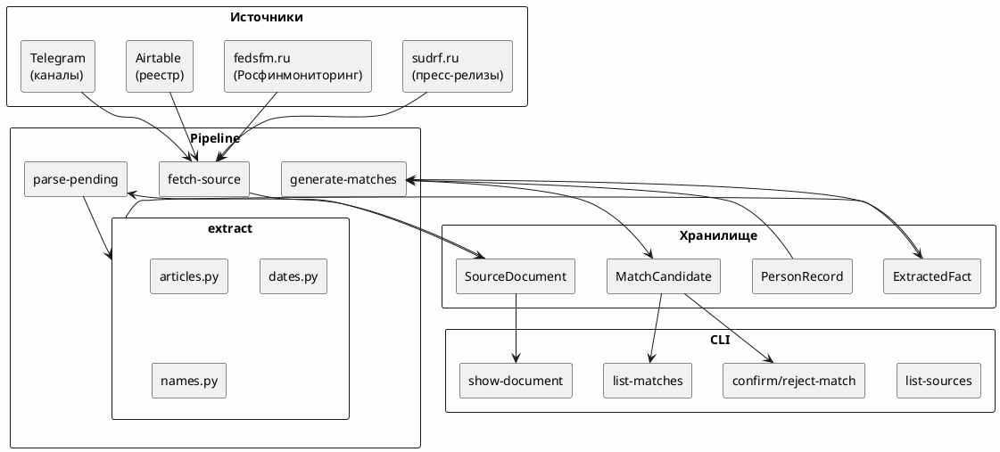

# Архитектура

## Обзор

Полуавтоматическая OSINT-система мониторинга уголовных дел. Все неоднозначные решения принимает оператор через очередь ручной проверки.

## Принципы

- **Факт vs предположение.** Каждое значение поля — `ExtractedFact` со статусом (`confirmed` / `inferred` / `unverified` / `conflicting` / `rejected`), цитатой, источником и confidence.
- **Источник каждого факта** сохраняется (URL, дата, фрагмент, хеш).
- **Ничего опасного автоматически.** Создание/объединение/публикация — только через ручное подтверждение.
- **Fixtures-first.** Парсеры тестируются на сохранённых HTML, без live-сети.
- **Explainable matching.** Сопоставление людей с реестрами — детерминированное, объяснимое, с ручным подтверждением.

## Слой структуры

```
src/court_monitor/
├── config/         # loader.py (YAML), settings.py (pydantic-settings), registry.py
├── domain/         # models.py (enum'ы), facts.py (ExtractedFactDTO)
├── storage/        # orm.py (SQLAlchemy 2), repository.py, db.py, migrations.py
├── sources/        # base.py (ABC), sudrf.py, fedsfm.py, fedsfm_live.py,
│                   # airtable_registry.py, telegram_channel.py, probe.py,
│                   # http_client.py
├── parsers/        # sudrf_press.py, telegram_post.py
├── extraction/     # articles.py, dates.py, names.py, ner_names.py,
│                   # filtering.py, _utils.py
├── matching/       # candidates.py, score.py, name_normalizer.py
├── normalization/  # __init__.py (normalize_fio — ё→е, register)
├── services/       # __init__.py (pipeline orchestration)
├── cli/            # app.py (Typer)
├── api/            # app.py (FastAPI, read-only JSON)
├── web/            # app.py (операторский UI), jobs.py (фоновые задачи),
│                   # deps.py, templates/, static/
└── observability/  # __init__.py (structlog, correlation_id)
```

## Потоки данных



## Pipeline (services/__init__.py)

1. **Fetch** — адаптер (sudrf, fedsfm, telegram) загружает данные, возвращает `FetchResult`.
2. **Ingest** — `ingest_fetch_result()` дедуплицирует по `(external_id → canonical_url → url+content_hash)`.
3. **Parse** — `parse_press_release()` (selectolax) извлекает заголовок, дату, текст.
4. **Extract** — `extract_articles()`, `extract_dates()`, `extract_name_candidates()` работают на тексте. При `CM_NER_MODE=spacy` дополнительно вызывается `extract_name_candidates_ner()`, а его результат проходит через `_dedupe_against()` — иначе одно имя даёт два факта.
5. **Filter** — `evaluate_relevance()` проверяет статьи/ключевые слова из `monitoring.yaml`.
6. **Store** — `add_facts_from_dtos()` записывает факты в БД.
7. **Match** — `generate_matches()` ищет кандидатов через surname-based pre-filtering + scoring.

## Хранилище (ORM)

| Модель | Таблица | Описание |
|---|---|---|
| `SourceDocument` | `source_documents` | Загруженная страница/файл с провенансом и хешем |
| `ExtractedFact` | `extracted_facts` | Каждое извлечённое значение с confidence/quote |
| `PersonRecord` | `person_records` | Записи из внешних реестров (Росфинмониторинг) |
| `MatchCandidate` | `person_match_candidates` | Кандидаты сопоставления (pending → confirmed/rejected) |
| `Job` | `jobs` | Фоновая операция, запущенная из веба (статус, результат, ошибка) |

## Типы источников

| Тип | Backend | Описание |
|---|---|---|
| `sudrf` | fixture / http | Пресс-релизы судов на sudrf.ru |
| `rfm` | file import | Росфинмониторинг (XML/DBF/ZIP/CSV), `fetch-source fedsfm --file` |
| `rfm` | live http | Перечень с HTML-страницы fedsfm.ru, `fetch-source fedsfm --live` |
| `airtable` | fixture / http | Реестр источников из Airtable |
| `telegram` | fixture / http | Telegram-каналы (парсинг постов) |

## Целостность БД

`ondelete="CASCADE"` объявлен на внешних ключах, а связи помечены `passive_deletes=True` — то есть ORM намеренно перекладывает удаление детей на БД. SQLite по умолчанию `PRAGMA foreign_keys=OFF`, поэтому `make_engine()` включает прагму на каждое соединение; без неё не удалял никто и `MatchCandidate` переживал удаление своего факта.

## Миграции

Alembic, 9 миграций: initial → registry_provenance → person_records → person_names → match_candidates → review_items → audit_log → person_records_rfm_v2 → jobs.

`doctor` сравнивает применённую ревизию с head (`storage/migrations.py::revision_status`) и считает отставание проблемой: отставшая БД отвечает на `SELECT 1` и сохраняет все старые таблицы, поэтому обнаруживается только позже как `no such column` посреди прогона.

## Конфигурация

- `config/sources.yaml` — адаптеры sudrf-источников
- `config/monitoring.yaml` — статьи УК и ключевые слова для фильтрации
- `config/source_registry.yaml` — реестр Telegram-каналов (импорт из Airtable)
- `config/ca/fedsfm_ru_chain.pem` — цепочка доверия для fedsfm.ru; провенанс, отпечатки, ротация и остаточный риск описаны в `config/ca/README.md`
- `.env` / env vars — `CM_DATABASE_URL`, `CM_LOG_LEVEL`, `CM_CONFIG_DIR`, `CM_AIRTABLE_MODE`, `CM_LLM_MODE`, `CM_NER_MODE`

## Операторский веб-интерфейс (web/)

Server-rendered Jinja2 без сборки и без JS: `confirm`/`reject` — обычная форма с POST, поэтому всё тестируется через `TestClient`. Отделён от `api/`, который остаётся read-only JSON.

Страницы: обзор, документы и их факты, очередь совпадений с разбором score, очередь проверки, реестр с поиском, журнал аудита, операции.

Поиск по реестру идёт по `search_name` — нормализованной форме, — поэтому регистр, «ё» и лишние пробелы в запросе не мешают.

**Безопасность.** Аутентификации нет (D-007), поэтому по умолчанию слушает loopback, а `run-web --host` с внешним адресом печатает предупреждение. Все изменяющие маршруты зависят от `require_operator` + `verify_csrf`. Имя оператора уже пишется в `AuditLog` — когда появится настоящая авторизация, меняется только `require_operator`, эндпоинты трогать не нужно.

**Фоновые задачи (`web/jobs.py`).** Сбор источников идёт минутами и в HTTP-запрос не укладывается, поэтому работа уходит в `ThreadPoolExecutor(max_workers=1)`, а состояние живёт в таблице `jobs`. Один воркер — осознанно: SQLite сериализует запись и иначе выдаёт `database is locked`, а два одновременных `run_all` дважды дёргали бы одни и те же источники. Задача получает собственную сессию: request-scoped закрылась бы вместе с ответом. Повторный запуск операции того же вида отклоняется с 409. Ничто не переживает рестарт, поэтому `recover_stale_jobs` при старте помечает зависшие в `running` как прерванные — иначе UI обещал бы работу, которая никогда не завершится. Это закрывает D-008 для ad-hoc запуска; расписания по-прежнему нет.
