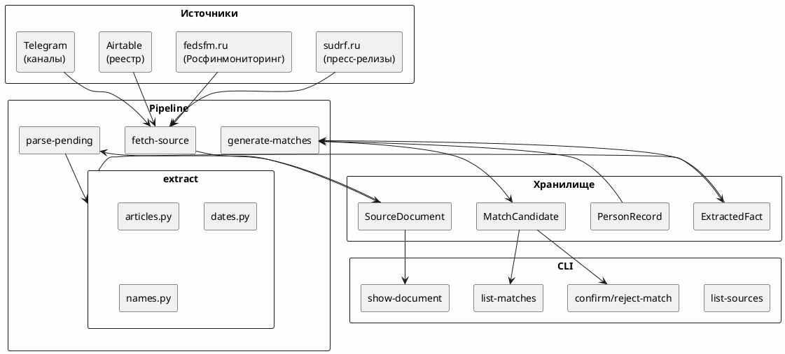

# Архитектура

## Обзор

Полуавтоматическая OSINT-система мониторинга уголовных дел. Все неоднозначные решения принимает оператор через очередь ручной проверки.

## Принципы

- **Факт vs предположение.** Каждое значение поля — `ExtractedFact` со статусом (`confirmed` / `inferred` / `unverified` / `conflicting` / `rejected`), цитатой, источником и confidence.
- **Источник каждого факта** сохраняется (URL, дата, фрагмент, хеш).
- **Ничего опасного автоматически.** Создание/объединение/публикация — только через ручное подтверждение.
- **Fixtures-first.** Парсеры тестируются на сохранённых HTML, без live-сети.
- **Explainable matching.** Сопоставление людей с реестрами — детерминированное, объяснимое, с ручным подтверждением.

## Слой структуры

```
src/court_monitor/
├── config/         # loader.py (YAML), settings.py (pydantic-settings), registry.py
├── domain/         # models.py (enum'ы), facts.py (ExtractedFactDTO)
├── storage/        # orm.py (SQLAlchemy 2), repository.py, db.py, migrations.py
├── sources/        # base.py (ABC), sudrf.py, fedsfm.py, airtable_registry.py,
│                   # telegram_channel.py, probe.py, http_client.py
├── parsers/        # sudrf_press.py, telegram_post.py
├── extraction/     # articles.py, dates.py, names.py, filtering.py, _utils.py
├── matching/       # candidates.py, score.py, name_normalizer.py
├── normalization/  # __init__.py (normalize_fio — ё→е, register)
├── services/       # __init__.py (pipeline orchestration)
├── cli/            # app.py (Typer)
├── api/            # app.py (FastAPI, read-only)
└── observability/  # __init__.py (structlog, correlation_id)
```

## Потоки данных



## Pipeline (services/__init__.py)

1. **Fetch** — адаптер (sudrf, fedsfm, telegram) загружает данные, возвращает `FetchResult`.
2. **Ingest** — `ingest_fetch_result()` дедуплицирует по `(external_id → canonical_url → url+content_hash)`.
3. **Parse** — `parse_press_release()` (selectolax) извлекает заголовок, дату, текст.
4. **Extract** — `extract_articles()`, `extract_dates()`, `extract_name_candidates()` работают на тексте.
5. **Filter** — `evaluate_relevance()` проверяет статьи/ключевые слова из `monitoring.yaml`.
6. **Store** — `add_facts_from_dtos()` записывает факты в БД.
7. **Match** — `generate_matches()` ищет кандидатов через surname-based pre-filtering + scoring.

## Хранилище (ORM)

| Модель | Таблица | Описание |
|---|---|---|
| `SourceDocument` | `source_documents` | Загруженная страница/файл с провенансом и хешем |
| `ExtractedFact` | `extracted_facts` | Каждое извлечённое значение с confidence/quote |
| `PersonRecord` | `person_records` | Записи из внешних реестров (Росфинмониторинг) |
| `MatchCandidate` | `person_match_candidates` | Кандидаты сопоставления (pending → confirmed/rejected) |

## Типы источников

| Тип | Backend | Описание |
|---|---|---|
| `sudrf` | fixture / http | Пресс-релизы судов на sudrf.ru |
| `rfm` | file import | Росфинмониторинг (XML/DBF/ZIP/CSV) |
| `airtable` | fixture / http | Реестр источников из Airtable |
| `telegram` | fixture / http | Telegram-каналы (парсинг постов) |

## Миграции

Alembic, 5 миграций: initial → registry_provenance → person_records → person_names → match_candidates.

## Конфигурация

- `config/sources.yaml` — адаптеры sudrf-источников
- `config/monitoring.yaml` — статьи УК и ключевые слова для фильтрации
- `config/source_registry.yaml` — реестр Telegram-каналов (импорт из Airtable)
- `.env` / env vars — `CM_DATABASE_URL`, `CM_LOG_LEVEL`, `CM_CONFIG_DIR`, `CM_AIRTABLE_MODE`, `CM_LLM_MODE`
