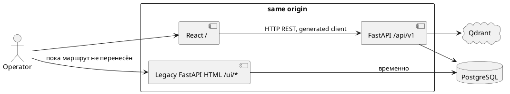

# План постепенной миграции operator UI на React

## Зачем это нужно

Нынешняя операторская консоль — это не отдельный frontend, а набор FastAPI-обработчиков,
которые одновременно читают БД, вызывают доменные сервисы и собирают HTML-строки. В
`src/web/ui/` 36 Python-модулей и 10 154 строки; общий каркас, меню, показатели и
подключение JavaScript находятся в `src/web/ui/layout.py`. Цель миграции — сделать
отдельное React-приложение в `frontend/`, сохранив Python единственным владельцем
данных, доменных решений и запусков pipeline.

Работы ниже — план, не реализация. Факты помечены ссылкой на прочитанный файл;
пункты, которые нельзя подтвердить кодом, явно названы предположением.

## Краткая картина и границы

`src/web/app.py` монтирует `/static` и последовательно подключает как JSON-роутеры из
`src/web/routers/`, так и HTML-роутеры из `src/web/ui/`. Большинство страниц возвращает
`HTMLResponse`; HTML строится f-строками, Jinja или другого шаблонизатора в
`pyproject.toml` нет. Общий CSS и JavaScript: `src/static/local-ui.css`,
`local-ui.js`, `table-sort*.js`; граф использует vendored `vis-network` и
`investigation-graph*.js` (`src/static/`).

`src/operator_console.py` **не UI**: это backend-сервис реестра операций. Он хранит
`operator_operation_runs` в PostgreSQL, запускает разрешённые CLI-команды в фоновом
потоке, пишет heartbeat и хвост stdout/stderr, не даёт двум операциям идти одновременно
и умеет их останавливать. Его нужно оставить backend-слоем; React только вызывает
явные API операций.



PostgreSQL уже слушает только `127.0.0.1:5433`, FastAPI — только
`127.0.0.1:8001` в `compose.yaml`; React не должен получать ни один из этих адресов.
Прямой доступ к Qdrant из UI в репозитории не найден. Более существенное расхождение:
Qdrant сейчас не является runtime-зависимостью этого checkout: в `compose.yaml` его
сервиса нет, а ADR 0011 и `docs/wiki/Implementation-Status.md` фиксируют, что vector
search удалён 27.09.2026; актуальный поиск Ask использует PostgreSQL `tsvector`
(`src/entities/ask.py`). Стрелка к Qdrant на диаграмме — заданная целевая схема, не
описание текущего deployment. Если Qdrant вернётся в отдельной задаче, доступ к нему
должен остаться только у backend; frontend-план от этого не меняется.

## Найденные страницы и требуемые контракты

Во всех строках «прямой SQL» означает, что обработчик страницы сам принимает `Session`
и делает ORM/SQL-запросы, а не только вызывает сервис. `Новый API` — ресурсный контракт,
который должен реализовать FastAPI; React не должен повторять соответствующую логику.

| Current page | Current implementation | Backend dependency | Required API | React replacement | Complexity |
|---|---|---|---|---|---|
| `/`, `/ui`, `/ui/candidates` | redirect; кандидаты, фильтры и XLSX из `web.candidate_rows` | чтение кандидатов | `GET /api/v1/candidates`, `GET /api/v1/candidates/export.xlsx` | `CandidatesPage` | низкая |
| `/ui/cycle` | сводка `workload`, состояние pipeline, карточка живого запуска | `workload`, `pipeline`, `OperationRegistry` | `GET /api/v1/work-cycle`, `GET /api/v1/operations/runs` | `WorkCyclePage` | средняя |
| `/ui/overview` | счётчики и ссылки | прямой SQL, `entities.unnamed.candidates` | `GET /api/v1/overview` | `OverviewPage` | низкая |
| `/ui/entities` | фильтры людей, статьи, роли, РФМ, вердикты | SQL, `correct_name`, `mark_official` | `GET /api/v1/entities`, `PATCH /api/v1/entities/{key}` | `EntitiesPage` | высокая |
| `GET /ui/entities/{key}` | legacy redirect 307 в досье | `ui_entity_moved` из `dossier.py` | API не нужен; сохранить redirect alias | нет: URL ведёт в `InvestigationPage` | низкая |
| `POST /ui/entities/collect` | запускает сборку сущностей | `OperationRegistry.start(mode="entities")` | `POST /api/v1/operations/runs` | кнопка `EntitiesPage`/`RunsPage` | средняя |
| `/ui/investigations` | поиск групп сущностей | SQL в `dossier.py` | `GET /api/v1/investigations?q=` | `InvestigationsPage` | средняя |
| `/ui/investigations/{key}` | досье, доказательства, решения, граф | `dossier.load`, CTE доказательств | `GET /api/v1/investigations/{key}`, graph API | `InvestigationPage` | высокая |
| `/ui/publications` | список/поиск публикаций и связанные сущности | `person_evidence_cte`, SQL | `GET /api/v1/articles?q=&source=&page=` | `PublicationsPage` | средняя |
| `/ui/articles/{id}`, `/ui/persons/{id}` | текст/подсветка; legacy-карточка Person | `get_article`, `get_person_detail` | `GET /api/v1/articles/{id}`, `GET /api/v1/persons/{id}/detail` | `ArticlePage`, `PersonPage` | низкая |
| `/ui/pairs`, `/ui/disputes` | пары, объяснение, решение same/different | `entities.disputes`, SQL | `GET /api/v1/entity-pairs`, `POST /api/v1/entity-pairs/{id}/decision` | `PairsPage` | высокая |
| `POST /ui/pairs/reset-decisions` | удалить все решения пар | `entities.disputes.reset_decisions`, одна транзакция | `DELETE /api/v1/entity-pair-decisions` с `confirm=true` | диалог в `PairsPage` | высокая |
| `POST /ui/queue/reset-decisions` | legacy alias того же массового сброса | тот же `reset_decisions` | тот же `DELETE /api/v1/entity-pair-decisions` | alias не получает отдельной страницы | низкая |
| `/ui/roles`, `/ui/politics-review` | неясные роль и политичность | `decide_role`, `decide_politics` | `GET/POST /api/v1/role-reviews`, `GET/POST /api/v1/politics-reviews` | `RoleReviewPage`, `PoliticsReviewPage` | средняя |
| `/ui/unnamed`, `/ui/base-unnamed` | безымянные, кандидаты и решения | `entities.unnamed`, `base_unnamed`, SQL | `GET/POST /api/v1/unnamed-figurants`, `/base-unnamed-cases` | `UnnamedPage`, `BaseUnnamedPage` | высокая |
| `/ui/junk-holds` | отложенные публикации, группировка дублей | `monitoring.junk_holds`, `hold_reader`, SQL | `GET /api/v1/junk-holds` | `JunkHoldsPage` | высокая |
| `POST /ui/junk-holds/junk-all` | отмечает мусором все статьи одной истории, либо ни одной | `mark_junk` в одной транзакции, rollback при устаревшей статье | `POST /api/v1/junk-holds/bulk-junk` с массивом id и version/confirm | AlertDialog с числом статей | высокая |
| `POST /ui/junk-holds/unrelease` | помечает ошибочно released статью мусором и удаляет её извлечённые события | `unrelease`; SQL `DELETE extracted_events` | `POST /api/v1/junk-holds/{article_id}/unrelease` | подтверждённая destructive-кнопка | высокая |
| остальные POST `/ui/junk-holds/{junk,release,hold,reextract}` | единичные решения | `mark_junk`, `release`, `hold_again`, `reextract` | action endpoints ресурса hold | действия `JunkHoldsPage` | средняя |
| `/ui/sentences` | приговоры, фильтры, скрыть/показать | `entities.sentence_cases`, reading record | `GET /api/v1/sentences`, `PATCH /api/v1/sentences/{id}/reading` | `SentencesPage` | средняя |
| `/ui/political` | результаты, фильтры, done-mark, XLSX | `political_rows`, done marks, CTE | `GET /api/v1/political-cases`, `PATCH /api/v1/political-cases/{key}/done`, export | `PoliticalPage` | высокая |
| `/ui/rfm` | список РФМ, даты, XLSX | snapshot lookup, `rf_entry`, SQL | `GET /api/v1/rosfinmonitoring/list`, export | `RosfinmonitoringPage` | средняя |
| `/ui/airtable`, `/ui/airtable/officials`, `/ui/officials` | inventory, sync, РФМ; список/CSV/правки должностных лиц | Airtable services, registry, ORM | `/api/v1/admin/airtable/*`, `GET/POST/PATCH /api/v1/officials` | `AirtablePage`, `OfficialsPage` | средняя |
| `/ui/runs`, `/ui/management` | старт стадий, карточки, история, funnel | `OperationRegistry`, `pipeline`, monitoring repository | `GET/POST /api/v1/operations/runs`, `POST /api/v1/operations/runs/{id}/stop` | `RunsPage` | высокая |
| `POST /ui/management/purge` | запускает `purge-junk` по всей БД | `JunkPurge`, `OperationRegistry`, server order check | `POST /api/v1/operations/runs` c `mode=purge`, `confirm_token` | отдельный destructive `AlertDialog` в `RunsPage` | высокая |
| `POST /ui/management/figurants` | запускает поиск фигурантов по всей БД | registry `mode=figurants`, `out_of_turn` | `POST /api/v1/operations/runs` c `mode=figurants` | действие `RunsPage` | средняя |
| `POST /ui/management/political` | запускает политическую классификацию и сверку РФМ | registry `mode=political`, `out_of_turn` | `POST /api/v1/operations/runs` c `mode=political` | действие `RunsPage` | средняя |
| `/ui/logs` | stdout/stderr, обновление раз в 5 сек | `OperationRegistry`, `_progress`, `run_tail` | `GET /api/v1/operations/runs/{id}` | `RunLogsPage` с периодическим опросом | средняя |
| `/ui/ask` | вопрос, результат/статистика, история | `entities.ask`, `ChatQuestionRecord` | `GET/POST /api/v1/questions` | `AskPage` | высокая |
| `/ui/wiki`, `/ui/wiki/{slug}`, `/ui/wiki/export.pdf` | index, Markdown, PDF | `web.wiki`, WeasyPrint | оставить legacy; позднее `GET /api/v1/wiki/*` | последняя очередь | средняя |
| `/ui/about` | build-info, счётчики, последний запуск | SQL | `GET /api/v1/about` | `AboutPage` | низкая |
| export: people/candidates/political/rfm | XLSX в UI модулях | `web.exports`, доменные выборки | `GET /api/v1/.../export.xlsx` | download-кнопки страниц | средняя |

Полный список серверных HTML-роутов и POST-действий находится в
`src/web/ui/{candidates,cycle,overview,entities,dossier,publications,persons,disputes,queue,unnamed,base_unnamed,junk_holds,sentences,political,rfm_list,airtable,officials_list,management,logs,ask,wiki,about}.py`.
Вспомогательные `court_hints.py`, `funnel.py`, `pipeline.py`, `political_filters.py`,
`political_rows.py`, `run_cards.py`, `run_tail.py`, `spend.py`, `work_cycle.py`,
`workload.py` не задают URL, но являются частью нынешнего rendering/UI поведения.

### Сверка полноты маршрутов

Статическая сверка всех строк `@router.get`/`@router.post` в `src/web/ui/` дала
**73 декоратора; 73 покрыто** строками таблицы выше: рабочей страницей/действием либо
явно указанным legacy redirect. Многострочные decorators учтены как отдельные маршруты.

| Модуль | Число decorators | Покрытие |
|---|---:|---|
| `about`, `cycle`, `logs`, `overview`, `people_export`, `publications` | 6 | отдельные строки таблицы |
| `airtable`, `ask`, `base_unnamed`, `rfm_list`, `persons` | 11 | строки соответствующих страниц и действий |
| `candidates`, `disputes`, `dossier`, `entities`, `political`, `sentences`, `wiki` | 23 | страницы, exports, actions и redirects в таблице |
| `junk_holds`, `management`, `officials`, `officials_list`, `queue`, `unnamed` | 33 | все единичные/массовые POST, списки и legacy redirects в таблице |

В частности, двойной decorator `reset_pair_decisions` посчитан дважды:
`POST /ui/queue/reset-decisions` и `POST /ui/pairs/reset-decisions`; оба названы
отдельными строками. Redirects: `/`, `/ui`, `/ui/disputes`, `/ui/queue`,
`/ui/management`, `/ui/officials` и `GET /ui/entities/{key}` сохранены как aliases,
а не получают самостоятельную React-страницу.

## Что уже можно переиспользовать

Следующие JSON-роуты уже имеют Pydantic `response_model`, поэтому их следует
переиздать под `/api/v1` с теми же схемами, прежде чем менять потребителей:

- persons: `/persons`, `/persons/{id}`, aliases, persecution, events, detail
  (`src/web/routers/persons.py`);
- article `/articles/{id}` (`src/web/routers/articles.py`);
- candidates `/candidates` (`src/web/routers/candidates.py`);
- snapshots и entries РФМ (`src/web/routers/rosfinmonitoring.py`);
- monitoring status/runs/findings (`src/web/routers/monitoring.py`);
- operation runs read-only (`src/web/routers/operations.py`);
- reviews и person-resolution reviews, включая POST decision
  (`src/web/routers/reviews.py`);
- investigation graph и expansion (`src/web/routers/investigations.py`);
- Airtable sync/configured уже частично `/api/admin/*` (`src/web/routers/airtable.py`).

«Без изменений» здесь означает семантику и Pydantic-схему, но **не URL**: почти все
они сегодня не versioned. `operations.py` пока только читает run; чтобы заменить
`management.py`, надо добавить создание/остановку run и серверную проверку порядка
стадий, а не вызывать `OperationRegistry` из React.

Отсутствуют API для всех view-model страниц из таблицы: entities/investigations,
publication list, рабочий цикл и очередь, pairs/roles/politics, unnamed/base-unnamed,
junk holds, sentences, political cases, full RFM list, officials, about и Ask. Их надо
проектировать как coarse-grained view endpoints с пагинацией/фильтрами, а не открывать
таблицы БД в браузер.

## Где HTML смешан с доменной логикой

Это первоочередные границы извлечения в backend. Новые сервисы/queries могут жить в
`src/web/services/` и `src/web/queries/` (или рядом с владельцем домена); FastAPI
router остаётся тонким адаптером. React получает DTO, а не SQL и не правила.

| Сейчас | Проблема | Куда перенести |
|---|---|---|
| `ui/dossier.py: load`, `_timeline`, `_evidence`, `_related`, `_event_graph` | ~953 строки: SQL/CTE, правила представления и HTML в одном модуле | `web/queries/investigations.py` + `web/services/investigations.py`, DTO `InvestigationDetail` |
| `ui/entities.py: ui_entities`, `_articles_by_group`, `_roles`, `_rf_levels`, `collect_entities` | SQL, доменные марки и запуск операции перемешаны с таблицей HTML | `web/queries/entities.py`, `web/services/entity_commands.py`, router API |
| `ui/political.py` и `ui/political_rows.py` | фильтрация, CTE, done-marks, РФМ и XLSX развиты вокруг разметки | `web/queries/political_cases.py`, `web/services/political_cases.py`, export service |
| `ui/management.py: _start*`, `_progress`, `_management_page` | HTTP form parsing/redirect и orchestration pipeline склеены с карточками | command API вокруг `OperationRegistry`; `pipeline` сохраняет серверную проверку `out_of_turn` |
| `ui/unnamed.py` и `ui/base_unnamed.py` | кандидаты/решения домена строятся одновременно с формами | `entities.unnamed`/`entities.base_unnamed` расширить query/command DTO, API router |
| `ui/junk_holds.py` | SQL-группировка и destructive-ish решения в HTML handlers | `monitoring` query/command service, транзакционные API |
| `ui/disputes.py`, `ui/queue.py` | пары/роль/политичность и SQL напрямую в web layer | существующие `entities.disputes`, `roles`, `politics` за отдельными API-сервисами |
| `ui/airtable.py`, `ui/officials_list.py` | Airtable/service/ORM и страницы | admin service/router; не переносить токены/режимы Airtable в frontend |
| `ui/ask.py` | вызов use case, запись вопроса, разметка результата | `entities.ask` за `questions` API; фоновые вычисления остаются Python |
| `ui/people_export.py`, `ui/rfm_list.py`, `ui/political.py` | доменная выборка и генерация XLSX привязаны к страницам | backend export services и download endpoints |

`ui/people_export.py` импортирует приватные/внутренние детали соседних доменных
модулей (`done_marks`, `KnownBase`, `all_cases`): новый export-сервис должен получить
публичные query-функции, а не воспроизводить эти импорты. `ui/management.py` также
режет/склеивает готовые HTML-секции; это причина не переносить его шаблон буквально,
а вернуть структурированный `RunDetail`/`PipelineState`.

## Сложные сценарии и безопасность

### Граф расследования

`/ui/investigations/{key}` уже выводит контейнер, а `investigation-graph.js` получает
`GET /api/investigations/{key}/graph` и по раскрытию узла — `/expand?node=...`
(`dossier.py`, `routers/investigations.py`, `static/investigation-graph*.js`). Это
единственный текущий AJAX-контракт UI. Сначала адаптировать его alias в
`/api/v1/investigations/{key}/graph`; затем `InvestigationGraph` как React-wrapper над
`vis-network`. Экземпляр сети надо уничтожать при unmount, раскрытия кэшировать по
`key,node`, а данные графа не пересчитывать на клиенте.

### Живые операции, tail и платные действия

`operator_console.py` хранит run в БД и heartbeat раз в 15 секунд; `run_tail.py`
выбирает последние три значимых строки. `logs.py` делает полное обновление страницы раз
в 5 секунд. В первой React-версии достаточно polling `GET /api/v1/operations/runs/{id}`
раз в 5 секунд: это сохраняет семантику без добавления инфраструктуры. Позднее можно
добавить SSE только для run-detail. `POST` стартов обязан возвращать 201/409 и `run_id`,
а stop — идемпотентный результат; backend сохраняет лимиты, allowlist CLI, stale/chain
и проверку порядка шагов. Перед запуском UI показывает сумму/предупреждение, но не
принимает решение о допустимости стоимости (`ui/spend.py`).

### Файлы и Airtable

XLSX/PDF/CSV остаются HTTP-download responses FastAPI. Для `fetch` не надо вручную
парсить XLSX: ссылка/кнопка ведёт на authenticated same-origin download endpoint с
`Content-Disposition`. `POST /api/admin/airtable/sync` уже выполняет синхронизацию на
backend; перенос страницы не даёт браузеру ключ Airtable. Проверка конфигурации также
остаётся server-side.

### Auth и CSRF

В коде не найдено middleware аутентификации, dependency текущего пользователя,
проверки CSRF-токена, cookie session или `CORSMiddleware`: `app.py` прямо говорит, что
CORS не нужен для private deployment behind reverse proxy. Все нынешние POST-form
handlers не содержат CSRF token. Значит авторизация, если есть, вероятно реализована
внешним reverse proxy; это **предположение**, потому что его конфигурации в репозитории
нет.

До включения React write-actions нужно подтвердить владельца auth и выбрать один
same-origin механизм: либо proxy auth + session cookie и CSRF synchronizer/double-submit
token, либо bearer-token API с защищённым хранением. Для предпочтительного cookie
варианта FastAPI выдаёт `GET /api/v1/csrf`, React отправляет `X-CSRF-Token` во всех
unsafe requests, а backend проверяет токен. Нельзя полагаться на отсутствие CORS как
на CSRF-защиту. Только после этого переносить POST-страницы.

### Массовые и разрушительные действия

`purge` — наиболее опасная операция. Через `OperationRegistry` она запускает CLI
`purge-junk` (`src/operator_console.py`), а `monitoring.junk_purge.JunkPurge` по 500
статей в отдельной транзакции удаляет `parsed_articles`: все статьи до `PIPELINE_SINCE`
и статьи, в последнем успешном извлечении которых нет события уголовного дела. Каскадом
уходят извлечённые данные, осиротевшие люди и связанные review; `source_documents`
остаются tombstone с пустым `raw_content`, чтобы discovery не скачал материал снова.
Удержанные screen статьи не удаляются, пока оператор не отметит их мусором. Остановка
сохраняет уже завершённые batch-транзакции — общего rollback нет (`monitoring/junk_purge.py`).

Новый контракт `POST /api/v1/operations/runs` для `mode=purge` должен сначала возвращать
`PurgePreview` (количество кандидатов, число устаревших, `PIPELINE_SINCE`, цена/статус
screen и короткое TTL `confirm_token`), а запускать только при повторном POST с этим
token. Backend повторно проверяет token, порядок этапа (`out_of_turn`), свежесть цепочки
и отсутствие live operation; клиент не может обойти эти проверки. `AlertDialog` обязан
назвать необратимость, batch-частичность и число статей, потребовать явное подтверждение
(`Удалить N статей`), затем показать `run_id`, прогресс и ссылку на лог.

`DELETE /api/v1/entity-pair-decisions` для обоих legacy адресов reset удаляет все manual
и automatic `EntityPairDecisionRecord` в одной транзакции (`entities.disputes.reset_decisions`).
Пары `different` сразу возвращаются в очередь, а уже слитые разделятся только после
следующей сборки entities. Нужны preview count, `confirm_token`, явный текст «сбросить
все N решений» и audit log. `junk-all` уже делает all-or-nothing для одной истории:
если хотя бы одна статья больше не held, handler откатывает всю транзакцию. Новый API
должен принимать точный список id и версию списка, вернуть 409 при устаревании, показать
число затрагиваемых статей и подтвердить, что они будут удалены только при следующем
`purge`. `unrelease` также destructive: удаляет extractor events, из-за чего статья
становится кандидатом на purge; требует отдельного подтверждения.

## Целевая frontend-структура

```text
frontend/
  src/
    api/              # generated OpenAPI client, http transport, query keys
    components/
      ui/             # shadcn/ui generated primitives
      layout/         # AppShell, navigation, status strip
      investigations/ # graph adapter, evidence/timeline
      operations/     # run card, tail, progress
    pages/            # routes из таблицы
    hooks/            # useRunPolling, useFilters, useCsrf
    lib/              # dates, download, query-string; без domain rules
    types/            # только UI-local types; API types — generated
    App.tsx
    main.tsx
  openapi/            # downloaded schema only if generation tool требует input
  package.json
  vite.config.ts
  tailwind.config.*
```

Использовать Vite + React + TypeScript + Tailwind; `shadcn/ui` — первичный источник
Button, Dialog, Select, Tabs, DropdownMenu, Form, Table и AlertDialog. Не вводить
Redux: данные сервера хранятся в кэше запросов, локальные controls — в состоянии
компонента и параметрах URL. Это не переносит бизнес-логику в React.

Выбор библиотек:

- `@tanstack/react-query` — кэш, инвалидация после мутаций, состояния загрузки/ошибки
  и polling run-detail; он отделяет server state от UI-state без Redux.
- `react-router-dom` — вложенные маршруты, search params и предсказуемые fallback routes;
  достаточно SPA, серверный rendering не нужен.
- `react-hook-form` + `zod` + `@hookform/resolvers` — формы и клиентская проверка формы;
  shadcn/ui `Form` имеет для этого штатную интеграцию. `zod` проверяет удобство ввода,
  FastAPI остаётся окончательной валидацией команд.
- `Vitest` + React Testing Library — быстрые component tests на Vite-стеке, проверяющие
  взаимодействие пользователя, а не внутренности компонента.

Для OpenAPI-клиента предложен `@hey-api/openapi-ts`: он генерирует TypeScript типы и
клиент из `/openapi.json`, поддерживает Pydantic-схемы и не требует ручного дублирования
моделей. Скрипт `frontend` должен получить schema из поднятого FastAPI или из
экспортированного build-артефакта и запускать `openapi-ts` **до** `typecheck`/`build`.
CI должен: (1) поднять/экспортировать backend OpenAPI, (2) regenerate client, (3)
падать на diff generated files. В production frontend использует только `/api/v1`.

## URL, один origin и совместимость

### Реальное состояние и `/api/v1`

Целевая схема расходится с кодом. Сейчас JSON живёт на корне: `/persons`, `/articles`,
`/candidates`, `/monitoring/*`, `/operations/runs`, `/reviews`,
`/person-resolution/reviews`, `/rosfinmonitoring/*`. Только graph имеет
`/api/investigations/*`, Airtable — `/api/admin/airtable/*` (`src/web/routers/`).
Graph вызывает server-rendered page/client JS; тесты вызывают все перечисленные пути.
В репозитории не найдено backend-клиента API в Telegram-боте или scripts; Telegram
адаптер упоминается в ADR 0019, но это не подтверждает HTTP-потребление. Внешние
потребители production неизвестны — **непроверенное предположение**.

Переход: добавить v1 routers с теми же service functions и Pydantic schemas, не
перемещая старые. Поддержать старые URI как aliases/deprecation period, добавить
`Deprecation`/`Sunset` headers и журнал обращений; обновить `investigation-graph.js`
либо держать его старый endpoint до миграции графа. Удалять aliases только после
инвентаризации внешних клиентов и отдельного решения.

Пока маршрут не перенесён, reverse proxy отправляет `/api/v1/*` в FastAPI, `/ui/*` и
legacy root также в FastAPI, а `/` и frontend-owned routes — в статическую SPA. Для
React-route reload proxy возвращает `frontend/dist/index.html`, **но не** для `/api`,
`/ui`, `/static`, файлов export и health.

Соответствие «канонический маршрут → legacy или React» должно быть декларативным файлом
infrastructure, например `deploy/frontend-route-map.json`, который читает выбранный
reverse proxy при reload конфигурации. До переключения новая страница доступна только
под `/new/<name>` и имеет React-route в `react-router-dom`; legacy остаётся на
`/ui/<name>`. После acceptance владелец выкладки меняет одну запись карты на
канонический путь и выполняет reload proxy, без пересборки frontend/backend image. Откат
— обратная запись и reload; API v1 и legacy HTML не удаляются. Если внешний proxy не
позволяет data-driven reload, карта становится частью его конфигурации и переключение
требует обычного deploy/reload этой конфигурации, но не deploy приложений. Конкретный
файл/механизм зависит от открытого решения о proxy.

### nginx и delivery

Nginx-конфигурации или сервиса в git нет: `compose.yaml` содержит postgres, migrate,
api и dagster; `Dockerfile` — только Python image; `var/deploy-irina.sh` пересобирает
и пересоздаёт только `api`, а ADR 0014 говорит о reverse proxy с auth/rate limit как
о внешней границе. Поэтому нельзя утверждать, что nginx существует, или приводить его
«существующую» конфигурацию. Нужно сначала получить production config/владельца.

Варианты после этого решения:

1. Если внешний nginx действительно есть, добавить отдельный frontend build artifact
   (или `frontend` container), а владельцу nginx предоставить согласованный route map
   из предыдущего раздела. Конфиг хранить в репозитории только если это разрешённый
   источник истины.
2. Если reverse proxy нет, добавить явный proxy/static service в `compose.yaml` и
   перенести туда authentication, TLS termination и маршрутизацию отдельным
   инфраструктурным изменением. Не подменять это Vite production server.

Изменения после принятия варианта: multi-stage `Dockerfile` (Node stage `npm ci` +
`npm run build`, Python stage оставляет backend; final artifact отдаёт выбранный proxy),
`compose.yaml` получает frontend/static service и healthcheck, а deploy script собирает
оба артефакта, проверяет API health, `/`, одну migrated page и legacy `/ui/...`; его
текущий pre-deploy check незакоммиченного дерева сохранить. В development Vite слушает
localhost и `server.proxy` направляет `/api/v1`, `/health` и временно `/ui` на FastAPI;
никаких CORS exception не нужно.

## Последовательность миграции

Каждый этап — отдельный deploy; завершение — проверяемый критерий, а не обещание.
Оценка ниже — порядок величины в человеко-днях одного разработчика, не обязательство.
Она основана на 73 UI-декораторах, 26 группах страниц в таблице, необходимости вынести
~10 тыс. строк UI и количестве новых view/command endpoints. Самая большая
неопределённость — объём DTO для `dossier.py`, `political.py`, `unnamed.py` и реальное
устройство production proxy/auth.

| Этап | Backend, ч.-дн. | Frontend, ч.-дн. | Внешняя зависимость и поведение при отсутствии решения |
|---|---:|---:|---|
| 1. Основа read-only | 4–6 | 5–7 | Не зависит от auth/proxy: v1 read aliases, OpenAPI generation, Vite shell и AppShell без публичного переключения; legacy не меняется. Готово: generated client, typecheck и legacy tests. |
| 2. Простое чтение | 4–6 | 6–8 | Нужен лишь способ отдать `/new/*` на одном origin. Если proxy не подтверждён, держать build-artifact/staging route, не переключать canonical URL. About, article, person, candidates, overview. |
| 3. Решение auth/CSRF и route map | 4–7 | 2–4 | **Обязательный gate до любого POST.** Если владелец proxy/auth не ответил, дальнейшие write-этапы не начинать; read-only legacy/React продолжают сосуществовать. |
| 4. Чтение с фильтрами и выгрузками | 6–9 | 8–12 | Зависит от способа same-origin delivery, не от CSRF. Publications, sentences read view, RFM, поиск investigations и downloads. |
| 5. Досье и граф | 10–15 | 10–14 | Зависит от этапа 3 для name/official POST. До него переносится только read-only detail/graph. |
| 6. Очереди решений и массовые команды | 12–18 | 12–18 | Зависит от этапа 3. Pairs, roles, politics, unnamed, base-unnamed, junk holds, sentences visibility, political done/export; обязательны 409, audit и confirm contracts. |
| 7. Pipeline и администрирование | 10–16 | 10–15 | Зависит от этапа 3 и подтверждения правил доступа к дорогим/разрушительным действиям. Cycle, runs, logs, Airtable, officials, Ask. |
| 8. Wiki и вывод legacy | 3–5 | 3–5 | Зависит от telemetry, решения о внешних клиентах старых API и отдельного одобрения удаления. |

Итого: **53–82 backend ч.-дня и 56–83 frontend ч.-дня**, без ожидания ответов
владельцев, production-инфраструктуры и RAG-работ из `TASK_RAG.md`.

Лучший первый экран — **«О системе» (`/ui/about`)**: одна read-only страница с двумя
агрегатами/last run (`ui/about.py`), без форм, export, graph, polling или доменных
решений. Она проверяет SPA shell, v1 client, one-origin routing и rollback при малом
риске.

## Открытые решения

1. **Qdrant в целевой схеме.** Текущий код и ADR 0011 говорят, что Qdrant удалён и
   Ask использует `tsvector`; прочитанный `TASK_RAG.md` планирует вернуть именно
   гибридный поиск на PostgreSQL + pgvector и прямо исключает возврат Qdrant. Владелец
   должен решить: (а) убрать Qdrant из целевой схемы frontend-плана — этапы не меняются,
   RAG остаётся отдельным backend-проектом; (б) вернуть Qdrant — до этапа 7 надо
   согласовать инфраструктуру, health/deploy и API Ask, но frontend всё равно общается
   только с FastAPI.
2. **Reverse proxy и auth перед `127.0.0.1:8001`.** От этого зависят canonical routing
   этапов 2, 4–8 и обязательный этап 3. Если это внешний proxy с session auth, он
   получает route map, а FastAPI добавляет CSRF. Если его нет, сначала отдельный
   infrastructure deploy добавляет proxy/static service; до этого React остаётся на
   staging/new route и write UI не включается. Если используется bearer auth, этап 3
   меняет transport/хранилище token, но не backend domain contracts.
3. **Внешние потребители старых API URL.** От этого зависят aliases и retirement на
   этапе 8. Если потребителей нет, старые URI можно удалить после telemetry window;
   если есть — aliases остаются на согласованный срок с `Deprecation`/`Sunset`, а
   миграция их клиентов становится отдельным планом. По коду это не выяснить: нужны
   production access logs и владельцы интеграций.

## Тесты и проверка

Существующие `tests/app` проверяют HTML, redirects, формы и конкретные элементы
legacy UI; они должны остаться, пока соответствующий `/ui/*` существует. `tests/js`
проверяют pure `table-sort-core.js` и `investigation-graph-core.js`; graph core можно
сохранить/портировать с эквивалентными TypeScript unit tests до удаления legacy JS.

Новые тесты:

- контрактные backend-тесты для каждого `/api/v1` (схема, пагинация/фильтр, 401/403,
  CSRF, валидация, 409 и скачивание файлов);
- `typecheck` сгенерированного клиента и CI-проверка расхождения OpenAPI;
- frontend unit-тесты форматирования/URL/фильтров и component-тесты с подменённым
  generated client;
- Playwright E2E на одном origin: карта маршрутов, read pages, по одной мутации каждого
  семейства решений, exports, раскрытие графа и polling операций;
- visual/accessibility проверки клавиатуры, Dialog и ошибок формы; компоненты shadcn не
  заменяют тесты доступности приложения.

Для каждого перенесённого маршрута acceptance-тесты переключаются с DOM-проверок
FastAPI HTML на API contract + browser E2E. Python/domain tests не переносятся во
frontend.

## Ограничения и непроверенное

- План основан на статическом чтении; команды, контейнеры и тесты намеренно не
  запускались по заданию.
- Не найден ни nginx, ни его конфиг, ни подтверждённый production auth; это надо
  выяснить до первого write endpoint.
- Не подтверждено, есть ли внешний HTTP-клиент (включая Telegram) для старых
  unversioned JSON URLs; нужен access-log/владелец интеграций до sunset aliases.
- Схема БД, domain services и микросервисная граница этим планом не меняются. Qdrant
  отсутствует в текущем runtime; оставлять ли его в целевой схеме — открытое решение,
  а не часть миграции frontend. Redux и Next.js не требуются.
