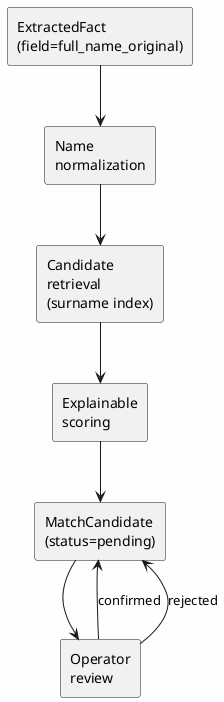

# Explainable Person Matching

## Цель

Сопоставлять факты типа `person` из судебных документов с записями `PersonRecord`
(Росфинмониторинг и другие реестры), **не объединяя записи автоматически**.

## Поток данных



## Нормализация имени

Модуль `matching/name_normalizer.py` преобразует ФИО в сравнимое представление:

| Поле | Пример | Описание |
|---|---|---|
| `raw` | `Иванова Ивана Ивановича` | Исходное значение |
| `tokens` | `["иванов", "иван", "иванович"]` | Нормализованные токены |
| `surname` | `иванов` | Фамилия (именительный падеж) |
| `name` | `иван` | Имя |
| `patronymic` | `иванович` | Отчество |
| `initials` | `ии` | Инициалы |
| `method` | `rules_v1` | Алгоритм |
| `confidence` | `0.85` | Уверенность |

### Правила

- `ё → е`, lowercase, удаление пунктуации
- Поддержка инициалов (`И. И.` → `ии`)
- Простая обработка падежных окончаний отчества (`Ивановича` → `иванович`)
- Не является морфологическим анализом — confidence отражает эвристичность

## Формула score

### Веса

| Правило | Вес |
|---|---|
| Полное совпадение ФИО | +0.70 |
| Совпадение фамилии и имени | +0.50 |
| Совпадение фамилии и инициалов | +0.35 |
| Совпадение даты рождения | +0.20 |
| Совпадение места рождения | +0.10 |
| Конфликт даты рождения | -0.50 |
| Конфликт имени | -0.40 |

### Ограничения

- Итоговый score: `0.0 ≤ score ≤ 1.0`
- Порог создания кандидата: `score ≥ 0.45`
- Отсутствующие данные **не** считаются конфликтом
- **Никакой score не автоматически подтверждает совпадение**

## Генерация кандидатов

Команда: `uv run court-monitor generate-matches`

Алгоритм:
1. Извлечь все `ExtractedFact` с `field=full_name_original`
2. Построить индекс `PersonRecord` по фамилии (после нормализации)
3. Для каждого факта найти записи с совпадающей фамилией
4. Рассчитать score для каждой пары
5. Создать `MatchCandidate` если `score ≥ 0.45`

### Идемпотентность

- Повторный запуск не создаёт дубликаты (unique constraint на `extracted_fact_id + person_record_id`)
- Не сбрасывает `confirmed` / `rejected` обратно в `pending`
- Обновляет score только для `pending`-кандидатов

## CLI

```bash
# Генерация кандидатов
uv run court-monitor generate-matches

# Список кандидатов
uv run court-monitor list-matches
uv run court-monitor list-matches --status pending

# Детали кандидата
uv run court-monitor show-match <id>

# Подтверждение / отклонение
uv run court-monitor confirm-match <id> --comment "..."
uv run court-monitor reject-match <id> --comment "..."
```

## Ограничения

1. **Нормализация — эвристика.** Не обрабатывает все падежные формы, сложные ФИО, иностранные имена.
2. **Фамильный индекс.** Кандидаты ищутся только по совпадающей фамилии. Если нормализация фамилии ошиблась, кандидат не будет найден.
3. **Нет морфологии.** «Иванова» и «Иванов» считаются разными фамилиями (разные токены).
4. **Место рождения** редко есть в пресс-релизах, поэтому `birthplace_score` обычно = 0.
5. **Решение за оператором.** Система только предлагает кандидатов — подтверждение/отклонение всегда ручное.

## Примеры

### Совпадение

- Документ: `Иванова Ивана Ивановича` (из текста пресс-релиза)
- Запись: `Иванов Иван Иванович` (из перечня РФМ)
- Результат: `score = 0.90` (ФИО + дата рождения)

### Конфликт

- Документ: `Петров Пётр Петрович`
- Запись: `Петров Павел Петрович` (другое имя)
- Результат: `score = 0.30` (фамилия совпадает, имя конфликтует)
