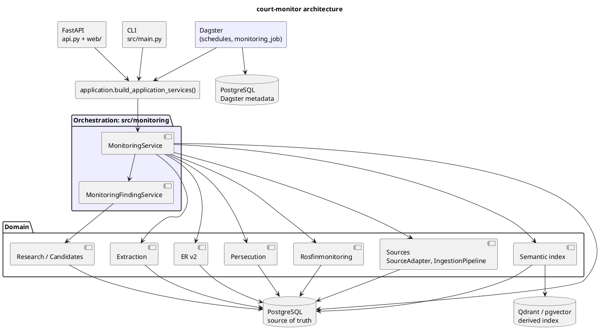

# Architecture

## Зачем это нужно

Эта страница показывает границы системы: где доменная логика, где orchestration,
где хранилища и какие части можно восстановить из PostgreSQL. Оператору это
помогает понять, почему один сценарий запускается через monitoring, а другой
через CLI. Программисту — куда добавлять новую функцию, не смешивая слои.

## Быстрый сценарий

```bash
# одноразовый ручной прогон pipeline
uv run python src/main.py monitor --catch-up

# статус runs и findings
uv run python src/main.py monitoring-status
uv run python src/main.py monitoring-findings --all

# локальная web-консоль
docker compose --profile api up -d
```

CLI, FastAPI и Dagster собирают сервисы через один composition root, поэтому
доменная логика не должна зависеть от конкретного способа запуска.

## Что происходит внутри



## Кодовые точки входа

| Слой | Где | Ответственность |
|---|---|---|
| CLI | `src/main.py`, `src/cli/` | парсинг команд и вызов доменных сервисов |
| API / UI | `src/api.py`, `src/web/` | FastAPI, JSON endpoints, operator console |
| Composition root | `src/application.py`, `src/cli/context.py` | настройки, engine, session factory, сервисы |
| Orchestration | `src/monitoring/` | порядок стадий, runs, checkpoints, findings |
| Domain | `src/sources/`, `src/extraction/`, `src/persons/`, `src/persecution/`, `src/rosfinmonitoring/`, `src/candidates/`, `src/research/` | бизнес-решения и persistence |
| Semantic index | `src/semantic_retrieval/` | semantic documents и vector store |
| Database | `src/db/`, `migrations/` | ORM и Alembic schema |

## Данные и артефакты

- PostgreSQL — source of truth: статьи, mentions, persons, classifications,
  RF matches, monitoring runs.
- Qdrant или pgvector — производный индекс; его можно перестроить из PostgreSQL.
- Dagster metadata — отдельная БД для scheduler/webserver, не доменная история.
- Reports и evaluation artifacts лежат в `reports/` и `evaluation/`.

## Проверка

```bash
uv run python src/main.py validate-config
uv run python src/main.py --help
uv run pytest tests/monitoring tests/app
```

Для production-like запуска см. [Setup](Setup.md) и [Rebuild-Image](Rebuild-Image.md).

## Ограничения и типичные ошибки

- Dagster не принимает доменных решений; он только запускает pipeline.
- API и Dagster не применяют миграции сами. Миграции — явный шаг.
- Qdrant/pgvector не источник фактов. При сомнении сверяться с PostgreSQL.
- Порты compose опубликованы на localhost; наружный доступ требует reverse proxy
  с auth/rate limit.
