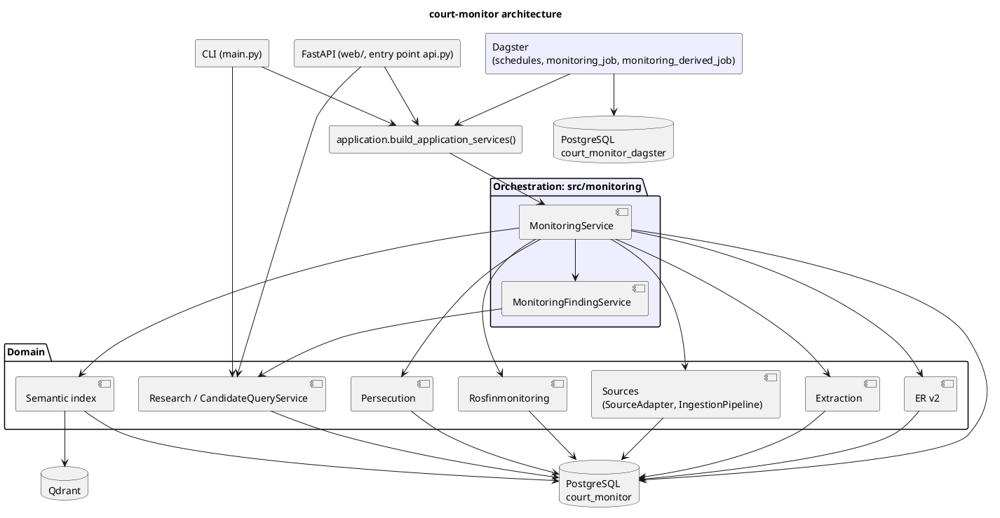

# Architecture

Компоненты court-monitor и их границы. Подробности этапов — на страницах [Overview](Overview.md), [Monitoring](Monitoring.md) и в [ADR](../adr/).

- **Домен** (`sources`, `extraction`, `persons`, `persecution`, `rosfinmonitoring`, `candidates`, `research`, `semantic_retrieval`) принимает решения: что за документ, кто этот человек, преследование ли это, есть ли он в списке РФМ.
- **Orchestration** (`monitoring`, Dagster) только выбирает работу, вызывает доменные сервисы и ведёт учёт run'ов (ADR 0013).
- **PostgreSQL** — source of truth. **Qdrant** — производный индекс (ADR 0011), восстанавливается из PostgreSQL. **Метаданные Dagster** — в отдельной БД.
- **Composition root** `application.build_application_services()` собирает граф объектов для monitoring CLI, monitoring API и Dagster resource.
- **Deployment** (ADR 0014): один образ для API, Dagster и миграций; compose-профиль `production`; миграции — явный шаг `migrate`; liveness (`/health/live`) отделён от readiness (`/health/ready`); порты только на localhost.

Pipeline монитора: Sources → Discovery → Ingestion → Extraction → ER v2 → Persecution → Rosfin → Semantic Index → Research/Candidate query → Monitoring Finding; Dagster запускает его снаружи и в доменные решения не входит.
