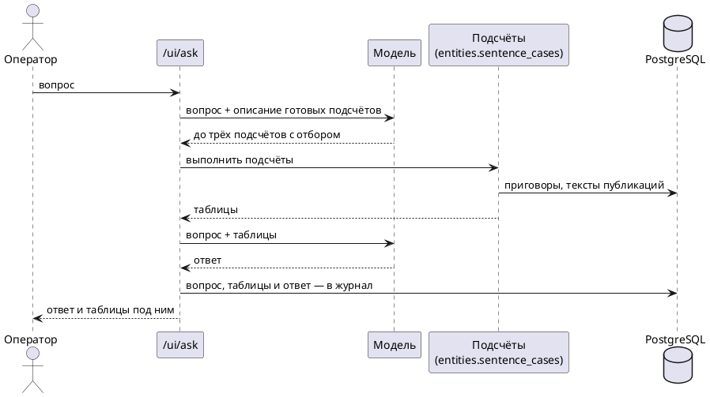

# Спросить: вопросы к базе обычными словами

Страница «Спросить» (`/ui/ask`) отвечает на вопросы вроде «в каких регионах самые суровые
наказания за антивоенные высказывания?». Ответ пишет модель, но числа в нём — из
подсчётов по базе, а не из её памяти.

## Как это устроено



Модель спрашивают дважды. Сначала она выбирает до трёх готовых подсчётов, потом пишет
ответ по их результатам. SQL она не пишет и сама ничего не считает.

Подсчётов три:

| Подсчёт | Что даёт |
|---|---|
| `stats` | приговоры по группам — регионы, причины, виды наказания, годы, статьи УК: число дел, средний, медианный и наибольший срок лишения свободы |
| `list` | список приговоров: самые большие сроки или самые свежие |
| `search` | поиск публикаций по словам (полнотекстовый, по тексту публикаций) |

Под ответом страница показывает сами таблицы. Если в ответе есть число, которого нет ни в
таблицах, ни в вопросе, над ответом появляется предупреждение с этим числом.

## Откуда берутся приговоры

Конвейер знает, что в публикации есть приговор, но не знает какой. Поэтому в конце шага 5
(«Отобрать политические дела») модель читает каждую публикацию с событием «приговор» или
«штраф» и выписывает по одной строке на осуждённого: человек, регион суда, вид наказания,
срок, штраф, заочно ли, дата, статьи УК, причина преследования и дословная цитата.

- Публикация читается один раз. Повторно — только при новой версии вопроса к модели.
- Строка без цитаты, которая дословно есть в тексте, не сохраняется.
- Запрос прокурора, решение иностранного суда и арест модель помечает отдельно; в таблицу
  попадают только приговоры.
- Регион приводится к одному названию субъекта РФ; чего нет в списке субъектов — пусто.

Один приговор, о котором написали пять источников, — пять строк. Перед подсчётом строки
сворачиваются в дела:

- строки названного человека — одно дело, если совпадает причина или наказание;
- строки неназванного — одно дело, если совпадают регион, наказание и месяц приговора;
- если такому набору соответствует ровно одно дело названного человека, строка
  присоединяется к нему.

Страница «Приговоры» (`/ui/sentences`) показывает дела с цитатами. Кнопка «Неверно»
убирает дело из всех подсчётов; убранное лежит на вкладке «Убранные», его можно вернуть.

## Чему в ответе можно верить

Замер на 100 публикациях, сверенных вручную:

| Поле | Качество |
|---|---|
| срок и вид наказания | верны там, где названы в тексте |
| регион | верен или пуст; у трети приговоров в публикации региона нет |
| причина преследования | примерно одна из десяти спорна |

Ограничения, о которых стоит помнить:

- Это приговоры, о которых написали источники базы, а не судебная статистика.
- Один и тот же приговор неназванного человека в двух публикациях может не свернуться в
  одно дело и посчитаться дважды.
- Средний срок по одному-двум приговорам ничего не значит; для сравнений модель просит
  группы не меньше чем с тремя сроками, а отброшенные группы называет.
- Заочные приговоры чаще выносят в Москве; при сравнении регионов их стоит исключать.

## Расходы

Вопрос стоит доли цента (два обращения к модели). Вопросы одного дня тратят не больше
`ASK_DAILY_BUDGET_USD` (по умолчанию $1); после этого страница отвечает отказом до завтра.
Чтение приговоров идёт в счёт бюджета шага (`ENTITY_MODEL_BUDGET_USD`); первый проход по
базе из 900 публикаций стоит около $0,3.

В модель уходят только вопрос и то, что рассказывают опубликованные статьи. База
оператора, перечень Росфинмониторинга и заметки операторов в неё не попадают.

## Запуск вручную

```bash
docker exec ebnv-api-1 sh -c 'cd /app && /opt/venv/bin/python src/main.py find-sentences'
```

## Код

- Чтение приговоров: `src/entities/sentences.py`; субъекты РФ: `src/entities/regions.py`.
- Свёртка в дела и подсчёты: `src/entities/sentence_cases.py`.
- Вопрос и ответ: `src/entities/ask.py`.
- Страницы: `src/web/ui/ask.py`, `src/web/ui/sentences.py`.
- Таблицы: `article_sentences`, `article_sentence_readings`, `chat_questions`.
