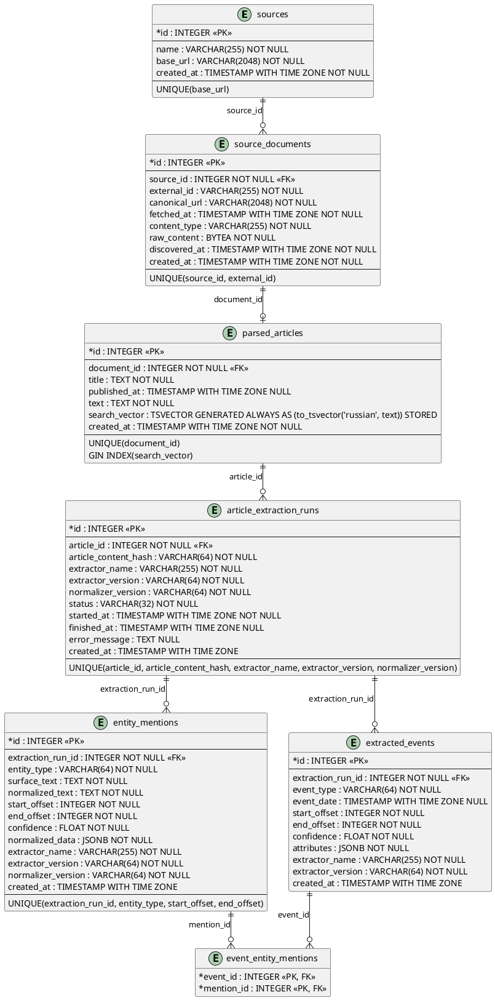

# Data Model / Persistence

## Зачем это нужно

Эта страница объясняет, где хранятся факты и производные данные. Оператору она
помогает понять, почему состояние переживает перезапуск API. Программисту —
какие таблицы являются source of truth и какие можно пересобрать.

## Быстрый сценарий

```bash
uv run alembic current
uv run alembic heads
```

Для inspection конкретной БД:

```bash
psql "$DATABASE_URL" -c '\dt'
```

Ожидание: Alembic current совпадает с heads; доменные таблицы описаны ORM в
`src/db/models/` и импортируются через `src/db/orm_models.py`.

## Схема (актуальная, по миграциям + `db/orm_models.py`)

Модели лежат по доменам в `db/models/` (`sources`, `extraction`, `persons`, `persecution`, `rosfinmonitoring`, `semantic`, `monitoring`, `operations`) на общем `Base` из `db/models/base.py`; `db/orm_models.py` импортирует их все, чтобы весь код и Alembic видели одну `Base.metadata`.



> **Внимание, расхождение:** файл `docs/uml/top to bottom direction.puml` в репозитории описывает **другую**, более раннюю схему — с таблицей `document_snapshots` (снапшоты по `content_hash`) между `source_documents` и `parsed_articles`, `raw_content` в `document_snapshots`, а не в `source_documents`, и с таблицей `article_chunks`, которой в текущей схеме больше нет. Ни миграции (`migrations/versions/`), ни `db/orm_models.py` такой таблицы/структуры не содержат. Диаграмма выше построена заново по фактическим миграциям и коду; старый `.puml`-файл не тронут, но как источник правды для текущей схемы использовать нельзя.

Таблицы созданы/изменены миграциями:
- `fdac899276a2_create_ingestion_tables.py` — `sources`, `source_documents`, `parsed_articles`, `article_chunks`
- `df2c42a78b48_add_article_chunk_search_vector.py` — добавляет `search_vector` (generated column) + GIN-индекс на `article_chunks`
- `a3f7c9d21b44_drop_article_chunks_add_article_search_vector.py` — удаляет `article_chunks`, переносит `search_vector` (generated column) + GIN-индекс на `parsed_articles`
- `f0b1c2d3e4f5_add_extraction_tables.py` — добавляет `article_extraction_runs`, `entity_mentions`, `extracted_events`, `event_entity_mentions`

`article_chunks` — это уже история: таблица существовала до удаления `ArticleChunk` из домена, см. [ADR 0002](../adr/0002-drop-dense-hybrid-search.md). Старые миграции не переписаны задним числом.

## Сущности и безымянные фигуранты (шаги 3–5)

Люди консоли «Следователь» ([Pipeline](Pipeline.md)). Производные таблицы
пересобираются своим шагом целиком; решения оператора и кэши ответов модели
хранятся по ключу и переживают пересборку.

| Таблица | Кто пишет | Смысл |
|---|---|---|
| `entity_groups` | шаг 3 | человек: `key` («имя фамилия», склонения и «ё» сведены; для тёзок с разными регионами — « · регион»), имя, варианты написания, число упоминаний и публикаций, события, регионы, дата последней публикации, источник имени (`rules`, `model`, `manual`) |
| `entity_group_mentions` | шаг 3 | какие упоминания (`entity_mentions`) составляют человека |
| `entity_group_charges` | шаг 3 | статья УК события, где человек — обвиняемый: часть, тип события, цитата, `other_targets` (сколько ещё обвиняемых в событии) |
| `entity_group_rf_matches` | шаг 5 | совпадение с записью перечня: `full` или `name` |
| `entity_group_roles` | шаг 4 | роль: `figurant`, `possible`, `mentioned`, `unclear`; `kind` (accused, foreign, historical, support, …), способ (`model`, `article`, `official`, `rules`), причина, цитата |
| `entity_group_politics` | шаг 5 | вердикт `political` / `criminal` / `unclear`, способ (`article`, `memorial`, `model`), причина, цитата |
| `unnamed_figurants` | шаг 5 | безымянные фигуранты — [Unnamed Figurants](Unnamed-Figurants.md) |
| `entity_name_normalizations`, `entity_role_answers`, `entity_politics_answers`, `unnamed_answers` | шаги 3–5 | кэш ответов модели по хэшу вопроса и версии промпта |
| `entity_pair_decisions` | оператор, шаг 5 (слияния по перечню и региону) | «один человек» / «разные люди» по паре ключей; `source`: `manual`, `rf`, `region` |
| `entity_name_overrides` | оператор | исправленное имя по ключу |
| `entity_official_marks` | оператор | «должностное лицо» или «нет» по ключу |
| `unnamed_decisions` | оператор | «это он» / «не он» / «никого нет» по ключу фигуранта и «ФИО|дата рождения» записи перечня |

Миграции: от `x8y9z0a1b2c3_entity_groups.py` до `c9d0e1f2a4b5_unnamed_figurants.py`.

## `operator_operation_runs`

Запуски routine operations из операторской консоли (`operator_console.OperationRegistry`, миграция `s3t4u5v6w7x8`). Источник истины — PostgreSQL: все процессы API видят одни и те же runs, перезапуск API историю не теряет.

| Поле | Тип | Смысл |
|---|---|---|
| `id` | serial PK | номер run |
| `operation_name` | varchar(64) | операция из allowlist (`monitor`, `discover-and-ingest`, `extract-entities`, `resolve-people`, `classify-persecution`) |
| `parameters` | jsonb | проверенные параметры (`source`, `sources`, `mode`, `limit`, `workers`); `mode` у `monitor` — шаг консоли: `load`, `purge`, `entities`, `figurants`, `political` (старые runs могут содержать `rosfin`) |
| `command` | jsonb | argv процесса, собранный из allowlist; shell не используется |
| `status` | varchar(16) | `pending` → `running` → `succeeded` / `failed`; `interrupted` — процесс пропал (CHECK) |
| `created_at`, `started_at`, `heartbeat_at`, `finished_at` | timestamptz | время по часам базы (`now()`) |
| `return_code` | int | код возврата процесса |
| `stdout`, `stderr` | text | последние 20 000 символов |
| `error` | text | исключение запуска или причина `interrupted` |
| `worker_id` | varchar(128) | `host:pid` процесса, который выполняет run |

- Частичный уникальный индекс `uq_operator_operation_runs_active_operation` по `operation_name` для `pending`/`running`: одна живая операция на всю базу, второй запуск получает 409.
- Процесс шлёт heartbeat каждые 15 с. Живой run без heartbeat дольше 5 мин получает `interrupted` при следующем чтении или запуске — операция снова свободна. Запись результата требует, чтобы run ещё был `running` у того же `worker_id`: поздний результат не перезаписывает `interrupted`.
- Выполнение — поток процесса API, принявшего запуск; confirm только создаёт run и сразу возвращает redirect.

## Векторы pgvector: `semantic_vector_collections`, `semantic_vectors`, `semantic_index_state`

Миграция `t4u5v6w7x8y9` ([ADR 0018](../adr/0018-pgvector-vector-store.md)) включает расширение `vector`. Таблицы — производные данные, как `semantic_documents`; фактов в них нет. Заполняются только при `SEMANTIC_VECTOR_BACKEND=pgvector`.

| Таблица | Поля | Смысл |
|---|---|---|
| `semantic_vector_collections` | `name` PK, `vector_size`, `created_at` | логическая коллекция (`persons_semantic`, `events_semantic`) и её размерность |
| `semantic_vectors` | PK (`collection_name`, `entity_type`, `entity_id`), `embedding vector` (без размерности, `STORAGE PLAIN`), `embedding_model_id`, `representation_version`, `content_hash`, `updated_at` | вектор сущности; удаляется вместе с коллекцией (`ON DELETE CASCADE`) |
| `semantic_index_state` | `entity_type` PK, `vector_backend`, `rebuilt_at` | чей полный rebuild поставил отметки `semantic_documents.indexed_at` |

- HNSW-индекс создаёт `PgVectorStore` для коллекции событий: `USING hnsw ((embedding::vector(N)) vector_cosine_ops) WHERE collection_name = '<имя>' AND vector_dims(embedding) = N`, имя `ix_semvec_hnsw_<коллекция>_<N>`. У коллекции персон индекса нет: она ищется точно. Другая модель — другой N, полный rebuild, без миграции.
- Миграция `u5v6w7x8y9z0` ставит `embedding` хранение `PLAIN` (вектор 768-d — 3 КБ, выше порога TOAST); существующие строки она не переписывает — это делает обязательный полный rebuild.
- Миграция записывает в `semantic_index_state` значение `qdrant` для типов сущностей, у которых уже есть отметки `indexed_at`.

## Persistence: `SqlAlchemyIngestionPersistence.save()`

`src/sources/sqlalchemy_persistence.py`. Одна транзакция (`session_factory.begin()`), upsert по естественным ключам на каждом уровне:

1. **Source** — ищется по `base_url`, создаётся при отсутствии.
2. **SourceDocument** — ищется по `(source_id, external_id)`; при повторной загрузке той же публикации обновляются `canonical_url`, `fetched_at`, `content_type`, `raw_content` (перезапись, не версионирование — старое содержимое не хранится).
3. **ParsedArticleRecord** — ищется по `document_id` (1:1 с документом); при повторном разборе `title`/`published_at`/`text` перезаписываются, `search_vector` пересчитывается автоматически (generated column).

Таким образом повторный `ingest` той же публикации — не добавление новой версии, а замена: одна строка `source_documents`/`parsed_articles` на публикацию.

## Extraction persistence

`SqlAlchemyExtractionPersistence.save()` сохраняет результат extraction одной транзакцией. Идемпотентность задаёт ключ:

```text
article_id + article_content_hash + extractor_name + extractor_version + normalizer_version
```

Повторный запуск той же версии возвращает существующий successful run и не создаёт дубликаты. Если `ParsedArticle.text` изменился, `content_hash` меняется и создаётся новый run. Старые результаты не смешиваются с новыми.
