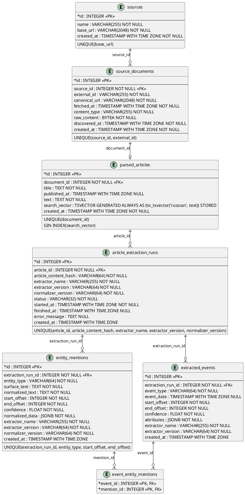

# Data Model / Persistence

## Схема (актуальная, по миграциям + `orm_models.py`)



> **Внимание, расхождение:** файл `docs/uml/top to bottom direction.puml` в репозитории описывает **другую**, более раннюю схему — с таблицей `document_snapshots` (снапшоты по `content_hash`) между `source_documents` и `parsed_articles`, `raw_content` в `document_snapshots`, а не в `source_documents`, и с таблицей `article_chunks`, которой в текущей схеме больше нет. Ни миграции (`migrations/versions/`), ни `orm_models.py` такой таблицы/структуры не содержат. Диаграмма выше построена заново по фактическим миграциям и коду; старый `.puml`-файл не тронут, но как источник правды для текущей схемы использовать нельзя.

Таблицы созданы/изменены миграциями:
- `fdac899276a2_create_ingestion_tables.py` — `sources`, `source_documents`, `parsed_articles`, `article_chunks`
- `df2c42a78b48_add_article_chunk_search_vector.py` — добавляет `search_vector` (generated column) + GIN-индекс на `article_chunks`
- `a3f7c9d21b44_drop_article_chunks_add_article_search_vector.py` — удаляет `article_chunks`, переносит `search_vector` (generated column) + GIN-индекс на `parsed_articles`
- `f0b1c2d3e4f5_add_extraction_tables.py` — добавляет `article_extraction_runs`, `entity_mentions`, `extracted_events`, `event_entity_mentions`

`article_chunks` — это уже история: таблица существовала до удаления `ArticleChunk` из домена, см. [ADR 0002](../adr/0002-drop-dense-hybrid-search.md). Старые миграции не переписаны задним числом.

## Persistence: `SqlAlchemyIngestionPersistence.save()`

`src/sqlalchemy_persistence.py`. Одна транзакция (`session_factory.begin()`), upsert по естественным ключам на каждом уровне:

1. **Source** — ищется по `base_url`, создаётся при отсутствии.
2. **SourceDocument** — ищется по `(source_id, external_id)`; при повторной загрузке той же публикации обновляются `canonical_url`, `fetched_at`, `content_type`, `raw_content` (перезапись, не версионирование — старое содержимое не хранится).
3. **ParsedArticleRecord** — ищется по `document_id` (1:1 с документом); при повторном разборе `title`/`published_at`/`text` перезаписываются, `search_vector` пересчитывается автоматически (generated column).

Таким образом повторный `ingest` той же публикации — не добавление новой версии, а замена: одна строка `source_documents`/`parsed_articles` на публикацию.

## Extraction persistence

`SqlAlchemyExtractionPersistence.save()` сохраняет результат extraction одной транзакцией. Идемпотентность задаёт ключ:

```text
article_id + article_content_hash + extractor_name + extractor_version + normalizer_version
```

Повторный запуск той же версии возвращает существующий successful run и не создаёт дубликаты. Если `ParsedArticle.text` изменился, `content_hash` меняется и создаётся новый run. Старые результаты не смешиваются с новыми.
