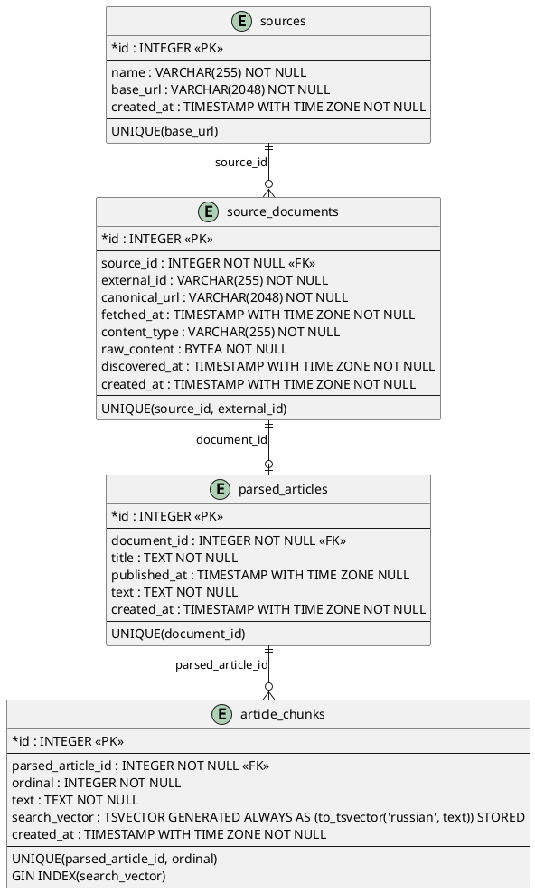

# Data Model / Persistence

## Схема (актуальная, по миграциям + `orm_models.py`)

> **Внимание, расхождение:** файл `docs/uml/top to bottom direction.puml` в репозитории описывает **другую**, более раннюю схему — с таблицей `document_snapshots` (снапшоты по `content_hash`) между `source_documents` и `parsed_articles`, и `raw_content` в `document_snapshots`, а не в `source_documents`. Ни миграции (`migrations/versions/`), ни `orm_models.py` такой таблицы не содержат — судя по всему, это след утраченного/незавершённого функционала версионирования снапшотов. Диаграмма выше построена заново по фактическим миграциям (`fdac899276a2`, `df2c42a78b48`) и коду; старый `.puml`-файл не тронут, но как источник правды для текущей схемы использовать нельзя.

Таблицы созданы миграциями:
- `fdac899276a2_create_ingestion_tables.py` — `sources`, `source_documents`, `parsed_articles`, `article_chunks`
- `df2c42a78b48_add_article_chunk_search_vector.py` — добавляет `search_vector` (generated column) + GIN-индекс

## Persistence: `SqlAlchemyIngestionPersistence.save()`

`src/sqlalchemy_persistence.py`. Одна транзакция (`session_factory.begin()`), upsert по естественным ключам на каждом уровне:

1. **Source** — ищется по `base_url`, создаётся при отсутствии.
2. **SourceDocument** — ищется по `(source_id, external_id)`; при повторной загрузке той же публикации обновляются `canonical_url`, `fetched_at`, `content_type`, `raw_content` (перезапись, не версионирование — старое содержимое не хранится).
3. **ParsedArticleRecord** — ищется по `document_id` (1:1 с документом); при повторном разборе текст/заголовок перезаписываются.
4. **ArticleChunkRecord** — старые chunks статьи **удаляются** (`DELETE ... WHERE parsed_article_id = ...`) и вставляются заново. Это делает переиндексацию в Qdrant после повторного ingestion обязательной (id чанков меняются) — см. [Search](Search.md).

Таким образом повторный `ingest` той же публикации — не добавление новой версии, а замена: одна строка `source_documents`/`parsed_articles` на публикацию, актуальные chunks.
