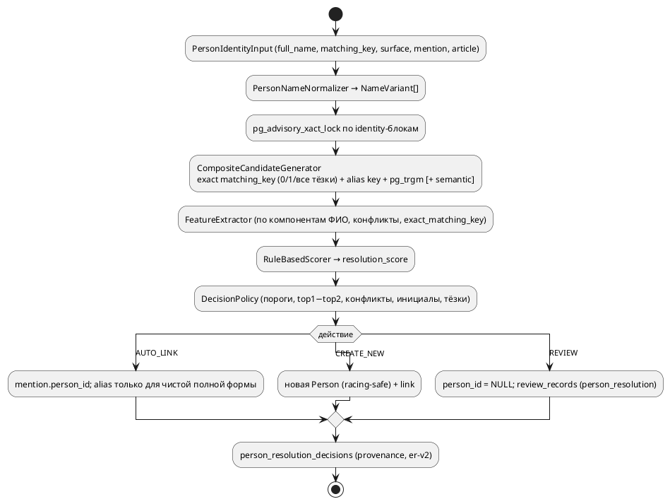

# Entity Resolution v2

Решение: [ADR 0012](../adr/0012-entity-resolution-v2.md). Модель Person и exact baseline: [Persons](Persons.md), [ADR 0005](../adr/0005-entity-resolution-strategy.md).

Главное правило: **похожий человек ≠ тот же человек**, и **одинаковое ФИО ≠ тот же человек**: `matching_key` — ключ поиска кандидатов, а не ключ identity (amendment ADR 0012, 2026-09-16). ER v2 может автоматически привязать новое упоминание к существующей Person или создать Person, но **никогда не объединяет две существующие canonical Person** — merge только явным действием ревьюера.



## Модули (`src/persons/resolution/`)

| Модуль | Роль |
|---|---|
| `models.py` | `PersonIdentityInput`, `NormalizedPersonName`/`NameVariant`, `PersonResolutionCandidate`, `PersonResolutionFeatures`, `PersonResolutionScore`, `PersonResolutionDecision`, enum'ы действий и причин |
| `normalizer.py` | `PersonNameNormalizer`: регистр, `ё→е`, точки/пунктуация, инициалы, все допустимые порядки ФИО; суффиксы — только подсказки |
| `candidates.py` | `ExactKeyCandidateGenerator` (все active Person с ключом имени `exact_key` или alias `alias`, по id), `TrigramCandidateGenerator` (pg_trgm), `SemanticCandidateGenerator`, `CompositeCandidateGenerator` |
| `features.py` | `PersonResolutionFeatureExtractor`: выравнивание вариантов, `exact/typo/initial_compatible/missing/mismatch`, конфликты (RapidFuzz Levenshtein) |
| `scoring.py` | `PersonResolutionScorer`: rule-based `resolution_score` (не вероятность), конфликт ограничивает score 0.25, точная полная форма ≥ 0.85 |
| `decision.py` | `PersonResolutionDecisionPolicy`, `ResolutionThresholds` |
| `aliases.py` | `AliasPromotionPolicy`: какая форма становится alias |
| `service.py` | `PersonResolutionEngine` (только чтение, dry-run), `PersonResolutionService` (advisory lock, применение, provenance) |
| `review.py` | `PersonResolutionReviewService`: сравнение для ревьюера и действия |
| `evaluation.py`, `cli.py`, `factory.py` | evaluation, CLI, сборка зависимостей |

Интеграция: `ExtractionResolutionService.resolve_extraction_run()` — extraction → normalization → lock → кандидаты → decision. Exact fast path и `RuleBasedPersonResolver` удалены. `ResearchService` ER не делает: research читает уже canonical entities.

## Решения

| Ситуация | Действие |
|---|---|
| полное ФИО или известный alias, единственный сильный кандидат, margin > минимума (в том числе единственная Person с тем же `matching_key`) | AUTO_LINK |
| несколько active Person с тем же `matching_key` (тёзки или дубли) | REVIEW (`multiple_exact_name_matches`), при любых score; ни id, ни semantic не выбирают |
| переставленное ФИО из 3 частей (0.90) | AUTO_LINK |
| переставленное ФИО из 2 частей, опечатка, нет отчества, инициалы, одна фамилия | REVIEW |
| несколько правдоподобных кандидатов / два сильных (возможные дубли Person, или `known_distinct_persons` после keep_separate) / малый margin | REVIEW |
| конфликт (другое отчество или имя, несовместимый инициал) | не plausible → CREATE_NEW |
| нет кандидатов или все слабые | CREATE_NEW |
| semantic включён, но недоступен, и есть кандидат с той же фамилией без конфликта | REVIEW вместо CREATE_NEW |

Причины (`reasons`): `strong_unique_match`, `no_candidate`, `no_plausible_candidate`, `multiple_plausible_candidates`, `possible_duplicate_persons`, `multiple_exact_name_matches`, `known_distinct_persons`, `incomplete_name`, `initials_only`, `conflicting_identity_data`, `low_decision_margin`, `medium_confidence_match`, `semantic_source_unavailable`; `exact_matching_key` — только в старых решениях удалённого fast path.

Точная полная форма (то же имя или alias, без инициалов, не одно слово) получает score ≥ 0.85 при любом прочтении ролей: суффикс может прочитать «Дмитрий Шостакович» как имя + отчество, а у имени из 4+ слов прочтений нет.

## Примеры (`resolve-person`, корпус evaluation)

```text
$ uv run python src/main.py resolve-person "Иванов Иван Иванович"
  candidate #1: Иван Иванович Иванов   resolution_score 0.90   sources trigram
    surname: exact   given name: exact   patronymic: exact
    order: different   alias: no   semantic: n/a
    conflicts: none
  candidate #2: Иван Петрович Иванов   resolution_score 0.25
    patronymic: mismatch   conflicts: patronymic_mismatch
Decision: auto_link → person #1 (strong_unique_match, margin 0.90)

$ uv run python src/main.py resolve-person "Алексей Сергеевич Иванов"   # две active Person-тёзки
  candidate #10: Алексей Сергеевич Иванов   resolution_score 1.00   sources exact_key, trigram
  candidate #42: Алексей Сергеевич Иванов   resolution_score 1.00   sources exact_key, trigram
Decision: review (low_decision_margin, multiple_plausible_candidates, multiple_exact_name_matches, possible_duplicate_persons, margin 0.00)

$ uv run python src/main.py resolve-person "И. Иванов"
  4 кандидата (Иван Иванович, Иван Петрович, Илья, Игорь Иванов), у всех 0.58,
  given name: initial_compatible
Decision: review (medium_confidence_match, multiple_plausible_candidates, initials_only, margin 0.00)

$ uv run python src/main.py resolve-person "Александр Пертров"
  candidate #5: Александр Петров   resolution_score 0.65
    surname: typo   given name: exact   conflicts: none
Decision: review (medium_confidence_match, margin 0.65)

$ uv run python src/main.py resolve-person "Василий Голубцов"
  candidate #29: Виктор Голубев   resolution_score 0.05
    surname: mismatch   given name: mismatch
Decision: create_new (no_plausible_candidate, conflicting_identity_data)
```

`resolve-person` — всегда dry-run: ничего не пишет в БД (`--json` — план целиком).

## Provenance

`person_resolution_decisions` (уникально по `mention_id` + `resolver_version`): `method` (`er_v2`; `exact_matching_key` — старые решения fast path), `action`, `status` (`applied`/`pending_review`/`reviewed`), `selected_person_id`, `resolution_score`, `decision_margin`, `reasons`, `identity` (+ нормализованное имя), `candidates` (снимок кандидатов, признаков и score), `semantic_source`, `resolver_version = er-v2`, `review_action`, `distinct_from_person_id` (keep_separate), `reviewer_note`, `created_at`, `reviewed_at`.

«Почему mention X связан с Person Y» — строка решения X. Повторная обработка использует записанное решение (идемпотентно); упоминания, связанные до ER v2, не перерешиваются. Re-resolution новой версией — отдельная явная операция (не реализована).

## Human review

REVIEW оставляет `entity_mentions.person_id = NULL` (Person-заглушки нет) и создаёт pending `review_records` (`subject_type = person_resolution`, `subject_id` = id решения).

```bash
uv run python src/main.py person-resolution-reviews list
uv run python src/main.py person-resolution-reviews show 42
uv run python src/main.py person-resolution-reviews apply 42 --action link_to_person --person-id 7 --note "тот же суд"
uv run python src/main.py person-resolution-reviews apply 42 --action merge_persons --person-id 7 --source-person-id 9
uv run python src/main.py person-resolution-reviews apply 43 --action keep_separate --person-id 7 --source-person-id 9 --note "другой суд"
```

API: `GET /person-resolution/reviews`, `GET /person-resolution/reviews/{decision_id}`, `POST /person-resolution/reviews/{decision_id}/decision` (`{"action", "person_id", "source_person_id", "note"}`; 404 — нет решения, 409 — решение не pending / person не active / не хватает второй Person).

| Действие | Эффект |
|---|---|
| `link_to_person` | связать mention, person-event links, alias по `AliasPromotionPolicy` |
| `create_new_person` | создать Person, в том числе тёзку с тем же `matching_key` (лог `er_namesake_created_by_review`) |
| `merge_persons` | `merge_persons_in_session(source → target)` + `PersonMergeRecord`, связать mention с target |
| `keep_separate` | связать с `person_id` и записать `distinct_from_person_id = source_person_id` (обязателен): дальше эта пара — `known_distinct_persons`, а не `possible_duplicate_persons`; новые упоминания всё равно REVIEW |

Ревьюер видит структурированное сравнение (детерминированная диагностика, не LLM-рассуждение): компоненты ФИО, порядок, alias, trigram/semantic similarity, конфликты, правила score, источник статьи.

## Concurrency

Unique-индекса по `matching_key` больше нет (тёзки), поэтому от параллельных дублей защищает только `pg_advisory_xact_lock` по identity-блокам (полные токены имени, одинаковы для переставленных форм). `ExtractionResolutionService` берёт блоки всех упоминаний run в начале (sorted), `resolve_mention` — свои перед чтением кандидатов (повторный захват — no-op). Кандидаты и решение считаются под lock: «Иван Иванов» и «Иванов Иван» (или одно имя дважды) в двух воркерах выполняются последовательно, второй видит закоммиченную Person первого и связывается с ней; CREATE_NEW пишет только после этого перечтения. `create_new_person` ревьюера берёт те же lock.

`merge_persons_in_session` блокирует source и target (`FOR UPDATE`, по возрастанию id) и перепроверяет `active`: два ревьюера, сливающие одну Person в разные target, дают ровно один `PersonMergeRecord`, второй получает 409. Self-merge запрещён.

Миграция `o9p0q1r2s3t4`: `uq_persons_matching_key_active` → `ix_persons_matching_key_active` (обычный partial `WHERE status = 'active'`), колонка `person_resolution_decisions.distinct_from_person_id`. Строки Person и связи не меняются; downgrade останавливается, пока есть active тёзки с общим ключом.

## Evaluation

```bash
EVALUATION_DATABASE_URL=postgresql+psycopg://...court_monitor_eval uv run python src/main.py evaluate-er [--sweep] [--semantic]
```

Корпус `tests/fixtures/er_v2_corpus.json`: 36 persons, 59 кейсов — 38 positive, 12 hard negatives, 8 ambiguous (в том числе две active тёзки: точное и переставленное ФИО, одна создана ревьюером), 1 indistinguishable (единственная Person с этим ФИО, но другой человек — считается отдельно как `indistinguishable_namesake_links`, не как false link); имена проходят extraction-нормализатор с обеих сторон. Результаты (2026-09-16, defaults):

| generator | recall@1 | recall@5 | recall@10 |
|---|---|---|---|
| exact (ключ имени + alias) | 0.42 | 0.42 | 0.42 |
| trigram | 0.82 | 1.00 | 1.00 |
| semantic (E5, без порога) | 0.92 | 1.00 | 1.00 |
| combined | 0.92 / 0.97 с semantic | 1.00 | 1.00 |

| метрика | значение |
|---|---|
| AUTO_LINK precision / recall | 1.00 / 0.58 |
| false links (в том числе на тёзках) | 0 |
| indistinguishable namesake links | 1 |
| false create-new (пропущенные связи) | 0 |
| review rate | 0.43 |
| лишние review / пропущенные review | 1 (`Роман Карпенков` ≈ `Карпенко`) / 0 |

Sweep: 0.85 — минимальный `ER_AUTO_LINK_MIN_SCORE` без ложных связей (при 0.80 «Илья Петрович Иванов» → «Илья Иванов»); 0.40 — максимальный `ER_REVIEW_MIN_SCORE` без пропущенных связей (при 0.50 «А. В. Новикова» становится новой Person). `ER_MIN_MARGIN` этим корпусом не различается. Semantic кандидаты не изменили ни одного решения и recall@5 — выключены по умолчанию.

## Конфигурация

| Переменная | По умолчанию |
|---|---|
| `ER_CANDIDATE_LIMIT` | `30` (2..200: меньше двух скрыло бы тёзку от policy) |
| `ER_AUTO_LINK_MIN_SCORE` | `0.85` |
| `ER_REVIEW_MIN_SCORE` | `0.40` |
| `ER_MIN_MARGIN` | `0.10` |
| `ER_SEMANTIC_CANDIDATES` | выключен; при `1` нужен `QDRANT_URL` (иначе warning и работа без semantic) |
| `ER_SEMANTIC_CANDIDATE_MIN_SCORE` | не задан (без порога, ограничено `ER_CANDIDATE_LIMIT`); только для генерации кандидатов |

## Semantic index после link/create

Link/create меняют semantic document Person (aliases, события). Индекс обновляется вручную: `rebuild-semantic-index --entity person --incremental` переиндексирует изменённые по `content_hash` документы. Автоматическое обновление — этап 6.

## Ограничения

- Корпус маленький и синтетический, пороги подобраны на нём.
- Extraction-нормализатор срезает окончания (`Анна Новикова` → `Анн Новиков`): пол теряется, имена искажаются; формы с инициалами extraction не нормализует, поэтому их score ниже.
- Нет транслитерации, уменьшительных имён без alias (`Маша`/`Мария`), фонетики, дат рождения и контекстных признаков.
- Единственная Person с тем же ФИО связывается автоматически: другой человек-тёзка неотличим без контекста (суд, регион, дата рождения не извлекаются). Вторая тёзка появляется только через `create_new_person` ревьюера; дальше каждое упоминание этого ФИО — REVIEW.
- Без unique-ключа дубли предотвращаются только для упоминаний с общим identity-блоком (полный токен); имена без общего полного токена (опечатка в каждом слове) могут параллельно создать две Person.
- Advisory lock включает токены имён и держится весь extraction run: частые имена сериализуют параллельные run.
- Опечатка никогда не даёт AUTO_LINK при порогах по умолчанию (максимум 0.80).
