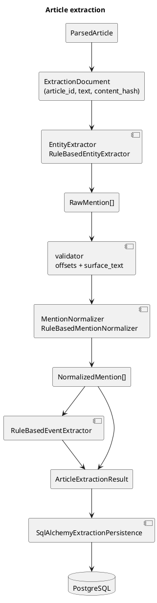

# Extraction

Этап 10 превращает полный `ParsedArticle.text` в проверяемые mentions и события. Постоянные chunks не возвращались: extractor работает только с текстом статьи, а любые внутренние окна не сохраняются и не имеют идентификаторов.

## Поток



## Mention, не canonical entity

Extraction создаёт только mention-записи: `NormalizedMention` с `entity_type=person/organization/court/location/legal_reference` и typed `normalized_data`. Оно не решает, что `Александр Иванов`, `Саша Иванов` и `А. П. Иванов` один человек. Нет таблицы `persons`, fuzzy matching между статьями, Росфинмониторинга или entity resolution.

## Типы

`EntityType`:

- `person`
- `organization`
- `court`
- `location`
- `legal_reference`

`EventType`:

- `case_opened`
- `search`
- `detention`
- `arrest`
- `charge`
- `sentence`
- `fine`
- `release`
- `other`

Роли связи события с mention:

- `subject`
- `target`
- `court`
- `authority`
- `location`
- `legal_basis`

## Provenance и offsets

Каждый mention хранит:

```text
article_id
article_content_hash
start_offset
end_offset
surface_text
extractor_name
extractor_version
normalizer_version
confidence
```

Инвариант перед сохранением:

```python
document.text[start_offset:end_offset] == surface_text
```

Нормализация не меняет `ParsedArticle.text`, поэтому offsets остаются offsets исходного полного текста.

`content_hash` считается по `ParsedArticle.text`. `title`, `source_name` и `source_url` в текущем baseline не участвуют в extraction logic, поэтому их изменение само по себе не создаёт новую версию extraction.

## NLP-подход

Выбран deterministic baseline без LLM и внешних API:

- regex/rule-based extraction для правовых ссылок, судов, организаций, мест, людей и событий;
- простая морфологическая нормализация имён на уровне безопасных эвристик;
- CPU-only, воспроизводимо, без скачивания моделей в тестах;
- Python 3.13 compatible, новых тяжёлых зависимостей нет.

Готовые русскоязычные NER/морфологические пайплайны не добавлены: для Python 3.13 и воспроизводимых CI-тестов они либо требуют тяжёлых моделей, либо скачивания, либо дают слишком большую operational cost для baseline этапа.

## Нормализация

Люди:

```text
full_name
last_name
first_name
patronymic
matching_key
```

Правовые ссылки:

```text
code
article
part
clause
```

Организации/суды:

```text
name
organization_type
location
matching_key
```

Extractor сохраняет `surface_text`. Normalizer не раскрывает инициалы догадкой и не объединяет однофамильцев.

## Таблицы

- `article_extraction_runs` — версия extraction для конкретного `article_id` + `content_hash` + versions.
- `entity_mentions` — normalized mentions с JSONB `normalized_data`.
- `extracted_events` — события и attributes JSONB.
- `event_entity_mentions` — связи event/mention/role.

Удаление run каскадно удаляет mentions, events и links. Уникальный ключ run обеспечивает идемпотентность повторного запуска той же версии.

## CLI

```bash
uv run python src/main.py extract-entities --article-id 123
uv run python src/main.py extract-entities --source ovd-info --limit 100
uv run python src/main.py extract-entities --source sota-vision --limit 100
uv run python src/main.py evaluate-extraction
```

## Golden dataset и метрики

Golden corpus: `tests/fixtures/extraction_golden_corpus.json`.

Он содержит 10 коротких вручную составленных статей по ОВД-Инфо и SOTA, положительные и отрицательные примеры, ФИО, инициалы, иностранное имя, организации, суды, места, правовые ссылки и несколько событий в одной статье.

Метрики:

- exact-span precision
- exact-span recall
- exact-span F1
- entity-type accuracy
- normalization accuracy
- event-type accuracy

Отчёт также содержит missed/false-positive/wrong-type/wrong-normalization/event errors.

## Ограничения

- Baseline rule-based, не полноценный NER.
- Нормализация падежей имён эвристическая и может ошибаться.
- События извлекаются по триггерам в предложении, без юридического вывода.
- Нет entity resolution и объединения mentions.
- Нет chunks, Qdrant, GraphRAG, UI, LLM, внешних платных API.
