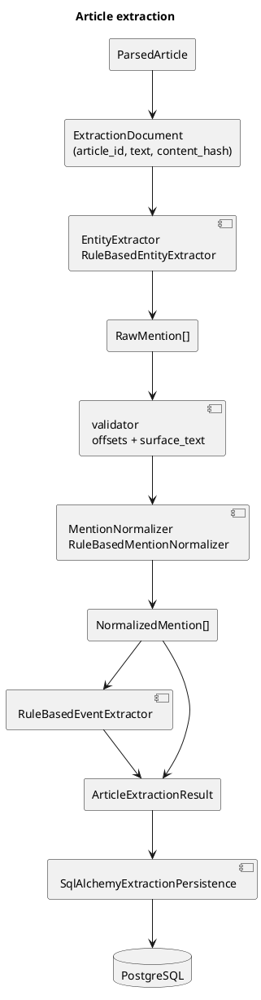

# Extraction

## Зачем это нужно

Этап 10 превращает полный `ParsedArticle.text` в проверяемые mentions и события. Постоянные chunks не возвращались: extractor работает только с текстом статьи, а любые внутренние окна не сохраняются и не имеют идентификаторов.

Extraction не создает Person. Она только говорит: “в этой статье в этих offsets
есть mention человека/суда/организации/правовой ссылки и такое-то событие”.

## Быстрый сценарий

```bash
uv run python src/main.py extract-entities --article-id 123
uv run python src/main.py extract-entities --source ovd-info --limit 100
uv run python src/main.py evaluate-extraction
```

После этого проверять `article_extraction_runs`, `entity_mentions`,
`extracted_events`, `event_entity_mentions`.

## Поток



## Mention, не canonical entity

Extraction создаёт только mention-записи: `NormalizedMention` с `entity_type=person/organization/court/location/legal_reference` и typed `normalized_data`. Оно не решает, что `Александр Иванов`, `Саша Иванов` и `А. П. Иванов` один человек. Нет таблицы `persons`, fuzzy matching между статьями, Росфинмониторинга или entity resolution.

## Типы

`EntityType`:

- `person`
- `organization`
- `court`
- `location`
- `legal_reference`

`EventType`:

- `case_opened`
- `search`
- `detention`
- `arrest`
- `charge`
- `sentence`
- `fine`
- `release`
- `other`

Роли связи события с mention:

- `subject`
- `target`
- `court`
- `authority`
- `location`
- `legal_basis`

## Provenance и offsets

Каждый mention хранит:

```text
article_id
article_content_hash
start_offset
end_offset
surface_text
extractor_name
extractor_version
normalizer_version
confidence
```

Инвариант перед сохранением:

```python
document.text[start_offset:end_offset] == surface_text
```

Нормализация не меняет `ParsedArticle.text`, поэтому offsets остаются offsets исходного полного текста.

`content_hash` считается по `ParsedArticle.text`. `title`, `source_name` и `source_url` в текущем baseline не участвуют в extraction logic, поэтому их изменение само по себе не создаёт новую версию extraction.

## NLP-подход

Выбран deterministic baseline без LLM и внешних API:

- regex/rule-based extraction для правовых ссылок, судов, организаций, мест, людей и событий;
- нормализация имён словарём pymorphy3 (см. «Правила имён людей» ниже);
- CPU-only, воспроизводимо, без скачивания моделей в тестах;
- Python 3.13 compatible, новых тяжёлых зависимостей нет.

Готовые русскоязычные NER/морфологические пайплайны не добавлены: для Python 3.13 и воспроизводимых CI-тестов они либо требуют тяжёлых моделей, либо скачивания, либо дают слишком большую operational cost для baseline этапа.

## Нормализация

Люди:

```text
full_name
last_name
first_name
patronymic
matching_key
```

Правовые ссылки:

```text
code
article
part
clause
```

Организации/суды:

```text
name
organization_type
location
matching_key
```

Extractor сохраняет `surface_text`. Normalizer не раскрывает инициалы догадкой и не объединяет однофамильцев.

### Правила имён людей

Имя приводится к именительному падежу словарём pymorphy3 (`extraction/name_morphology.py`) с одним родом на всё имя. Правила, найденные на реальном корпусе:

| Правило | Пример |
|---|---|
| Слова имени читаются в одном роде: если угаданный род склонил одно слово, остальные склоняются следом | «Даниила Неонова» → «Даниил Неонов», не «Даниила Неонов» |
| Предлог, требующий только родительного падежа (`для`, `у`, `от`, `без`, `против`, …), задаёт род того же имени во всей статье | «для Евгения Поливко» → «Евгений Поливко» |
| Отчество задаёт род раньше фамилии, известной словарю в одном роде | «Ипатова Елена Анатольевна» остаётся женщиной |
| Незнакомое слово перед отчеством или перед «имя отчество» — часть имени | «Мемет Решатович Белялов», «Скобов Александр Валерьевич» |
| Фамилия, совпадающая с обычным словом, остаётся перед «имя отчество», если окончание фамильное | «Салманов Рамиль Дилгамович» |
| Человек, против которого направлено преступление, — не цель события | «подготовка убийства министра Вадима Волченко» |
| Карточка реестра «Мемориала»: человек — заголовок карточки, как есть, без поиска и склонения | «Ярош Сергей Васильевич» |

Остатки: около 0,1 % персон с косвенным падежом по словарю, почти все — несклоняемые и иностранные фамилии («Бонцлер», «Урсу»).

### Версии

Версия каждого компонента входит в ключ `article_extraction_runs`: при смене версии статья получает **второй** run рядом со старым, старые упоминания остаются. Поэтому после смены версии нужна пересборка производных данных (`TRUNCATE` + extract/ER/РФМ/классификация), иначе упоминания удвоятся. Исключение — новые статьи и новые источники: `extract-entities --source <name>` извлекает только их, старых run у них нет.

| Компонент | Версия |
|---|---|
| `RuleBasedEntityExtractor` | 1.5.0 (с распознавателем — 2.3.0) |
| `RuleBasedMentionNormalizer` | 1.5.0 |
| `RuleBasedEventExtractor` | 1.8.0 |

## Таблицы

- `article_extraction_runs` — версия extraction для конкретного `article_id` + `content_hash` + versions.
- `entity_mentions` — normalized mentions с JSONB `normalized_data`.
- `extracted_events` — события и attributes JSONB.
- `event_entity_mentions` — связи event/mention/role.

Удаление run каскадно удаляет mentions, events и links. Уникальный ключ run обеспечивает идемпотентность повторного запуска той же версии.

## CLI

```bash
uv run python src/main.py extract-entities --article-id 123
uv run python src/main.py extract-entities --source ovd-info --limit 100
uv run python src/main.py extract-entities --source sota-vision --limit 100
uv run python src/main.py extract-entities --source memopzk-figurants --limit 10000
uv run python src/main.py evaluate-extraction
```

## Golden dataset и метрики

Golden corpus: `tests/fixtures/extraction_golden_corpus.json`.

Он содержит 10 коротких вручную составленных статей по ОВД-Инфо и SOTA, положительные и отрицательные примеры, ФИО, инициалы, иностранное имя, организации, суды, места, правовые ссылки и несколько событий в одной статье.

Метрики:

- exact-span precision
- exact-span recall
- exact-span F1
- entity-type accuracy
- normalization accuracy
- event-type accuracy

Отчёт также содержит missed/false-positive/wrong-type/wrong-normalization/event errors.

## Кодовые точки входа

| Сценарий | Код |
|---|---|
| extraction models | `src/extraction/models.py` |
| rule-based mentions | `src/extraction/extractors.py` |
| normalization | `src/extraction/normalizers.py`, `src/extraction/name_morphology.py` |
| events | `src/extraction/events.py` |
| pipeline | `src/extraction/pipeline.py` |
| persistence | `src/extraction/persistence.py` |
| CLI/evaluation | `src/extraction/cli.py`, `src/extraction/metrics.py` |

## Ограничения

- Baseline rule-based, не полноценный NER.
- Нормализация падежей имён эвристическая и может ошибаться.
- События извлекаются по триггерам в предложении, без юридического вывода.
- Нет entity resolution и объединения mentions.
- Нет chunks, Qdrant, GraphRAG, UI, LLM, внешних платных API.
