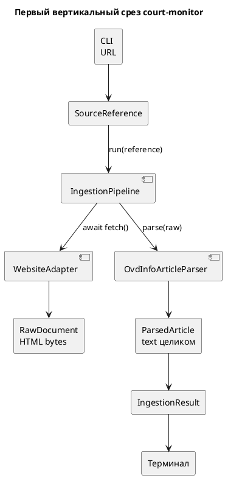

# Ingestion

Загрузка одной публикации ОВД-Инфо и подготовка её к сохранению и поиску.

## Шаги

*(взято из `docs/uml/Первый вертикальный срез court-monitor.puml`)*

### 1. `WebsiteAdapter.fetch()`

`src/website_adapter.py`. Асинхронный GET (`httpx`, timeout 5s, фиксированный `User-Agent`). Возвращает `RawDocument`: `content` (сырые байты), `content_type`, `fetched_at` (UTC, момент загрузки), `url` (после редиректов — `str(response.url)`).

### 2. `OvdInfoArticleParser.parse()`

`src/article_parser.py`. HTML-парсинг через `selectolax`, селекторы жёстко заданы под вёрстку ovd.info:

- заголовок: `h1.express-text-heading`
- дата публикации: `#article_published`, формат `%d.%m.%Y, %H:%M`, таймзона `Europe/Moscow`
- параграфы текста: `.field--name-field-express-text > p`

Параграфы соединяются через `"\n\n".join(...)` в `ParsedArticle.text` — единственный source of truth содержимого статьи. Chunking (разбиение на фрагменты) в pipeline не входит: если алгоритму понадобятся фрагменты, они вычисляются временно в памяти (`split(article.text)`) и не сохраняются в БД.

Парсер бросает `ValueError`, если не найден заголовок или нет ни одного параграфа — т.е. жёстко завязан на структуру одного сайта (не универсальный HTML-экстрактор).

### 3. Persistence

`IngestionPipeline.run()` передаёт `raw_document` и `parsed` в `IngestionPersistence.save()` — подробности на странице [Data-Model](Data-Model.md).

## Идемпотентность

`IngestionPipeline` не проверяет, была ли публикация уже загружена — идемпотентность (upsert по `external_id`) реализована на уровне persistence, не здесь.
