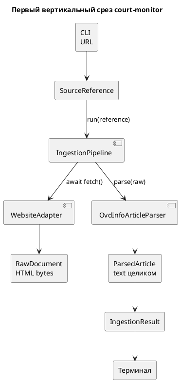

# Ingestion

## Зачем это нужно

Загрузка публикаций и подготовка их к сохранению и поиску. Есть два уровня:

- **discovery** (этап 9) — `SourceAdapter.discover(limit)` находит ссылки на статьи на сайте источника (листинг + pagination) и возвращает `list[SourceReference]`;
- **ingestion одной статьи** — `IngestionPipeline.run(reference)` (см. ниже) — fetch → parse → persist, источник-агностичен.

`SourceIngestion.run(limit)` связывает оба уровня: discovery, затем `IngestionPipeline.run()` по очереди для каждой ссылки. Ошибка одной статьи (`IngestionError`) не прерывает обработку остальных — попадает в `SourceIngestionResult.failures`; программная ошибка (например, `TypeError`) не перехватывается и пробрасывается наверх.

## Быстрый сценарий

```bash
uv run python src/main.py discover-and-ingest --source ovd-info --limit 20
uv run python src/main.py discover-and-ingest --source tg-example --limit 50
uv run python src/main.py ingest "https://ovd.info/news/example"
```

Ожидание: новые публикации появляются в `source_documents` и
`parsed_articles`; повтор той же публикации не создаёт дубль, а обновляет
существующую запись по `(source_id, external_id)`.

## Источники

| Источник | `SourceAdapter` | Листинг | `ArticleParser` |
|---|---|---|---|
| ОВД-Инфо (`ovd-info`) | `OvdInfoSourceAdapter` | `https://ovd.info/express-news`, pagination `?page=N` (Drupal) | `OvdInfoArticleParser` |
| SOTA (`sota-vision`) | `SotaVisionSourceAdapter` | `https://sota.vision/category/news/`, pagination `/page/N/` (WordPress) | `SotaVisionArticleParser` |
| Telegram-каналы (`tg-<username>`, 70 шт.) | `TelegramSourceAdapter` | публичное веб-превью `https://t.me/s/<username>`, pagination `?before=<id>` | `TelegramPostParser` |
| 2-й Западный окружной военный суд (`sudrf-2zovs`) | `SudrfSourceAdapter` | `https://2zovs.msk.sudrf.ru/modules.php?name=press_dep`, pagination по годам `&op=12&arc_list=YYYY` | `SudrfArticleParser` |
| Реестр фигурантов «Мемориала» (`memopzk-figurants`) | `MemopzkFigurantAdapter` | REST `https://memopzk.org/wp-json/wp/v2/figurant`, по 100 карточек, сначала изменённые, пауза 10 с | `FigurantParser` |
| Коммерсантъ, сайт (`kommersant`) | `RssSourceAdapter` | RSS `https://www.kommersant.ru/RSS/news.xml`, фильтр по рубрике и словам о суде | `KommersantArticleParser` |

Все реализуют один и тот же `Protocol SourceAdapter` (`sources/source_adapter.py`) и берут загрузку листинга из общего `sources/discovery_pagination.py`: `fetch_listing_page_with_retry` (retry только на `TransportError`/HTTP 429/5xx с экспоненциальным backoff, обычные 4xx — `PermanentDiscoveryError` без retry). Обход страниц общий — `discover_paginated_references` (dedup по `external_id` между страницами, остановка на пустой странице / странице без новых ссылок) — только у `ovd-info` и `sota-vision`: они нумеруют страницы подряд. Telegram листает по `?before=<id>` до границы по дате, а `sudrf` — по годовым архивам, ссылки на которые читает с уже загруженной страницы, поэтому у обоих свой цикл обхода.

`src/main.py discover-and-ingest --source <name> --limit N` выбирает источник через `source_registry.SOURCES` — добавление источника не требует правок `IngestionPipeline`, `SourceIngestion` или persistence-интерфейсов, только новых `*_reference.py` / `*_listing_parser.py` / `*_source_adapter.py` / `*_article_parser.py` + запись в реестр.

### Telegram-каналы

Список каналов — `src/sources/telegram/channels.csv` (`username`, `title`, `topics`); добавить канал = добавить строку. Каждый канал — отдельный источник `tg-<username>` (`source_name` = название канала, `base_url` = `https://t.me/<username>`), все включены в monitoring по умолчанию.

- Discovery листает веб-превью от новых постов к старым (≥ 1 с между страницами канала) и останавливается на `limit` или на постах старше окна истории; посты без текста (только медиа) пропускаются.
- Окно истории — переменная окружения `TELEGRAM_HISTORY_DAYS` (по умолчанию 30 дней), читается один раз при сборке реестра источников и проверяется при старте процесса (`ApplicationSettings`). Разовый бэкфилл канала глубже 30 дней требует запуска с большим значением, например `TELEGRAM_HISTORY_DAYS=120 uv run python src/main.py discover-and-ingest --source tg-<username> --limit 500`; на обычный monitoring-прогон значение по умолчанию не меняем.
- Документ — один пост: `https://t.me/<username>/<id>?embed=1&mode=tme` (текст и дата поста; ссылка открывается в браузере). Заголовок — первая строка поста.
- Аккаунт и API-ключи Telegram не нужны; канал без публичного веб-превью не даёт постов.

### Суды на движке `sudrf.ru`

Сайты судов общей юрисдикции работают на одном движке, модуль пресс-службы — `modules.php?name=press_dep`. `sources/sudrf/` параметризован хостом, поэтому один адаптер обслуживает любой суд; в реестре объявлен один — `SUDRF_2ZOVS` на `2zovs.msk.sudrf.ru`. Добавить ещё суд = вызвать `sudrf_source(name, title, host)` и положить результат в `SOURCES`.

- Страница свежих новостей (`?name=press_dep`) показывает 30 последних материалов; всё, что старше, лежит на странице архива своего года (`&op=12&arc_list=YYYY`), и год умещается в одну страницу. Discovery читает ссылки на архивы с уже загруженной страницы и идёт по годам от новых к старым — помесячные архивы пропускаются, они подмножества годовых.
- Страницы отдают windows-1251 и объявляют кодировку в `<meta>`; `selectolax` её учитывает, поэтому разбор идёт из байтов без явного decode.
- Суд публикует ссылки на себя под хостом `2zovs--msk.sudrf.ru`, который редиректит на канонический. Оба хоста заданы явным allowlist (`sudrf_host_aliases`), а не заменой всех `--` на точку: такая замена приняла бы и `2zovs.msk.sudrf--ru` — отдельно регистрируемый домен.
- Тело новости начинается с повторения заголовка отдельным абзацем. Парсер отбрасывает этот абзац при точном совпадении с заголовком: иначе extractor читает каждый приговор дважды.

### Реестр фигурантов «Мемориала» (ADR 0017)

Карточка реестра — один преследуемый человек: ФИО, статьи, регион, стадия, мера, категория, список. Поля есть в самом листинге, поэтому адаптер не скачивает страницы: `fetch` отдаёт карточку, найденную при discovery (кеш процесса переживает экземпляр адаптера — мониторинг ищет и загружает разными экземплярами); карточка вне листинга скачивается отдельно с паузой `Crawl-delay`. Полная первичная загрузка — 72 запроса, около 12 минут:

```bash
uv run python src/main.py discover-and-ingest --source memopzk-figurants --limit 8000
```

`FigurantParser` пишет из карточки короткий текст («Ярош Сергей Васильевич обвиняется по статьям: ч. 2 ст. 205.2 УК РФ…»). Заголовок карточки — ФИО в именительном падеже: для этого источника извлечение берёт человека из заголовка и не склоняет его. Карточка без полного имени (одни инициалы) не загружается. Изменённая после загрузки карточка не перечитывается.

### Коммерсантъ

Сайт называет подсудимых, которых Telegram-канал издания оставляет без имени. Из RSS берутся только новости вне рубрик «Мир», «Спорт», «Бизнес» и т. п. со словами о суде, задержании или деле (около 25 в день); скачиваются только их страницы (`p.doc__text`, дата из JSON-LD).

### Канонический `SourceReference`

Каждый источник даёт единую функцию `canonicalize_<source>_reference(url) -> SourceReference | None` (`sources/ovd_info/reference.py`, `sources/sota_vision/reference.py`; у `sources/sudrf/reference.py` первым аргументом идёт хост суда): убирает query/fragment, проверяет домен и путь, отдаёт стабильный `external_id`. Ей пользуются и listing-парсер (при discovery), и прямой CLI-ingest по URL — поэтому `ingest URL` и обнаруженная через `discover-and-ingest` та же статья дают один и тот же `SourceReference`, а не два разных документа в БД.

## Шаги (одна статья)



*(взято из `docs/uml/Первый вертикальный срез court-monitor.puml`)*

### 1. `WebsiteAdapter.fetch()`

`src/sources/website_adapter.py`. Асинхронный GET (`httpx`, timeout 5s, фиксированный `User-Agent`). Возвращает `RawDocument`: `content` (сырые байты), `content_type`, `fetched_at` (UTC, момент загрузки), `url` (после редиректов — `str(response.url)`).

### 2. `OvdInfoArticleParser.parse()`

`src/sources/article_parser.py`. HTML-парсинг через `selectolax`, селекторы жёстко заданы под вёрстку ovd.info:

- заголовок: `h1.express-text-heading`
- дата публикации: `#article_published`, формат `%d.%m.%Y, %H:%M`, таймзона `Europe/Moscow`
- параграфы текста: `.field--name-field-express-text > p`

Параграфы соединяются через `"\n\n".join(...)` в `ParsedArticle.text` — единственный source of truth содержимого статьи. Chunking (разбиение на фрагменты) в pipeline не входит: если алгоритму понадобятся фрагменты, они вычисляются временно в памяти (`split(article.text)`) и не сохраняются в БД.

Парсер бросает `ValueError`, если не найден заголовок или нет ни одного параграфа — т.е. жёстко завязан на структуру одного сайта (не универсальный HTML-экстрактор).

### 3. Persistence

`IngestionPipeline.run()` передаёт `raw_document` и `parsed` в `IngestionPersistence.save()` — подробности на странице [Data-Model](Data-Model.md).

## Идемпотентность

`IngestionPipeline` не проверяет, была ли публикация уже загружена — идемпотентность (upsert по `external_id`) реализована на уровне persistence, не здесь.

## Кодовые точки входа

| Сценарий | Код |
|---|---|
| source registry | `src/sources/source_registry.py` |
| source protocol | `src/sources/source_adapter.py` |
| discovery helpers | `src/sources/discovery_pagination.py` |
| one article pipeline | `src/sources/ingestion_pipeline.py` |
| batch source ingestion | `src/sources/source_ingestion.py` |
| persistence | `src/sources/sqlalchemy_persistence.py` |
| CLI | `src/sources/cli.py` |

## Проверка

```bash
uv run pytest tests/sources
uv run python src/main.py discover-and-ingest --source ovd-info --limit 1
```

## Ограничения и типичные ошибки

- Изменившийся на сайте документ обычный incremental run может не перечитать,
  если `(source, external_id)` уже есть.
- Telegram discovery зависит от публичного web preview; приватные каналы не
  читаются.
- `TELEGRAM_HISTORY_DAYS` читается при старте процесса.
- Ошибка одной статьи не валит всю пачку, но должна попасть в failures/run items.
