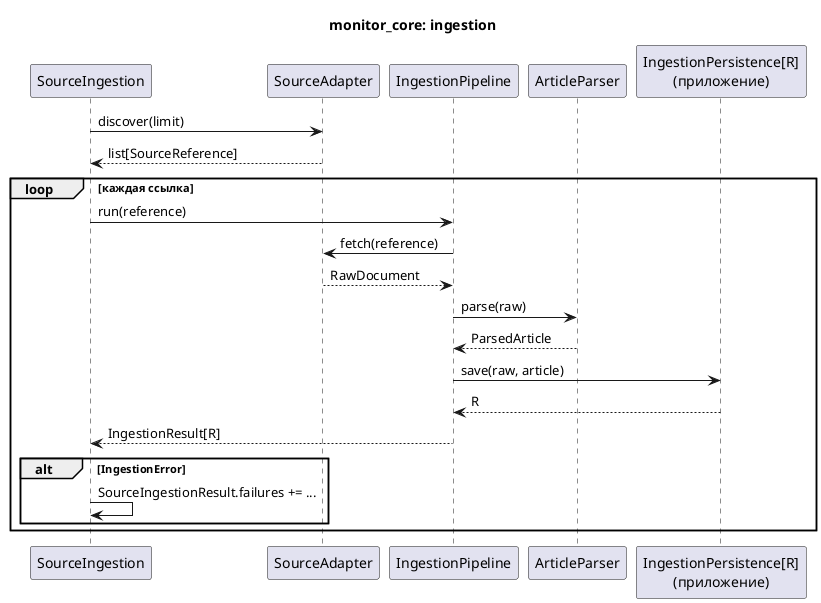
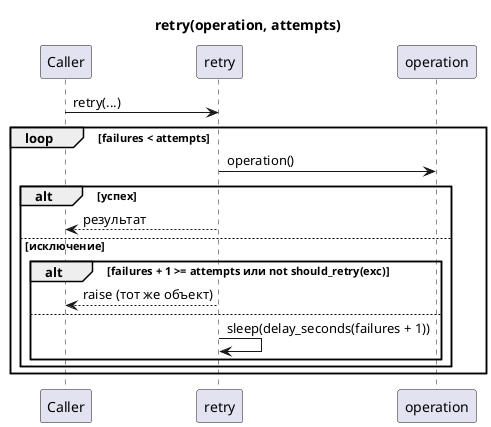

# Monitor Core

## Зачем это нужно

`src/monitor_core` — переиспользуемое ядро для мониторинга адресуемых текстовых
источников: найти ссылки, скачать документ, разобрать его в текст и отдать
хранилищу потребителя. Отдельно в ядре лежат OpenAI-совместимый транспорт
JSON-чата и общий sync/async retry.

Ядро ничего не знает о судах, делах и людях. Извлечение, схема БД, политики
источников, промпты, entity resolution, поиск, `MonitoringService` и Dagster
остаются в приложении. Это не универсальный framework, а общий механизм
content monitoring; почему граница проведена так — [ADR 0023](../adr/0023-monitor-core.md).

Оператору страница не нужна: команды и поведение ingestion не изменились, см.
[Ingestion](Ingestion.md) и [Monitoring](Monitoring.md).

## Быстрый сценарий

Новый источник Court Monitor реализует протоколы ядра и регистрируется в
`src/sources/source_registry.py` — ядро при этом не меняется (подробно — в
[Ingestion](Ingestion.md)).

Новый потребитель ядра собирает тот же конвейер из своих частей:

```python
from monitor_core.ingestion import IngestionPipeline
from monitor_core.model import SourceReference

pipeline = IngestionPipeline(
    source_adapter=my_fetcher,  # DocumentFetcher
    parser=my_parser,           # ArticleParser
    persistence=my_store,       # IngestionPersistence[int]
)
result = await pipeline.run(SourceReference(external_id="1", url="https://example.test/1"))
result.persistence  # то, что вернул my_store.save(): здесь int
```

Рабочий пример второго потребителя (мониторинг новостей компаний, только
публичный API ядра, без импортов Court Monitor) —
`tests/monitor_core/example_consumer/test_company_news_monitor.py`.

## Что происходит внутри



`IngestionPipeline` даёт и шаги по отдельности: `read(reference)` (fetch + parse
→ `FetchedArticle`) и `save(fetched)`. `MonitoringService` пользуется ими, чтобы
между чтением и записью применить свою политику: пропуск `NoTextError`, окно дат,
изоляцию ошибок по элементам и счётчики.

`RetryingDocumentFetcher` оборачивает любой `DocumentFetcher` и повторяет только
`TransientFetchError` (по умолчанию 3 попытки, пауза 0.5 с, затем ×2).

### Retry

`monitor_core.retry.retry` / `retry_async(operation, *, attempts, should_retry,
delay_seconds, sleep)`: `attempts` — общее число вызовов; что повторять, сколько
ждать и чем спать решает вызывающий код. Последняя или неповторяемая ошибка
выходит тем же объектом (`raise` без обёртки). Сон выполняется внутри `except`,
поэтому исключение, прервавшее сон, несёт упавшую попытку в `__context__`.



Пользователи: AI entity review (`src/persons/resolution/ai_review_service.py`,
sync, `attempts = ENTITY_REVIEW_MAX_RETRIES + 1`) и `RetryingDocumentFetcher`
(async).

### LLM transport

`monitor_core.llm.post_json_chat` собирает тело OpenAI-совместимого запроса со
`response_format = json_schema` и `temperature = 0` и отправляет его;
`read_chat_completion` читает первый choice в `ChatCompletion`. Ошибки httpx и
любой HTTP-статус возвращаются вызывающему как есть; битый конверт — одно из
`CHAT_ENVELOPE_ERRORS`. Решения о том, что считать ошибкой, как её назвать,
показывать ли тело ответа провайдера и какие у провайдера дополнительные опции,
принимает клиент:

- OpenRouter — `src/entities/llm.py` (`chat_json`, `Endpoint`, `ModelError`, учёт
  стоимости);
- Together и совместимые серверы — `src/llm/together_client.py`.

## Кодовые точки входа

Снаружи ядро импортируется только из публичных пакетов; у каждого есть
`__all__`, корень `monitor_core` ничего не экспортирует.

| Пакет | Что внутри |
|---|---|
| `monitor_core.model` | `SourceReference`, `RawDocument`, `ParsedArticle`, `IngestionResult[R]` |
| `monitor_core.ports` | `DocumentFetcher`, `SourceAdapter`, `ArticleParser`, `IngestionPersistence[R]` |
| `monitor_core.ingestion` | `IngestionPipeline[R]`, `FetchedArticle`, `SourceIngestion[R]`, `SourceIngestionResult[R]`, `SourceIngestionFailure`, `ArticleIngestionPipeline[R]`, `RetryingDocumentFetcher` |
| `monitor_core.errors` | `IngestionError` и наследники: fetch/parse/no text/persistence/discovery, `ListingPageNotFoundError` |
| `monitor_core.llm` | `post_json_chat`, `read_chat_completion`, `ChatCompletion`, `CHAT_ENVELOPE_ERRORS` |
| `monitor_core.retry` | `retry`, `retry_async` |

Где ядро используется в приложении:

| Сценарий | Код |
|---|---|
| CLI `ingest` / `discover-and-ingest` | `src/cli/ingestion.py` |
| automated monitoring | `src/monitoring/service.py` (`_ingest_references`) |
| источники, парсеры, discovery | `src/sources/` |
| хранилище и его результат `SqlAlchemyPersistenceResult` | `src/sources/sqlalchemy_persistence.py` |
| OpenRouter / Together | `src/entities/llm.py`, `src/llm/together_client.py` |
| AI entity review retry | `src/persons/resolution/ai_review_service.py` |

## Проверка

```bash
uv run pytest tests/monitor_core
uv run mypy --strict src tests
```

Инварианты, которые охраняют тесты:

- `tests/monitor_core/test_monitor_core_boundary.py` — ядро не импортирует пакеты
  приложения; внешний код импортирует ядро только через публичные пакеты;
  удалённые модули-прослойки `sources.*` не возвращаются;
- `tests/monitor_core/test_monitor_core_public_api.py` — точный состав `__all__`
  каждого пакета; ядро не знает полей результата хранилища;
- `tests/monitor_core/test_monitor_core_ports.py` — реализации ОВД-Инфо
  соответствуют протоколам (проверяет mypy);
- characterization-тесты, зафиксировавшие поведение до переноса:
  `tests/app/test_discover_and_ingest_characterization.py`,
  `tests/monitoring/test_monitoring_ingestion_characterization.py` (нужна БД),
  `tests/entities/test_digest_llm_characterization.py`,
  `tests/llm/test_together_characterization.py`,
  `tests/persons/test_entity_review_retry_characterization.py`,
  `tests/sources/test_retrying_fetcher_characterization.py`.

## Ограничения и типичные ошибки

- Импорт из модуля за публичным пакетом (`monitor_core.ingestion.pipeline`) или
  импорт пакета приложения внутри ядра валит architecture guard — это намеренно.
- Источник должен быть адресуемым (`SourceReference.url` обязателен) и текстовым
  (`ParsedArticle.title` и `text`).
- LLM transport синхронный, ingestion асинхронный.
- `temperature = 0` зашит в транспорт; другое значение передаётся через
  `extra_body`.
- `CHAT_ENVELOPE_ERRORS` — это встроенные `ValueError`/`KeyError`/`IndexError`/
  `TypeError`, а не собственный тип ошибки.
- Намеренно не перенесены: retry в `src/monitoring/decision_screen.py`,
  `fetch_listing_page_with_retry` в `src/sources/discovery_pagination.py`,
  Anthropic-путь в `src/entities/normalizer.py`, `src/llm/cli_reviewer.py`.
- Отложено (не баги): `ParsedArticle` / `ArticleParser` уже, чем реальная
  семантика документа; параметр `IngestionPipeline(source_adapter=...)` принимает
  любой `DocumentFetcher`; `monitor_core/ingestion/retry.py` можно переименовать в
  `retrying_fetcher.py`.
