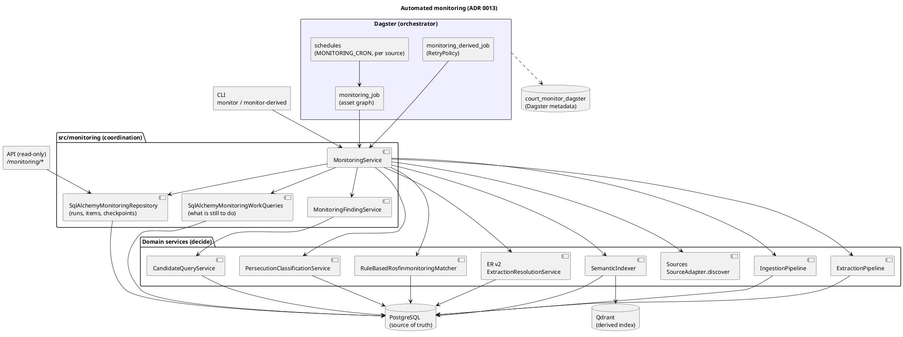
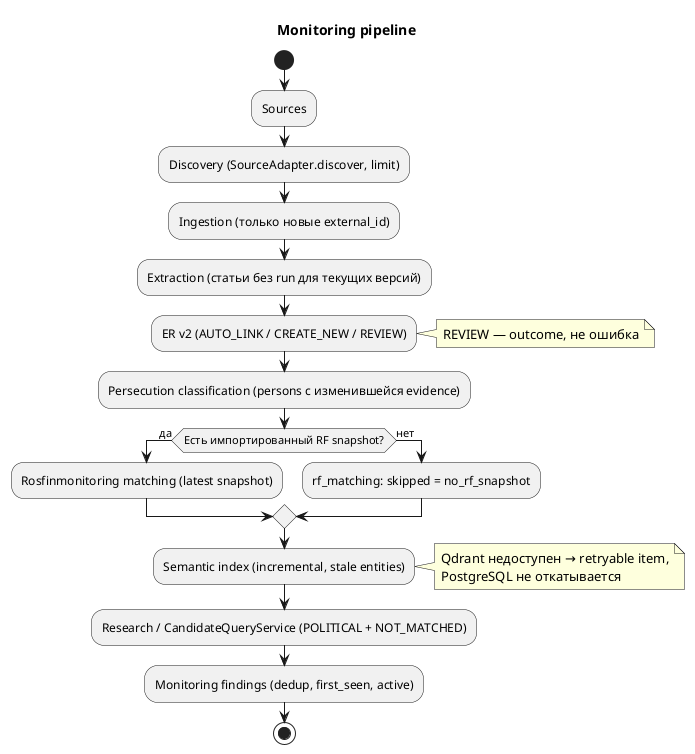
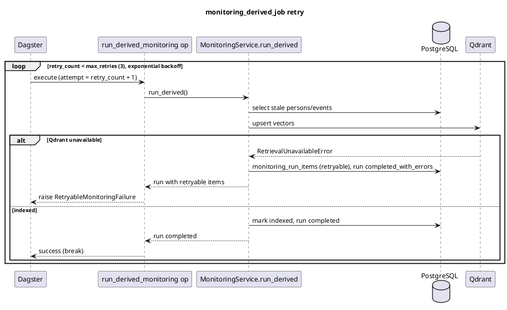

# Monitoring

Автоматический, повторяемый и наблюдаемый прогон всего pipeline по расписанию. Решение и мотивация — [ADR 0013](../adr/0013-automated-monitoring.md). Принцип: **orchestrator coordinates, domain services decide** — monitoring только вызывает существующие сервисы и ведёт учёт run'ов.

## Архитектура

Dagster — оболочка вокруг pipeline, а не часть домена: он запускает те же методы `MonitoringService`, что и CLI.



## Поток данных



Asset graph Dagster повторяет эти этапы: `source_discovery → source_ingestion → entity_extraction → person_resolution → persecution_classification → rosfinmonitoring_matching → semantic_indexing → monitoring_summary`. Между assets передаются только `RunHandle`, IDs и счётчики — не тексты статей.

## Идемпотентность и восстановление

Каждый этап сам выбирает недоделанную работу из PostgreSQL (`src/monitoring/selection.py`), поэтому любой run, job или asset можно выполнить повторно (at-least-once):

| Этап | Что выбирается |
|---|---|
| discovery/ingestion | ссылки, чьего `(source, external_id)` ещё нет в `source_documents` |
| extraction | статьи источника без extraction run для текущих версий extractor/normalizer |
| resolution | успешные runs с непривязанным person mention без ER-решения |
| classification | активные persons без классификации текущей версии или с evidence новее неё |
| RF matching | активные persons без match для latest snapshot или с evidence новее него |
| semantic | persons/events с отсутствующим, неиндексированным или устаревшим документом |

Evidence change — самое позднее из: person создан/обновлён, привязано событие, добавлен alias, записано или отревьюено ER-решение. Результат считается свежим, только если записан позже изменения evidence как минимум на `EVIDENCE_SETTLE_INTERVAL` (10 минут): timestamps evidence — это начало транзакции, а не commit, и без запаса параллельный run мог бы классифицировать Person до commit чужой ER-транзакции и больше её не пересчитать. Цена — один идемпотентный пересчёт недавно изменённых persons. Поэтому Person, созданная ручным ER review, будет классифицирована, сматчена и проиндексирована следующим run'ом без повторного ingestion.

Сценарий «discover OK → ingest OK → extraction упал на середине»: следующий run помечает старый run `aborted` (нет heartbeat дольше `MONITORING_STALE_RUN_AFTER_MINUTES`), не скачивает уже сохранённые документы и доделывает extraction/ER/классификацию. Ручная очистка не нужна.

## Ретраи Dagster

Ретрай есть только у `monitoring_derived_job`; HTTP ретраит сам source layer, поэтому у `monitoring_job` retry policy нет. Ретраятся только retryable-сбои: retryable items или run `failed` с `stage_metrics.run.failure_kind = retryable`. Ошибка кода или конфигурации → `dagster.Failure(allow_retries=False)`, без повторов.



## Run, статусы, ошибки

- `monitoring_runs.status`: `running`, `completed`, `completed_with_errors` (есть item failures), `failed` (упал этап целиком), `aborted` (stale).
- Счётчики: `documents_discovered/ingested/skipped/failed`, `articles_extracted`, `events_created`, `persons_created/linked`, `person_reviews_created`, `classifications_created`, `rf_matches_created`, `semantic_entities_indexed`, `findings_created`, `error_count`.
- `stage_metrics`: разбивки по этапам — статусы классификации и RF, `duration_ms`, `skipped` (`no_rf_snapshot`), `status` semantic (`indexed` / `failed` / `not_configured`).
- `monitoring_run_items`: какой объект упал — stage, entity type/id или URL, `error_type`, сообщение (без SQL-параметров), `failure_kind` (`retryable` / `non_retryable`, по типу исключения).

Структурированные логи (logger `monitoring`, stderr): `monitoring_run_started`, `monitoring_discovery_completed`, `monitoring_ingestion_completed`, `monitoring_extraction_completed`, `monitoring_er_completed`, `monitoring_classification_completed`, `monitoring_rf_completed`, `monitoring_semantic_completed`, `monitoring_findings_completed`, `monitoring_run_completed`, `monitoring_run_failed`, плюс `monitoring_item_failed` и `monitoring_run_aborted_stale`. Секреты (DATABASE_URL, ключи) не логируются и не попадают в Dagster config.

## Параллельность

- Один источник — один `running` run: partial unique index на `monitoring_runs(scope)`. Второй запуск получает `already_running` (CLI, exit code 3) или пропуск этапов (Dagster).
- Разные источники работают параллельно.
- Глобальные derived-этапы сериализуются advisory lock'ами `monitoring:derived:<stage>`. Lock ждётся опросом `pg_try_advisory_lock`, и пока run ждёт, он обновляет heartbeat — живой run не считается stale.
- Fencing: все служебные записи run идут с `WHERE status = 'running'`. Worker, чей run уже помечен `aborted`, получает `MonitoringRunAbortedError` на ближайшем heartbeat (перед каждым этапом и каждой единицей работы) и останавливается, не продолжая работу рядом с новым run.

## Findings

`monitoring_findings` — «в этом monitoring workflow появился actionable результат», а не статус Person.

- Критерий MVP: `political_persecution_not_in_rf` / `enbv-v1` — через `CandidateQueryService` (latest classification `political`, confidence ≥ 0.7, RF `not_matched` для latest snapshot). RF `ambiguous`/`needs_review`/`insufficient_data` не считаются отсутствием.
- Dedup: `(finding_type, person_id, criteria_version)`; повторный run обновляет только `last_seen_*`.
- История: `first_seen_run_id`/`first_seen_at` не меняются; перестал удовлетворять критерию → `active = false`, `inactive_since`. «Когда Person впервые попала в результаты и в каком run» — `first_seen_*`.
- Provenance: `persecution_classification_id`, `rosfin_match_id`, `snapshot_id`; evidence и источники — через Person (`POST /research`).
- Без RF snapshot оценка пропускается (`no_rf_snapshot`), ложных findings нет.
- Новые критерии — через `MonitoringQueryProvider`.

## Запуск

```bash
set -a; source .env; set +a
uv run alembic upgrade head

# все MONITORING_ENABLED_SOURCES
uv run python src/main.py monitor
# один источник
uv run python src/main.py monitor --source ovd-info
# только discovery: ничего не пишет, checkpoint не меняет
uv run python src/main.py monitor --source ovd-info --dry-run --limit 5
# backfill (checkpoint не меняет)
uv run python src/main.py monitor --backfill --source ovd-info --limit 500
# повторить classification / RF / semantic / findings без web discovery
uv run python src/main.py monitor-derived
# статус, один run с упавшими объектами, findings
uv run python src/main.py monitoring-status
uv run python src/main.py monitoring-status --run-id 12
uv run python src/main.py monitoring-findings --all
```

API (read-only): `GET /monitoring/status`, `GET /monitoring/runs?source=&status=&limit=`, `GET /monitoring/runs/{id}`, `GET /monitoring/findings?active_only=`.

### Dagster локально

```bash
set -a; source .env; set +a
cd src && uv run dagster dev -m monitoring.dagster.definitions
# http://127.0.0.1:3000 → Jobs → monitoring_job, config:
#   ops: {source_discovery: {config: {source: ovd-info, discovery_limit: 5}}}
```

Schedules создаются выключенными (`STOPPED`) — включаются в UI. Для постоянного instance задать `DAGSTER_HOME`.

### Docker compose

```bash
docker compose up -d postgres
uv run alembic upgrade head
docker compose --profile monitoring up -d --build   # webserver :3000, daemon
```

`dagster-db-init` создаёт отдельную БД `DAGSTER_PG_DB` (по умолчанию `court_monitor_dagster`); таблицы Dagster не смешиваются с доменными. Semantic-этап в контейнерах: собрать образ с `--build-arg INSTALL_SEMANTIC=1`, поднять `--profile semantic` и задать `MONITORING_QDRANT_URL=http://qdrant:6333`. На видеокарте NVIDIA: `compose.gpu.yaml` собирает образ с semantic и распознавателем имён (GLiNER), отдаёт GPU контейнерам `api` и `dagster-daemon` и включает `PERSON_EXTRACTION_STRATEGY=hybrid` и semantic-этап; подготовка хоста описана в заголовке файла.

## Ограничения

- Изменившийся на источнике документ обычным run'ом не перечитывается; `--backfill --refetch-known` перечитает, extraction создаст run для нового content hash рядом со старым (versioning документов не делался).
- Отдельные assets и «re-execute from failure» в Dagster для `monitoring_job` не поддерживаются (in-memory IO: handle упавшего процесса потерян) — запускать job целиком заново, это безопасно; изоляция этапов — через `monitoring_derived_job` / `monitor-derived`.
- Settle-интервал предполагает расхождение часов приложения и БД меньше 10 минут.
- `external_ref` и тексты ошибок хранятся как есть (SQL-параметры вырезаются). У текущих источников URL публичные; для источника с токенами в URL нужна санитизация.
- Первый run на существующей БД догоняет классификацию/RF/индекс для всех persons без актуального результата.
- `person_reviews_created` может переучитывать уже pending review при повторном разрешении extraction run со смешанными mentions.
- Упавший RF match для Person временно деактивирует её finding до следующего успешного match (история сохраняется).
- Внешних уведомлений (Telegram/email) нет — этап 7.
