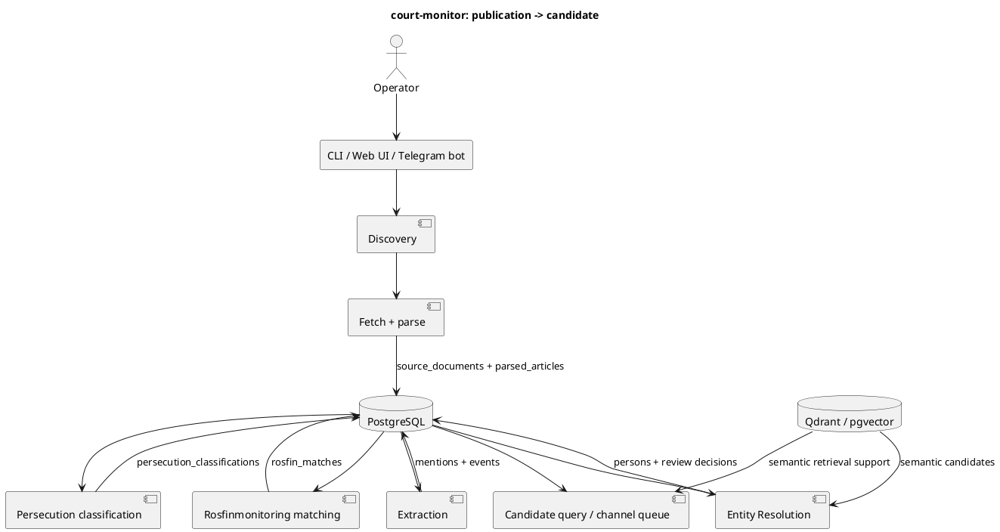

# Overview

## Зачем это нужно

`court-monitor` превращает публикации из источников в список людей, которых надо
проверить оператору: есть ли политическое преследование и нет ли человека в
выбранном snapshot Росфинмониторинга.

Оператору эта страница дает общий маршрут. Программисту — карту модулей и
данных.

## Быстрый сценарий

Минимальный ручной pipeline:

```bash
uv run python src/main.py discover-and-ingest --source ovd-info --limit 10
uv run python src/main.py extract-entities --limit 100
uv run python src/main.py resolve-people --limit 100
uv run python src/main.py classify-persecution --limit 100
uv run python src/main.py match-rosfinmonitoring --snapshot-id 1
uv run python src/main.py list-candidates --snapshot-id 1 --min-confidence 0.7
```

Для регулярной работы чаще нужен monitoring:

```bash
uv run python src/main.py monitor --catch-up
uv run python src/main.py monitoring-status
```

`snapshot-id 1` в примере не универсален: брать реальный id из
`rosfinmonitoring_snapshots`.

## Что происходит внутри



## Пример результата

```text
person_id=42 name="Иван Иванов" persecution_status=political rf_status=not_matched confidence=0.92
```

Смысл: Person активен, последняя classification политическая, по выбранному
snapshot РФМ подтверждено отсутствие, запись попадает в candidates.

## Кодовые точки входа

| Модуль | Роль |
|---|---|
| `src/main.py`, `src/cli/` | CLI и lazy composition context |
| `src/api.py`, `src/web/` | FastAPI, JSON API, operator console, wiki renderer |
| `src/sources/` | source registry, adapters, fetch, parse, ingestion persistence |
| `src/extraction/` | rule-based mentions, normalization, events |
| `src/persons/` | Person persistence, ER v2, review queue, AI review |
| `src/persecution/` | political persecution classification |
| `src/rosfinmonitoring/` | snapshots and matching |
| `src/candidates/` | final candidate query |
| `src/research/` | deterministic research responses and reports |
| `src/semantic_retrieval/` | semantic documents, Qdrant/pgvector vector store |
| `src/monitoring/` | automated pipeline runs, checkpoints, findings |
| `src/db/`, `migrations/` | ORM and Alembic schema |

## Данные и артефакты

- `source_documents`, `parsed_articles` — загруженный и разобранный текст.
- `article_extraction_runs`, `entity_mentions`, `extracted_events` — extraction.
- `persons`, `person_aliases`, `person_resolution_decisions` — identity layer.
- `persecution_classifications` — последняя политическая классификация.
- `rosfinmonitoring_snapshots`, `rosfin_matches` — сверка РФМ.
- `operator_operation_runs`, `monitoring_runs` — эксплуатационная история.
- `reports/` и `evaluation/` — оценка качества.

## Проверка

```bash
uv run python src/main.py validate-config
uv run ruff check src tests migrations
uv run mypy --strict src tests
uv run pytest
```

Подробности: [Testing](Testing.md).

## Ограничения и типичные ошибки

- `list-candidates` требует загруженный snapshot РФМ и match по нему.
- ER-review убирает запись из очереди ER, но не скрывает Person из candidates:
  candidates зависят от classification, РФМ, статуса Person и UI-фильтров.
- Semantic index производный; при смене backend/model нужен rebuild.
- Текущий проверенный статус проекта не здесь, а в [Implementation
  Status](Implementation-Status.md).
