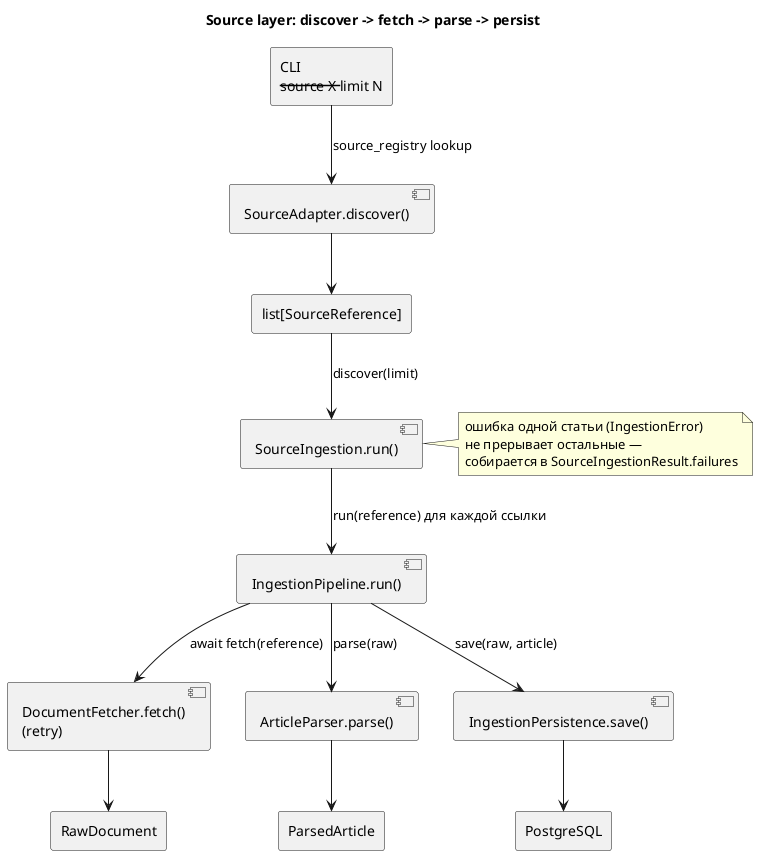

# Overview

## Поток данных (source layer, этап 9)

Один источник = один `SourceAdapter` (discover + fetch) + один `ArticleParser`. `IngestionPipeline` и `SourceIngestion` источник-агностичны — работают через `Protocol` из `source_adapter.py`/`persistence.py`, не знают о конкретном сайте.

## Модули (`src/`)

| Модуль | Роль |
|---|---|
| `main.py` | CLI: `ingest`, `discover-and-ingest --source ...`, `search`, `evaluate-search` |
| `models.py` | Pydantic-модели домена (`SourceReference` … `SearchHit`) — см. [CONTEXT.md](../../CONTEXT.md) |
| `source_adapter.py` | `Protocol DocumentFetcher`/`SourceAdapter` — контракт `discover()`/`fetch()` |
| `source_registry.py` | `SourceDefinition` + реестр источников (`ovd-info`, `sota-vision`) для CLI |
| `source_ingestion.py` | `SourceIngestion` — discover → пройти по ссылкам через pipeline, изолируя ошибки одной статьи |
| `discovery_pagination.py` | Общий helper: постраничный discovery с dedup/limit + retry/backoff для listing-запросов |
| `ovd_info_reference.py`, `ovd_info_listing_parser.py`, `ovd_info_source_adapter.py` | Источник ОВД-Инфо: канонический `SourceReference`, парсинг листинга, discovery с pagination |
| `sota_vision_reference.py`, `sota_vision_listing_parser.py`, `sota_vision_source_adapter.py` | Источник SOTA (sota.vision): то же самое для второго сайта |
| `website_adapter.py` | HTTP-загрузка одной публикации (`httpx`) — источник-агностичный `DocumentFetcher` |
| `retrying_fetcher.py` | Retry/backoff поверх `DocumentFetcher` (только `TransientFetchError`) |
| `ingestion_errors.py` | Иерархия ошибок: `FetchError`/`ParseError`/`PersistenceError`, `DiscoveryError` (transient/permanent) |
| `article_parser.py` | `Protocol ArticleParser` + `OvdInfoArticleParser` (`selectolax`), отдаёт `ParsedArticle.text` целиком |
| `sota_vision_article_parser.py` | `SotaVisionArticleParser` — то же для sota.vision |
| `ingestion_pipeline.py` | Оркестратор одной статьи: fetch → parse → persistence |
| `persistence.py` | `Protocol IngestionPersistence` |
| `sqlalchemy_persistence.py` | Реализация persistence поверх SQLAlchemy/Postgres, dedup по (`source_id`, `external_id`) |
| `orm_models.py` | ORM-модели (таблицы) |
| `database.py` | Engine/session factory |
| `search_backend.py` | `Protocol SearchBackend` |
| `postgres_lexical_search.py` | Lexical-поиск (tsvector) по `parsed_articles.text` |
| `search_evaluator.py`, `evaluation_*.py` | Оценка качества поиска (MRR) |
| `extraction_models.py` | Pydantic-модели extraction: document, raw/normalized mentions, events, save result |
| `extraction_extractors.py` | Deterministic rule-based entity extraction без LLM и внешних API |
| `extraction_normalizers.py` | Нормализация людей, организаций/судов, мест, правовых ссылок |
| `extraction_events.py` | Rule-based события и роли связей с mentions |
| `extraction_pipeline.py` | Оркестратор extraction: validate spans → normalize → deduplicate → events → persistence |
| `extraction_persistence.py` | SQLAlchemy persistence для runs, mentions, events, links |
| `extraction_metrics.py` | Golden corpus loader и метрики extraction |
| `research_workflow/`, `together_llm_client.py`, `rosfinmonitoring_snapshot_lookup.py`, `research_workflow_factory.py` | Natural-language research: LangGraph workflow, Together AI request intake, детерминированная сборка результата, см. [Research-Workflow](Research-Workflow.md) |
| `research_models.py`, `research_service.py`, `research_repository.py`, `research_mapping.py`, `research_cli.py` | Research layer: `ResearchRequest` → `ResearchService` → `ResearchResponse` (Person + events + evidence + review warnings), см. [Research](Research.md) |

Детали — на страницах [Ingestion](Ingestion.md), [Data-Model](Data-Model.md), [Extraction](Extraction.md), [Search](Search.md), [Evaluation](Evaluation.md), [Research](Research.md).

Dense/hybrid/reranked-hybrid поиск (Qdrant, `sentence-transformers`) и chunking были удалены — см. [ADR 0002](../adr/0002-drop-dense-hybrid-search.md).

## Стек

Python 3.13, PostgreSQL 18 (tsvector/GIN), SQLAlchemy 2.x + Alembic, `selectolax`, `httpx`, Pydantic 2.
