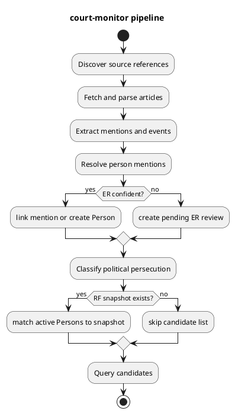

# Pipeline

## Зачем это нужно

Pipeline описывает путь от публикации до кандидата для оператора. Это не один
монолитный процесс: стадии можно запускать вручную, через monitoring, через
operator console или через Telegram bot.

Главный результат pipeline — активная Person с политической classification и
подтверждённым отсутствием в выбранном snapshot Росфинмониторинга.

## Быстрый сценарий

```bash
uv run python src/main.py discover-and-ingest --source ovd-info --limit 100
uv run python src/main.py extract-entities --limit 20000
uv run python src/main.py resolve-people --limit 20000
uv run python src/main.py classify-persecution --limit 20000
uv run python src/main.py match-rosfinmonitoring --snapshot-id 1 --limit 20000
uv run python src/main.py list-candidates --snapshot-id 1 --min-confidence 0.7
```

Для обычной эксплуатации:

```bash
uv run python src/main.py monitor --catch-up
uv run python src/main.py monitoring-status
```

## Что происходит внутри



## Стадии

| Стадия | Команда | Что пишет |
|---|---|---|
| Ingestion | `discover-and-ingest`, `ingest` | `sources`, `source_documents`, `parsed_articles` |
| Extraction | `extract-entities` | `article_extraction_runs`, `entity_mentions`, `extracted_events`, `event_entity_mentions` |
| Person resolution | `resolve-people` | `persons`, `person_aliases`, `person_event_links`, `person_resolution_decisions` |
| Classification | `classify-persecution` | `persecution_classifications` |
| RF matching | `match-rosfinmonitoring` | `rosfin_matches` |
| Candidate query | `list-candidates`, `/ui/candidates` | ничего не пишет; читает latest results |

## Пример результата

```json
{
  "person_id": 42,
  "canonical_name": "Иван Иванов",
  "persecution_status": "political",
  "persecution_confidence": 0.95,
  "rosfinmonitoring_status": "not_matched",
  "event_count": 3
}
```

Смысл: Person прошла classification и RF matching, поэтому попала в candidates.

## Кодовые точки входа

- Sources: `src/sources/`, [Ingestion](Ingestion.md).
- Extraction: `src/extraction/`, [Extraction](Extraction.md).
- Person resolution: `src/persons/`, [Persons](Persons.md),
  [Entity Resolution](Entity-Resolution.md).
- Persecution: `src/persecution/`, [Persecution Classification](Persecution-Classification.md).
- Rosfinmonitoring: `src/rosfinmonitoring/`, [Rosfinmonitoring](Rosfinmonitoring.md).
- Candidates: `src/candidates/`, `src/web/ui/candidates.py`.
- Monitoring wrapper: `src/monitoring/`, [Monitoring](Monitoring.md).

## Данные и артефакты

Pipeline source of truth — PostgreSQL. `reports/` и `evaluation/` нужны для
оценки качества, но production query candidates читает не их, а текущие таблицы.

## Bulk rebuild: workers and GPU

`extract-entities` и `match-rosfinmonitoring` принимают `--workers N`. Items
независимы, результат не зависит от N. `resolve-people --workers N` остается
opt-in: ER-решения зависят от уже созданных Persons и порядка.

```bash
uv run python src/main.py extract-entities --limit 100000 --workers 8
uv run python src/main.py resolve-people --limit 100000 --workers 1
uv run python src/main.py classify-persecution --limit 100000
uv run python src/main.py match-rosfinmonitoring --snapshot-id 1 --limit 100000 --workers 8
```

NER strategy (`PERSON_EXTRACTION_STRATEGY=ner|hybrid`) использует CUDA, если она
доступна, но каждый worker грузит свою копию модели. На малой VRAM не повышать
workers без замера.

## Проверка

```bash
uv run python src/main.py monitoring-status
uv run python src/main.py person-resolution-reviews list
uv run python src/main.py list-candidates --snapshot-id 1 --min-confidence 0.7
```

Если candidates пусты, проверять по цепочке: есть ли active Persons,
classification `political`, RF match `not_matched`, и не отфильтрован ли период в
UI.

## Ограничения и типичные ошибки

- `--limit` у некоторых стадий может взять старый хвост данных. Для полного
  rebuild ставить limit выше размера корпуса.
- Pending ER-review — не ошибка pipeline: mention остается непривязанным до
  ручного решения.
- Без RF snapshot финальный candidates list невозможен.
- Candidate query не меняет данные; исчезновение/появление человека объясняется
  изменением Person/classification/RF/filter state.
