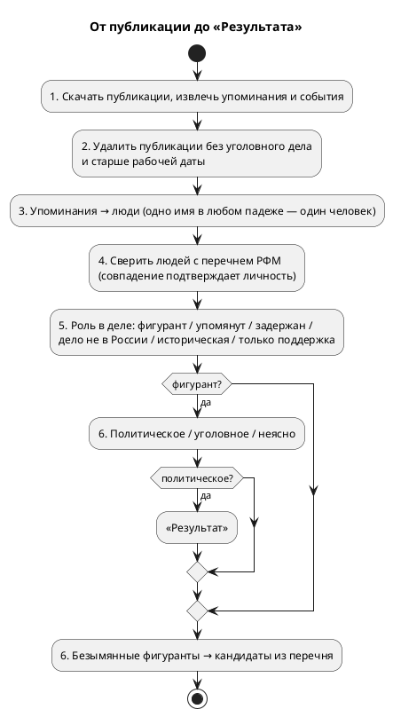

# Pipeline

## Зачем это нужно

Pipeline — путь от публикации до «Результата»: списка людей, против которых
российские власти возбудили политическое уголовное дело. Оператор ведёт его по
кругу из шести шагов на странице «Управление» (раздел «Система» консоли). Каждый
шаг — отдельный запуск со своей карточкой и логом; нажать можно только текущий шаг.

Перечень Росфинмониторинга никого не отсеивает: он подтверждает личность (дата
рождения и место), см. [Rosfinmonitoring](Rosfinmonitoring.md).

## Быстрый сценарий

1. Открыть <http://127.0.0.1:8001/ui/management> (или «Обзор» → «Цикл обработки»).
2. Нажать подсвеченный шаг; дождаться карточки запуска со статусом «Завершено».
3. Повторять до шага 6; затем открыть «Результат».

Те же шаги из командной строки (внутри контейнера API):

```bash
docker exec ebnv-api-1 sh -c 'cd /app && /opt/venv/bin/python src/main.py purge-junk'
docker exec ebnv-api-1 sh -c 'cd /app && /opt/venv/bin/python src/main.py collect-entities'
docker exec ebnv-api-1 sh -c 'cd /app && /opt/venv/bin/python src/main.py check-entities-rosfin'
docker exec ebnv-api-1 sh -c 'cd /app && /opt/venv/bin/python src/main.py find-figurants'
docker exec ebnv-api-1 sh -c 'cd /app && /opt/venv/bin/python src/main.py find-political'
```

Команды, запущенные так, не создают карточку запуска и не двигают круг шагов на
«Управлении».

## Шесть шагов

| Шаг | Кнопка / команда | Что делает | Что пишет |
|---|---|---|---|
| 1 | «Подгрузить статьи», `monitor --catch-up --load-only` | скачивает новые публикации всех новостных источников, извлекает упоминания и события | `source_documents`, `parsed_articles`, `entity_mentions`, `extracted_events` |
| 2 | «Очистить от мусора», `purge-junk` | удаляет публикации без уголовного события и опубликованные до рабочей даты | удаляет строки; от поста остаётся пустая запись, чтобы не скачивать его снова |
| 3 | «Собрать сущности», `collect-entities` | сводит упоминания в людей, приводит имена к именительному падежу, связывает людей со статьями УК | `entity_groups`, `entity_group_mentions`, `entity_group_charges` |
| 4 | «Сверить с Росфинмониторингом», `check-entities-rosfin` | скачивает свежий перечень и сверяет людей с ним | `entity_group_rf_matches`, снимок перечня |
| 5 | «Найти фигурантов», `find-figurants` | определяет роль каждого человека в деле | `entity_group_roles` |
| 6 | «Отобрать политические дела», `find-political` | отделяет политическое преследование от обычной уголовщины; затем ищет безымянных фигурантов | `entity_group_politics`, `unnamed_figurants` |

После шага 6 круг начинается снова с шага 1. Запуск, оборванный или упавший на
шагах 2–6, повторяется; шаг 1 считается сделанным, даже если упал один из источников.

## Что происходит внутри



### Шаг 2: рабочая дата

`PIPELINE_SINCE` (в `compose.yaml`, сейчас `2026-09-20`) — с какой даты публикации
идёт работа. Шаг 2 удаляет всё опубликованное раньше, включая карточки реестра
«Мемориала»; их записи помечаются `application/x-court-monitor-expired` и не
считаются в воронке. Без переменной по дате ничего не удаляется.

### Шаг 3: как упоминания становятся людьми

`src/entities/grouping.py`: одно имя и фамилия в любом падеже — один человек
(«Моора», «Моору», «Моор»); отчество отличает тёзок; фамилия без имени
присоединяется к полному имени из той же публикации. «Жене Владимира» — родство, не
человек; «Дрион Алексис» и «Алексис Дрион» — один человек. Имена в именительный
падеж приводит правило, а в спорных случаях модель (`src/entities/normalizer.py`).
Решения оператора — «Один человек», «Разные люди», исправленное имя, отметка
«должностное лицо» — хранятся по ключу и применяются при каждой пересборке.

### Шаг 5: роль в деле

`src/entities/roles.py`. Должностных лиц (судьи, прокуроры, следователи) отмечают
правила. Остальных модель читает по цитатам и выбирает роль: обвиняемый в
российском деле (фигурант), административное дело, задержан или обыскан, дело не
в России, историческая репрессия, только поддержка (письма, акции, напоминание о
давнем приговоре), адвокат, свидетель и т. д. Люди из перечня тоже оцениваются.

### Шаг 6: политическое или нет

`src/entities/politics.py`. Сначала правила: статья УК из списка политических
(`persecution/classifier.py`), категория реестра «Мемориала» или только статьи
обычной уголовщины (без ст. 213 и 318). Остальных читает модель; неудавшийся ответ
— «неясно», никогда не «политическое». В конце шага — поиск безымянных фигурантов
([Unnamed Figurants](Unnamed-Figurants.md)).

## Модель и расходы

Шаги 3, 5 и 6 спрашивают модель через OpenRouter (`OPENROUTER_API_KEY`, по
умолчанию `deepseek/deepseek-v4.1-flash`, другая — `ENTITY_NORMALIZE_MODEL`).

- Ответы кэшируются по вопросу (`entities/answers.py`): повторный прогон спрашивает
  только новое.
- «Обвиняемый» и «политическое» закрепляются за человеком: их не переспрашивают,
  когда появляются новые публикации.
- Один запуск шага тратит не больше `ENTITY_MODEL_BUDGET_USD` (по умолчанию $2);
  что не успели спросить, спросит следующий запуск.
- Стоимость видна в карточке запуска. Прогон шагов 3–6 по неделе публикаций —
  центы.

Сравнить другую модель с ответами уже работающей, ничего не записывая:

```bash
docker exec -e ENTITY_NORMALIZE_MODEL=xiaomi/mimo-v2.6-flash ebnv-api-1 \
  sh -c 'cd /app && /opt/venv/bin/python src/main.py compare-entity-models --step politics --sample 100'
```

## Кодовые точки входа

- Шаги и их порядок: `src/web/ui/pipeline.py`; запуски: `src/operator_console.py`.
- CLI шагов 2–6: `src/monitoring/cli.py`.
- Очистка: `src/monitoring/junk_purge.py`.
- Сущности: `src/entities/` — `collector.py`, `grouping.py`, `normalizer.py`,
  `rf_check.py`, `roles.py`, `politics.py`, `unnamed.py`, `disputes.py`,
  `answers.py`, `llm.py`.

## Проверка

- Карточка каждого запуска на «Управлении» показывает счётчики и стоимость; лог —
  «Система» → «Логи».
- «Обзор» → «Цикл обработки»: статус последнего запуска каждого шага.
- Воронка отбора («Обзор» → «Воронка отбора»): сколько осталось после каждого шага.

## Ограничения и типичные ошибки

- Дата события в базе — дата публикации (или пусто, если в тексте другой год);
  точной даты события нет.
- Шаг 4 сверяет по имени: даты рождения в новостях нет, тёзку отличает только
  отчество.
- `HTTP 402` в логе шагов 3, 5, 6 — на OpenRouter кончились деньги; люди без ответа
  остаются «неясно» до следующего запуска.
- Пересборка образа во время запуска обрывает его: перед `--force-recreate api`
  проверить, что запусков нет ([Rebuild-Image](Rebuild-Image.md)).

## Старый путь: Person и кандидаты

До консоли «Следователь» результатом были карточки Person и список кандидатов:
`extract-entities` → `resolve-people` → `classify-persecution` →
`match-rosfinmonitoring` → `list-candidates`. Этот путь остаётся в коде и CLI
(его использует Telegram-бот), но консоль работает с сущностями шагов 3–6. См.
[Persons](Persons.md), [Entity Resolution](Entity-Resolution.md),
[Persecution Classification](Persecution-Classification.md).
