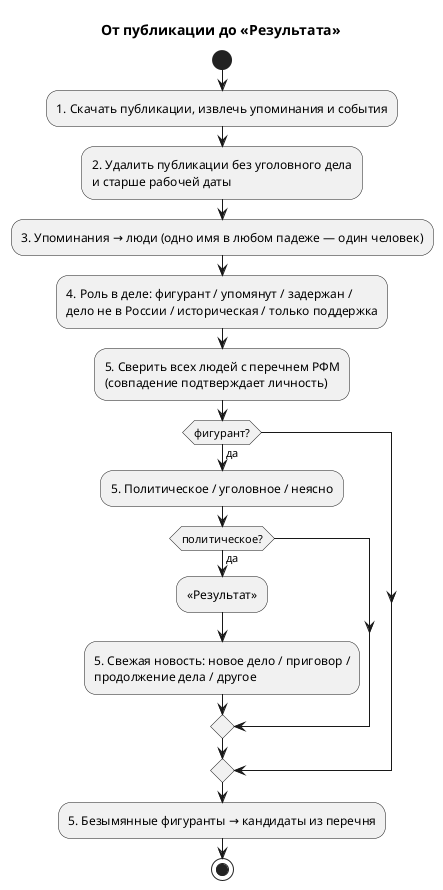

# Pipeline

## Зачем это нужно

Pipeline — путь от публикации до «Результата»: списка людей, против которых
российские власти возбудили политическое уголовное дело. Оператор ведёт его по
кругу из пяти шагов на странице «Рабочий цикл», разбирая проверки между шагами.
Каждый шаг — отдельный запуск; полная карточка и лог находятся в «Журнале
запусков». Нажать можно только текущий шаг.

Перечень Росфинмониторинга никого не отсеивает: он подтверждает личность (дата
рождения и место), см. [Rosfinmonitoring](Rosfinmonitoring.md).

## Быстрый сценарий

1. Открыть <http://127.0.0.1:8001/ui/cycle>.
2. Нажать подсвеченный шаг; состояние и краткий итог видны на этой же станции,
   полные сведения — в [журнале запусков](http://127.0.0.1:8001/ui/runs).
3. Между шагами разобрать станцию с ненулевым счётчиком. Незакрытая предыдущая
   проверка не блокирует запуск, но требует подтверждения.
4. После шага 5 проверить политичность и безымянных, затем открыть «Результат».

Те же шаги из командной строки (внутри контейнера API):

```bash
docker exec ebnv-api-1 sh -c 'cd /app && /opt/venv/bin/python src/main.py purge-junk'
docker exec ebnv-api-1 sh -c 'cd /app && /opt/venv/bin/python src/main.py collect-entities'
docker exec ebnv-api-1 sh -c 'cd /app && /opt/venv/bin/python src/main.py find-figurants'
docker exec ebnv-api-1 sh -c 'cd /app && /opt/venv/bin/python src/main.py find-political'
```

Команды, запущенные так, не создают карточку запуска и не двигают круг шагов в UI.

### Сделать всё

Кнопка «Сделать всё» на странице «Работа» и над шагами в «Журнале запусков» выполняет все
оставшиеся шаги подряд — от того, чья сейчас очередь, до пятого. Каждый шаг остаётся
отдельным запуском со своей карточкой и журналом; когда он завершился успешно, следующий
запускается сам (`OperationParameters.chain`, `OperationRegistry._continue_chain`).

Цепочка останавливается, если шаг упал, был остановлен кнопкой или потерян при перезапуске
сервера: оператор смотрит, что случилось, и нажимает «Сделать всё» ещё раз — оно продолжит с
того же шага. Исключение одно: загрузка, в которой не ответил один из источников, считается
сделанной, и цепочка идёт дальше — как и при ручном запуске.

Перед запуском браузер спрашивает один раз за все шаги: про необратимое удаление на шаге 2 и
про стоимость каждого платного шага. Лимит расходов у каждого шага свой, как при запуске по
одному. Кнопки отдельных шагов остались в «Журнале запусков».

## Пять шагов

| Шаг | Кнопка / команда | Что делает | Что пишет |
|---|---|---|---|
| 1 | «Подгрузить статьи», `monitor --catch-up --load-only` | скачивает новые публикации всех новостных источников, извлекает упоминания и события | `source_documents`, `parsed_articles`, `entity_mentions`, `extracted_events` |
| 2 | «Очистить от мусора», `purge-junk` | удаляет публикации без уголовного события и опубликованные до рабочей даты | удаляет строки; от поста остаётся пустая запись, чтобы не скачивать его снова |
| 3 | «Собрать сущности», `collect-entities` | сводит упоминания в людей, приводит имена к именительному падежу, заново применяет опознания безымянных, связывает людей со статьями УК | `entity_groups`, `entity_group_mentions`, `entity_group_unnamed_mentions`, `entity_group_charges` |
| 4 | «Найти фигурантов», `find-figurants` | определяет роль каждого человека в деле | `entity_group_roles` |
| 5 | «Отобрать политические дела и сверить с РФМ», `find-political` | сверяет людей со свежим перечнем, отделяет политическое преследование от обычной уголовщины, называет свежую новость политического дела и ищет безымянных фигурантов | `entity_group_rf_matches`, снимок перечня, `entity_group_politics`, `entity_group_news`, `unnamed_figurants` |

Опознания безымянных хранятся не в `entity_mentions`, а в
`unnamed_identity_resolutions`. Шаг 3 каждый раз материализует их в
`entity_group_unnamed_mentions`, поэтому решение переживает пересоздание
`entity_groups`.

После шага 5 круг начинается снова с шага 1. Запуск, оборванный или упавший на
шагах 2–5, повторяется; шаг 1 считается сделанным, даже если упал один из источников.

Между шагами цикл показывает: сбои извлечения (информация), отсев, пары, неясную
роль, неясную политичность и безымянных. Сбои не входят в счётчик. Роль и
политичность можно решить прямо на странице; решение хранится по ключу сущности
(`entity_role_decisions`, `entity_politics_decisions`) и применяется при следующей
пересборке шага 4 или 5. Опознание безымянного используется шагами 3–5 следующего
круга.

## Что происходит внутри


```plantuml
@startuml
title От публикации до «Результата»
start
:1. Скачать публикации, извлечь упоминания и события;
:2. Удалить публикации без уголовного дела\nи старше рабочей даты;
:3. Упоминания → люди (одно имя в любом падеже — один человек);
:4. Роль в деле: фигурант / упомянут / задержан /\nдело не в России / историческая / только поддержка;
:5. Сверить всех людей с перечнем РФМ\n(совпадение подтверждает личность);
if (фигурант?) then (да)
  :5. Политическое / уголовное / неясно;
  if (политическое?) then (да)
    :«Результат»;
    :5. Свежая новость: новое дело / приговор /\nпродолжение дела / другое;
  endif
endif
:5. Безымянные фигуранты → кандидаты из перечня;
stop
@enduml
```

### Шаг 2: рабочая дата

`PIPELINE_SINCE` (в `compose.yaml`, сейчас `2026-09-20`) — с какой даты публикации
идёт работа. Шаг 2 удаляет всё опубликованное раньше, включая карточки реестра
«Мемориала»; их записи помечаются `application/x-court-monitor-expired` и не
считаются в воронке. Без переменной по дате ничего не удаляется.

С отсевом (`JUNK_SCREEN=jev` в `compose.yaml`; в коде по умолчанию выключен) статья без уголовного события, похожая
на новость о деле, удерживается на проверку вместо удаления — [Junk Screen](Junk-Screen.md).

### Шаг 3: как упоминания становятся людьми

`src/entities/grouping.py`: одно имя и фамилия в любом падеже — один человек
(«Моора», «Моору», «Моор»); отчество отличает тёзок; фамилия без имени
присоединяется к полному имени из той же публикации. «Жене Владимира» — родство, не
человек; «Дрион Алексис» и «Алексис Дрион» — один человек. Имена в именительный
падеж приводит правило, а в спорных случаях модель (`src/entities/normalizer.py`).
Решения оператора — «Один человек», «Разные люди», исправленное имя, отметка
«должностное лицо» — хранятся по ключу и применяются при каждой пересборке.

### Шаг 4: роль в деле

`src/entities/roles.py`. Должностных лиц (судьи, прокуроры, следователи) отмечают
правила. Остальных модель читает по цитатам и выбирает роль: обвиняемый в
российском деле (фигурант), административное дело, задержан или обыскан, дело не
в России, историческая репрессия, только поддержка (письма, акции, напоминание о
давнем приговоре), адвокат, свидетель и т. д. Люди из перечня тоже оцениваются.

### Шаг 5: политическое, РФМ или нет

Сначала `src/entities/rf_check.py` скачивает свежий перечень и сверяет сущности.
Перечень подтверждает личность, а не решает, политическое ли дело. Затем
`src/entities/politics.py` применяет правила: статья УК из списка политических
(`persecution/classifier.py`), категория реестра «Мемориала» или только статьи
обычной уголовщины (без ст. 213 и 318). Остальных читает модель; неудавшийся ответ
— «неясно», никогда не «политическое». В конце шага — поиск безымянных фигурантов
([Unnamed Figurants](Unnamed-Figurants.md)).

### Шаг 5: новое дело или приговор

`src/entities/news.py`. Модель читает последние публикации о каждом политическом деле
(свежая первой, с датой) и называет, о чём свежая новость: **новое дело** (задержание,
возбуждение, обвинение — впервые), **приговор**, **продолжение дела** (продление
ареста, апелляция, этап старого дела), **дело завершено** (человек уже на свободе —
освобождён, обменян, отбыл срок, оправдан — или умер, а публикация вспоминает прошлое) или
**другое**. Без ответа модели — «не
определено», в следующий раз спросят снова. Ответы кэшируются по цитатам. На
«Результате» — колонка и фильтр «Свежая новость», в Excel — последняя колонка; в
досье — под «Ролью в деле». Отдельно, без остального шага:

```bash
docker exec ebnv-api-1 sh -c 'cd /app && /opt/venv/bin/python src/main.py find-news'
```

## Модель и расходы

Шаги 3, 4 и 5 спрашивают модель через OpenRouter (`OPENROUTER_API_KEY`, по
умолчанию `deepseek/deepseek-v4.1-flash`, другая — `ENTITY_NORMALIZE_MODEL`).

- Ответы кэшируются по вопросу (`entities/answers.py`): повторный прогон спрашивает
  только новое.
- «Обвиняемый» и «политическое» закрепляются за человеком: их не переспрашивают,
  когда появляются новые публикации.
- Один запуск шага тратит не больше `ENTITY_MODEL_BUDGET_USD` (по умолчанию $2);
  что не успели спросить, спросит следующий запуск.
- Стоимость видна в карточке запуска. Прогон шагов 3–5 по неделе публикаций —
  центы.

Сравнить другую модель с ответами уже работающей, ничего не записывая:

```bash
docker exec -e ENTITY_NORMALIZE_MODEL=xiaomi/mimo-v2.6-flash ebnv-api-1 \
  sh -c 'cd /app && /opt/venv/bin/python src/main.py compare-entity-models --step politics --sample 100'
```

## Кодовые точки входа

- Шаги и их порядок: `src/web/ui/pipeline.py`; запуски: `src/operator_console.py`.
- CLI шагов 2–5: `src/monitoring/cli.py`.
- Очистка: `src/monitoring/junk_purge.py`.
- Сущности: `src/entities/` — `collector.py`, `grouping.py`, `normalizer.py`,
  `rf_check.py`, `roles.py`, `politics.py`, `news.py`, `unnamed.py`, `disputes.py`,
  `answers.py`, `llm.py`.

## Проверка

- Станция шага в «Рабочем цикле» показывает состояние и последний итог.
- Карточка каждого запуска в «Журнале запусков» показывает счётчики и стоимость;
  полный вывод — в «Логах».
- Воронка отбора в журнале: сколько осталось после каждого шага.

## Ограничения и типичные ошибки

- Дата события в базе — дата публикации (или пусто, если в тексте другой год);
  точной даты события нет.
- «Собрать сущности» пересоздаёт людей, и совпадения с перечнем пропадают до шага 5:
  если круг остановлен между шагами 3 и 5, «Люди» и «Результат» показывают людей
  без данных перечня.
- Шаг 5 сверяет по имени: даты рождения в новостях нет, тёзку отличает только
  отчество.
- `HTTP 402` в логе шагов 3–5 — на OpenRouter кончились деньги; люди без ответа
  остаются «неясно» до следующего запуска.
- Пересборка образа во время запуска обрывает его: перед `--force-recreate api`
  проверить, что запусков нет ([Rebuild-Image](Rebuild-Image.md)).

## Старый путь: Person и кандидаты

До консоли «Следователь» результатом были карточки Person и список кандидатов:
`extract-entities` → `resolve-people` → `classify-persecution` →
`match-rosfinmonitoring` → `list-candidates`. Этот путь остаётся в коде и CLI
(его использует мониторинг), но консоль работает с сущностями шагов 3–5. См.
[Persons](Persons.md), [Entity Resolution](Entity-Resolution.md),
[Persecution Classification](Persecution-Classification.md).
