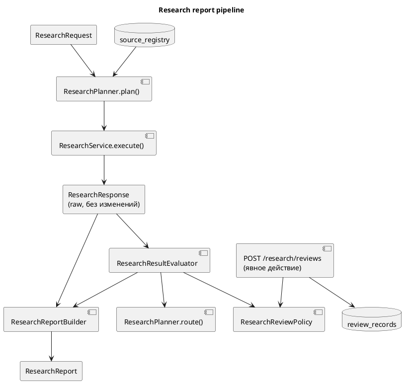

# Research Reports

## Зачем это нужно

Детерминированный отчёт поверх `ResearchResponse`: факты с цитатами, централизованная политика human review и database-first source routing. Решение — [ADR 0010](../adr/0010-research-report-review-routing.md). Факты устанавливает [Research](Research.md), natural-language обвязка — [Research-Workflow](Research-Workflow.md).

> Report Builder не меняет факты. После intake LLM не используется.

## Быстрый сценарий

```bash
uv run python src/main.py ask \
  "Найди политически преследуемых людей, которых нет в Росфинмониторинге"
```

По умолчанию `ask` печатает именно report. Persistent review task создаётся не
автоматически, а отдельным `POST /research/reviews`.



## Модули

| Модуль | Роль |
|---|---|
| `research/reports/models.py` | `ResearchReport`, `ResearchReportItem`, `ResearchClaim`, `ResearchCitation`, `ResearchReportWarning`, `ResearchReportSummary`, `ResearchReportStatus`, `ResearchReviewDecision`, `ResearchReviewReason` |
| `research/reports/citations.py` | citation = `ResearchEvidence` + `ResearchSource` (второго provenance-пайплайна нет) |
| `research/reports/review_policy.py` | `ResearchReviewPolicy` — единственное место с условиями review |
| `research/reports/evaluation.py` | `ResearchResultEvaluator`: review по каждому человеку + routing |
| `research/reports/builder.py` | `ResearchReportBuilder.build(request=, response=, evaluation=)` |
| `research/planning/models.py` | `ResearchPlan`, `ResearchPlanStep`, `ResearchDataRequirement`, `SourceCapability`, `SourceRoutingDecision` |
| `research/planning/planner.py` | `ResearchPlanner.plan()` / `.route()`, `source_capabilities(SOURCES)` |
| `research/review_tasks.py` | `ResearchReviewTaskService` — идемпотентное создание review task |

## Отчёт по человеку (`ResearchReportItem`)

- person id, каноническое имя, aliases;
- статус, confidence, основания и `classification_id` классификации преследования;
- snapshot, статус, confidence и фиксированный текст (`rosfinmonitoring_summary`) по Росфинмониторингу;
- события;
- `why_matched` — только реально применённые критерии и значения этого человека;
- `claims` и `citations`;
- `domain_warnings` (копия warnings `ResearchService`) и `report_warnings` (пробелы данных, provenance);
- `review` (`ResearchReviewDecision`) и вычисляемые `review_required` / `partial`.

### Claims

| `claim_type` | `basis` | Цитаты | Confidence |
|---|---|---|---|
| `identity` | `source_documents` | mention spans, затем event spans человека | — |
| `persecution_classification` | `source_documents` | все spans человека (классификатор видит только их) | классификации |
| `rosfinmonitoring_status` | `rosfinmonitoring_snapshot` | нет, провенанс — `snapshot_id` | сопоставления |
| `event` | `source_documents` | span этого события (`event_id`) | извлечения события |

Claim с `basis=source_documents` без цитат → `supported=false`, warning `claim_without_citation`, review `missing_evidence`. Evidence со статьёй, которой нет в `sources`, не цитируется (`evidence_without_source`). Полный текст статьи в отчёт не попадает. Общей confidence нет.

### Формулировки Росфинмониторинга

| Статус | Текст |
|---|---|
| `not_matched` | Не найден в перечне Росфинмониторинга: сопоставление со snapshot #N выполнено. |
| `matched` | Найден в перечне Росфинмониторинга (snapshot #N): <запись>. |
| `ambiguous` | Несколько возможных записей…: присутствие не подтверждено, отсутствие в перечне не подтверждено. |
| `needs_review` | Сопоставление… требует проверки человеком: присутствие не подтверждено, отсутствие в перечне не подтверждено. |
| `insufficient_data` | Недостаточно данных для надёжного сопоставления…; отсутствие в перечне не подтверждено. |
| `no_match_record` | Сопоставление со snapshot #N ещё не выполнялось; отсутствие в перечне не подтверждено. |

Как отсутствие сформулирован только `not_matched`, это проверяется тестом по всем статусам. Запрос `rosfinmonitoring_status=not_matched` по-прежнему не возвращает `no_match_record` (ADR 0008).

## Human review

| Reason | Условие | Severity | Можно сохранить |
|---|---|---|---|
| `persecution_uncertain` | классификация `uncertain` | blocking | да (`classification_id`) |
| `persecution_needs_review` | классификация `needs_review` | blocking | да (`classification_id`) |
| `low_confidence` | `political` ниже 0.70 | advisory | да (`classification_id`) |
| `rosfin_ambiguous` | `ambiguous` | blocking | да (`snapshot_id`) |
| `rosfin_needs_review` | `needs_review` | blocking | да (`snapshot_id`) |
| `rosfin_insufficient_data` | `insufficient_data` | blocking | да (`snapshot_id`) |
| `missing_evidence` | нет ни одного цитируемого span или у события нет своего span | blocking | нет |

Нет классификации и `no_match_record` — это пробелы данных (`partial`), а не review: нужно запустить классификатор или matcher. `ENTITY_RESOLUTION_AMBIGUOUS` не вводится: research возвращает только `active` persons.

### Review required ≠ review record

`human_review_gate` только помечает результат; при чтении ничего не записывается. Persistent task создаётся явно:

```bash
curl -X POST http://localhost:8001/research/reviews \
  -H 'Content-Type: application/json' \
  -d '{"person_id": 2, "reason": "rosfin_ambiguous", "snapshot_id": 1}'
```

| Ситуация | HTTP |
|---|---|
| создан pending review | 201 (`created: true`) |
| pending review этого subject уже есть | 200 (`created: false`, тот же `review_id`) |
| person/classification/match не найдены (в т.ч. `no_match_record`) | 404 |
| текущие данные не требуют review (статус изменился, классификация не последняя) | 409 |
| нет нужной ссылки, лишние поля, `missing_evidence` | 422 |

Запись: `review_records(subject_type=persecution_classification|rosfinmatch, subject_id=<classification id|rosfin_matches.id>, decision=pending, reason=<reason code>, confidence)`. Идемпотентность обеспечивает partial unique index `uq_review_records_pending_subject` (`decision = 'pending'`) и `INSERT … ON CONFLICT DO NOTHING`. Если в БД до миграции уже есть несколько pending review одного subject, `alembic upgrade head` останавливается с перечнем и SQL для проверки; дубли нужно решить вручную. После решения (approved/rejected) можно создать новый pending review. В ответе `requested_reason` — причина из запроса, `stored_reason` — причина уже существующей записи: они различаются, если matching перезапускали и строка `rosfin_matches` обновилась на месте.

## Planning и source routing

Database first: сначала всегда поиск в БД, рекомендация — только после него.

- Кандидаты — источники из `sources.source_registry` (`SourceCapability`); при `criteria.source` — только источник с таким `source_name`, неизвестное имя → кандидатов нет.
- `source_refresh_required=true` только если `total_matched == 0`, запрос не по `person_id` и кандидат поддерживает discovery.
- Freshness (`fetched_at`) не используется: согласованного порога нет.
- Это рекомендация: ingestion не запускается.

| `ResearchReportStatus` | Когда |
|---|---|
| `complete` | есть результаты, все факты процитированы, review не нужен |
| `partial` | есть пробелы данных (нет классификации, `no_match_record`, claim без цитаты) |
| `review_required` | хотя бы один результат требует review (важнее `partial`) |
| `no_matches` | 0 результатов, обновление источников не поможет |
| `insufficient_data` | 0 результатов в текущей БД, рекомендовано обновить источники |

## Пример (test PostgreSQL, fake parser)

Запрос: «Найди политически преследуемых людей, которых нет в Росфинмониторинге».

```text
! Snapshot не указан пользователем; использован последний доступный snapshot #1 от 2024-01-01.
Report: complete — Найдено 1, показано 1. Все показанные факты подкреплены источниками, проверка не требуется.
Source refresh: not recommended (database_sufficient)

#1 Виктор Викторов
  Persecution: political (0.90)
  Rosfinmonitoring: not_matched (0.80) — Не найден в перечне Росфинмониторинга: сопоставление со snapshot #1 выполнено.
  Reasons:
    - Антивоенная деятельность
  Matched because:
    - persecution_status: requested political (confidence ≥ 0.70); actual political (0.90)
    - rosfinmonitoring_status: requested not_matched (snapshot #1); actual not_matched
  Claims:
    - [identity] Виктор Викторов (person #1) упоминается в источниках. sources [1]
    - [persecution_classification] Преследование классифицировано как политическое. Основания: Антивоенная деятельность. (confidence 0.90) sources [1]
    - [rosfinmonitoring_status] Не найден в перечне Росфинмониторинга: сопоставление со snapshot #1 выполнено. (confidence 0.80)
    - [event] Событие: arrest 2024-03-05 (event #1). (confidence 0.80) sources [1]
  Sources (1):
    [1] ОВД-Инфо — Арест за пикет — https://example.test/demo-1
  Review: not required
```

Review-required (`ambiguous`):

```text
#2 Анна Алексеева
  Persecution: political (0.80)
  Rosfinmonitoring: ambiguous (0.50) — Несколько возможных записей в перечне (snapshot #1): присутствие не подтверждено, отсутствие в перечне не подтверждено.
  ...
  ! rosfin_ambiguous: Several Rosfinmonitoring entries match this person; not a confirmed presence or absence.
  Review: required (blocking)
    - rosfin_ambiguous: Человеку соответствуют несколько записей перечня: ни присутствие, ни отсутствие не подтверждены.
```

Пустой результат:

```text
Report: insufficient_data — В текущей базе найдено 0 подходящих людей. Это не доказывает, что таких людей нет: локальная копия источников может быть неполной. Обновление источников (ovd-info, sota-vision, sudrf-2zovs, tg-…) — рекомендация, оно не выполнялось.
Source refresh: recommended (ovd-info, sota-vision, sudrf-2zovs, tg-…) — not executed
```

## Тесты

- `tests/research/test_research_review_policy.py` — условия review, severity, инвариант «policy ⊇ domain review».
- `tests/research/test_research_report_builder.py` — сценарии A–E, provenance, `why_matched`, статусы отчёта.
- `tests/research/test_research_planner.py` — capabilities из registry, database first, source filter.
- `tests/research/test_research_graph_report.py` — скомпилированный граф: порядок узлов, review → report, clarification не доходит до planning.
- `tests/research/test_research_review_tasks.py` — идемпотентность, проверка условия, неактивный person, конкурентная вставка, partial unique index (PostgreSQL).
- `tests/db/test_review_pending_index_migration.py` — миграция на БД с дублями pending review останавливается с понятным сообщением.
- `tests/research/test_research_workflow_integration.py` — граф + настоящий `ResearchService` + PostgreSQL → отчёт с реальными цитатами.

## Ограничения

- Основания классификации — строки без собственных spans: claim классификации цитирует все spans человека.
- Нет freshness-политики; routing по пустому результату.
- Routing не запускает ingestion и не обновляет сопоставления с Росфинмониторингом.
- `why_matched` для имени показывает первое совпавшее имя/alias; совпадение только по нормализованной форме помечается отдельно.
- Сообщения `domain_warnings` на английском (как в `ResearchService`), тексты отчёта — на русском.
