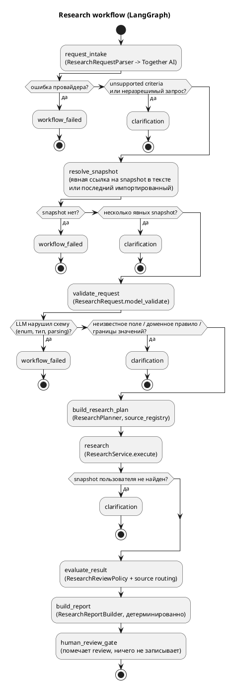

# Research Workflow (natural language)

Natural-language запрос → LangGraph → `ResearchRequest` → research plan → детерминированный `ResearchService` ([Research](Research.md)) → оценка результата → отчёт ([Research-Reports](Research-Reports.md)) → human review gate → `ResearchQueryResult`. LLM (Together AI) используется только для разбора запроса. Решения — [ADR 0009](../adr/0009-langgraph-research-orchestration.md), [ADR 0010](../adr/0010-research-report-review-routing.md).

> LLM interprets intent; domain services determine facts.



## Модули

| Модуль | Роль |
|---|---|
| `research_workflow/state.py` | `ResearchGraphState` (TypedDict) — всё состояние workflow |
| `research_workflow/graph.py` | `build_research_graph(request_parser=, research_service=, snapshot_lookup=, planner=, review_policy=, report_builder=)` (последние три — опционально, по умолчанию стандартные), узлы, `run_research_query()` |
| `research_workflow/intake.py` | `ResearchRequestParser`, `LlmResearchRequestParser`, JSON schema intake, рендер промпта |
| `research_workflow/prompts/request_intake.md` | system prompt request intake |
| `research_workflow/llm.py` | `StructuredLlmClient`, типизированные ошибки провайдера |
| `research_workflow/models.py` | `ResearchIntake`, `UnsupportedCriterion`, `ResearchQueryResult`, `WorkflowStatus`, `WorkflowErrorCode` |
| `research_workflow/snapshot_references.py` | детерминированный поиск явных ссылок на snapshot в тексте |
| `research_workflow/assembly.py` | детерминированная сборка результата |
| `research_planning/`, `research_reports/` | план, оценка, review policy, отчёт — см. [Research-Reports](Research-Reports.md) |
| `together_llm_client.py` | Together AI (`httpx`, `response_format: json_schema`) |
| `rosfinmonitoring_snapshot_lookup.py` | последний snapshot с импортированными записями |
| `research_workflow_factory.py` | сборка зависимостей для CLI и API |

## Семантика

- **Snapshot.** Если запрошен `rosfinmonitoring_status`, а `snapshot_id` пользователь не назвал, берётся последний snapshot, у которого есть записи (`snapshot_date` desc, `id` desc), и добавляется warning `Snapshot не указан пользователем; использован последний доступный snapshot #N от YYYY-MM-DD.` Если для него matching не запускался — ещё warning. `snapshot_id` решается только по явным ссылкам в тексте (`snapshot 3`, `snapshot #3`, `snapshot_id=3`, `снапшот №3`); голое число («3 человека») ссылкой не считается. Одна явная ссылка используется (warning, если LLM указал другое), несколько разных → `clarification_required`, ни одной → значение LLM отбрасывается с warning. Нет ни одного snapshot → `failed` / `no_rosfinmonitoring_snapshot`.
- **Неполное имя** («Найди Иванова») → `name="Иванов"`, поиск выполняется.
- **Unsupported criteria** (профессия, возраст, регион, …) → `clarification_required` с перечнем, поиск **не** выполняется.
- **Неразрешимый/противоречивый запрос** → вопрос от intake → `clarification_required`.
- **Неизвестное поле в запросе от LLM** (`criteria.region`) → становится unsupported criterion → `clarification_required`, поиск не выполняется.
- **Нарушение доменных правил и границ** (`date_from > date_to`, `limit` > 1000, пустой `event_types`) → `clarification_required` с текстом ошибки.
- **LLM нарушил схему** (значение enum, тип, parsing, не-JSON) → `failed` / `llm_invalid_output`; перевешивает исправимые ошибки.
- **Неожиданная ошибка** (например, БД) → `failed` / `workflow_unexpected_error`, HTTP 500; в логе только тип исключения, traceback — на уровне DEBUG.
- **Ошибки провайдера** → `failed`: `llm_timeout`, `llm_unavailable`, `llm_rate_limited`, `llm_authentication_failed`, `llm_request_rejected`, `llm_not_configured`.
- **Результаты** — объекты `PersonResearchResult` без изменений (статусы, events, evidence, sources, warnings, `review_required`).
- **Отчёт и план** — `report` и `plan` добавлены рядом с `results` только для `completed`; при clarification/failed они `null`, planning и research не выполняются.
- **Review** — `review_required` берётся из отчёта (`ResearchReviewPolicy`); условие review — это отчёт со статусом `review_required`, а не ошибка workflow. Review record при запросе не создаётся.
- **Пустой результат** — `report.status` = `insufficient_data` (рекомендовано обновить источники) или `no_matches`; это не утверждение, что таких людей нет.

## `ResearchQueryResult`

```json
{
  "status": "completed",
  "query": "Найди политически преследуемых людей, которых нет в Росфинмониторинге",
  "request": {"object_type": "person", "criteria": {"persecution_status": "political", "rosfinmonitoring_status": "not_matched", "snapshot_id": 7, "...": null}, "limit": 20},
  "results": ["PersonResearchResult ..."],
  "total_matched": 1,
  "unsupported_criteria": [],
  "warnings": ["Snapshot не указан пользователем; использован последний доступный snapshot #7 от 2026-09-01."],
  "clarification_question": null,
  "error": null,
  "plan": {"database_search": true, "steps": ["..."], "data_requirements": ["persons", "persecution_classifications", "rosfinmonitoring_matches"], "candidate_sources": ["..."], "notes": ["..."]},
  "report": {"status": "complete", "summary": {"...": "..."}, "items": ["ResearchReportItem ..."], "source_routing": {"source_refresh_required": false, "sources": [], "reason": "database_sufficient"}, "source_refresh_recommended": false, "recommended_sources": [], "review_required": false},
  "clarification_required": false,
  "review_required": false
}
```

## CLI

```bash
uv run python src/main.py ask \
  "Найди людей, которых преследовали за антивоенную деятельность и которых нет в Росфинмониторинге" \
  --show-request

# JSON целиком, логи workflow в stderr
uv run python src/main.py ask "Найди Иванова" --json --verbose

# план и прежний вид ResearchResponse вместо отчёта
uv run python src/main.py ask "Найди Иванова" --show-plan --raw
```

По умолчанию печатается отчёт (`ResearchReport`). `--show-request` печатает только структурированный `ResearchRequest` и `unsupported_criteria` (без рассуждений модели), `--show-plan` — `ResearchPlan`, `--raw` — прежний вид `ResearchResponse`. Exit codes: `0` — completed (в том числе 0 результатов), `2` — failed, `3` — clarification required.

## API

```bash
curl -X POST http://localhost:8000/research/query \
  -H 'Content-Type: application/json' \
  -d '{"query": "Найди политически преследуемых людей, которых нет в Росфинмониторинге"}'
```

| Ситуация | HTTP |
|---|---|
| completed, clarification_required | 200 |
| `llm_timeout` | 504 |
| `llm_unavailable`, `llm_rate_limited`, `llm_not_configured` | 503 |
| `llm_authentication_failed`, `llm_request_rejected`, `llm_invalid_output` | 502 |
| `no_rosfinmonitoring_snapshot` | 409 |
| `workflow_unexpected_error` | 500 |
| нет `DATABASE_URL` / Together не настроен при старте | 503 |
| невалидное тело (`query` пустой, >2000 символов, лишние поля) | 422 |

Тело ответа при ошибках workflow — тот же `ResearchQueryResult` со `status="failed"` и `error`. Persistent review task — отдельным запросом `POST /research/reviews` ([Research-Reports](Research-Reports.md#human-review)).

## Конфигурация

| Переменная | Назначение |
|---|---|
| `TOGETHER_API_KEY` | ключ Together AI (обязательно) |
| `TOGETHER_MODEL` | id модели Together с поддержкой JSON schema (обязательно, значения по умолчанию нет) |
| `TOGETHER_TIMEOUT_SECONDS` | таймаут запроса, по умолчанию `30` |

## Тесты

- `tests/test_research_intake.py` — промпт, JSON schema, парсер с fake LLM.
- `tests/test_research_graph.py` — скомпилированный граф с fakes: маршруты, snapshot, unsupported, ошибки, сохранение статусов/provenance, логи.
- `tests/test_research_graph_report.py` — план, оценка, отчёт и review gate в скомпилированном графе.
- `tests/test_together_llm_client.py` — Together через `httpx.MockTransport`.
- `tests/test_research_workflow_integration.py` — fake parser + LangGraph + настоящий `ResearchService` + test PostgreSQL.
- `tests/test_together_live.py` — реальный Together, только при `TOGETHER_LIVE_TESTS=1`.

```bash
TOGETHER_LIVE_TESTS=1 TOGETHER_API_KEY=... TOGETHER_MODEL=... uv run pytest -m live_together
```

## Ограничения

- Одна реплика: уточнение возвращается, диалог не сохраняется.
- Качество разбора зависит от модели; fake-тесты проверяют обвязку, а не понимание языка.
- Поддержка JSON schema (`$defs`/`anyOf`) зависит от модели Together — проверяется только live-тестом.
- Причина преследования («антивоенная деятельность») не фильтруется отдельно: сводится к `persecution_status="political"`.
