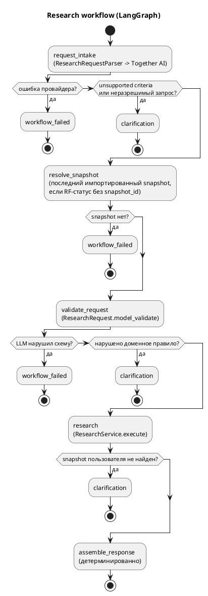

# Research Workflow (natural language)

Natural-language запрос → LangGraph → `ResearchRequest` → детерминированный `ResearchService` ([Research](Research.md)) → `ResearchQueryResult`. LLM (Together AI) используется только для разбора запроса. Решение — [ADR 0009](../adr/0009-langgraph-research-orchestration.md).

> LLM interprets intent; domain services determine facts.



## Модули

| Модуль | Роль |
|---|---|
| `research_workflow/state.py` | `ResearchGraphState` (TypedDict) — всё состояние workflow |
| `research_workflow/graph.py` | `build_research_graph(request_parser=, research_service=, snapshot_lookup=)`, узлы, `run_research_query()` |
| `research_workflow/intake.py` | `ResearchRequestParser`, `LlmResearchRequestParser`, JSON schema intake, рендер промпта |
| `research_workflow/prompts/request_intake.md` | system prompt request intake |
| `research_workflow/llm.py` | `StructuredLlmClient`, типизированные ошибки провайдера |
| `research_workflow/models.py` | `ResearchIntake`, `UnsupportedCriterion`, `ResearchQueryResult`, `WorkflowStatus`, `WorkflowErrorCode` |
| `research_workflow/assembly.py` | детерминированная сборка результата |
| `together_llm_client.py` | Together AI (`httpx`, `response_format: json_schema`) |
| `rosfinmonitoring_snapshot_lookup.py` | последний snapshot с импортированными записями |
| `research_workflow_factory.py` | сборка зависимостей для CLI и API |

## Семантика

- **Snapshot.** Если запрошен `rosfinmonitoring_status`, а `snapshot_id` пользователь не назвал, берётся последний snapshot, у которого есть записи (`snapshot_date` desc, `id` desc), и добавляется warning `Snapshot не указан пользователем; использован последний доступный snapshot #N от YYYY-MM-DD.` Если для него matching не запускался — ещё warning. `snapshot_id`, которого нет в тексте запроса, считается выдуманным LLM и игнорируется. Нет ни одного snapshot → `failed` / `no_rosfinmonitoring_snapshot`.
- **Неполное имя** («Найди Иванова») → `name="Иванов"`, поиск выполняется.
- **Unsupported criteria** (профессия, возраст, регион, …) → `clarification_required` с перечнем, поиск **не** выполняется.
- **Неразрешимый/противоречивый запрос** → вопрос от intake → `clarification_required`.
- **Нарушение доменных правил** (`date_from > date_to` и т.п.) → `clarification_required` с текстом ошибки.
- **LLM нарушил схему** (неизвестное поле, значение enum, не-JSON) → `failed` / `llm_invalid_output`.
- **Ошибки провайдера** → `failed`: `llm_timeout`, `llm_unavailable`, `llm_rate_limited`, `llm_authentication_failed`, `llm_request_rejected`, `llm_not_configured`.
- **Результаты** — объекты `PersonResearchResult` без изменений (статусы, events, evidence, sources, warnings, `review_required`).

## `ResearchQueryResult`

```json
{
  "status": "completed",
  "query": "Найди политически преследуемых людей, которых нет в Росфинмониторинге",
  "request": {"object_type": "person", "criteria": {"persecution_status": "political", "rosfinmonitoring_status": "not_matched", "snapshot_id": 7, "...": null}, "limit": 20},
  "results": ["PersonResearchResult ..."],
  "total_matched": 1,
  "unsupported_criteria": [],
  "warnings": ["Snapshot не указан пользователем; использован последний доступный snapshot #7 от 2026-09-01."],
  "clarification_question": null,
  "error": null,
  "clarification_required": false,
  "review_required": false
}
```

## CLI

```bash
uv run python src/main.py ask \
  "Найди людей, которых преследовали за антивоенную деятельность и которых нет в Росфинмониторинге" \
  --show-request

# JSON целиком, логи workflow в stderr
uv run python src/main.py ask "Найди Иванова" --json --verbose
```

`--show-request` печатает только структурированный `ResearchRequest` и `unsupported_criteria` (без рассуждений модели). Exit codes: `0` — completed (в том числе 0 результатов), `2` — failed, `3` — clarification required.

## API

```bash
curl -X POST http://localhost:8000/research/query \
  -H 'Content-Type: application/json' \
  -d '{"query": "Найди политически преследуемых людей, которых нет в Росфинмониторинге"}'
```

| Ситуация | HTTP |
|---|---|
| completed, clarification_required | 200 |
| `llm_timeout` | 504 |
| `llm_unavailable`, `llm_rate_limited`, `llm_not_configured` | 503 |
| `llm_authentication_failed`, `llm_request_rejected`, `llm_invalid_output` | 502 |
| `no_rosfinmonitoring_snapshot` | 409 |
| нет `DATABASE_URL` / Together не настроен при старте | 503 |
| невалидное тело (`query` пустой, >2000 символов, лишние поля) | 422 |

Тело ответа при ошибках workflow — тот же `ResearchQueryResult` со `status="failed"` и `error`.

## Конфигурация

| Переменная | Назначение |
|---|---|
| `TOGETHER_API_KEY` | ключ Together AI (обязательно) |
| `TOGETHER_MODEL` | id модели Together с поддержкой JSON schema (обязательно, значения по умолчанию нет) |
| `TOGETHER_TIMEOUT_SECONDS` | таймаут запроса, по умолчанию `30` |

## Тесты

- `tests/test_research_intake.py` — промпт, JSON schema, парсер с fake LLM.
- `tests/test_research_graph.py` — скомпилированный граф с fakes: маршруты, snapshot, unsupported, ошибки, сохранение статусов/provenance, логи.
- `tests/test_together_llm_client.py` — Together через `httpx.MockTransport`.
- `tests/test_research_workflow_integration.py` — fake parser + LangGraph + настоящий `ResearchService` + test PostgreSQL.
- `tests/test_together_live.py` — реальный Together, только при `TOGETHER_LIVE_TESTS=1`.

```bash
TOGETHER_LIVE_TESTS=1 TOGETHER_API_KEY=... TOGETHER_MODEL=... uv run pytest -m live_together
```

## Ограничения

- Одна реплика: уточнение возвращается, диалог не сохраняется.
- Качество разбора зависит от модели; fake-тесты проверяют обвязку, а не понимание языка.
- Поддержка JSON schema (`$defs`/`anyOf`) зависит от модели Together — проверяется только live-тестом.
- Причина преследования («антивоенная деятельность») не фильтруется отдельно: сводится к `persecution_status="political"`.
- `limit` вне 1..1000 от LLM считается нарушением схемы (`llm_invalid_output`), а не уточнением.
