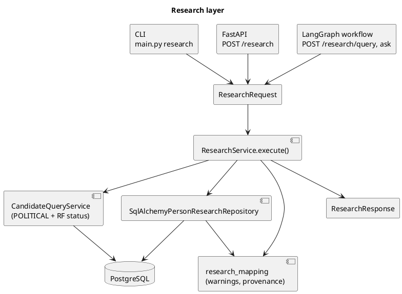

# Research

Детерминированный research layer: структурированный запрос `ResearchRequest` → `ResearchService` → `ResearchResponse` с результатами по канонической `Person`. Статьи — только evidence/provenance. Решение и мотивация — [ADR 0008](../adr/0008-research-domain-and-research-service.md). Отчёт с цитатами, review policy и source routing поверх `ResearchResponse` — [Research-Reports](Research-Reports.md) (ADR 0010); `ResearchService` и `POST /research` от них не зависят.



## Модули

| Модуль | Роль |
|---|---|
| `research_models.py` | `ResearchObjectType`, `ResearchRequest`, `PersonResearchCriteria`, `PersonResearchResult`, `ResearchEvent`, `ResearchEvidence`, `ResearchSource`, `ResearchRosfinmonitoring`, `ResearchWarning`, `ResearchResponse` |
| `research_service.py` | `ResearchService`, порты `PersonResearchRepository` и `CandidateQuery`, `PersonResearchDetails`, `ResearchSnapshotNotFoundError` |
| `research_repository.py` | PostgreSQL-реализация порта: отбор person id, последняя классификация, RF-статус, events/evidence/sources |
| `research_mapping.py` | Чистый маппинг ORM → модели результата, `build_warnings` |
| `research_cli.py` | argparse → `ResearchRequest`, текстовый вывод |

## Критерии (`PersonResearchCriteria`)

Все критерии объединяются через AND. Неизвестные поля → ошибка валидации.

| Критерий | Семантика |
|---|---|
| `person_id` | точный id |
| `name` | подстрока без учёта регистра (`ILIKE`, спецсимволы экранируются) в `canonical_name`, `normalized_name`, `person_aliases.surface_text/normalized_text` |
| `persecution_status` | статус **последней** классификации (`classified_at` desc, затем `id` desc; общий `persecution_queries.latest_persecution_classification_ids()` с `CandidateQueryService` и `GET /persons/{id}/persecution`) |
| `persecution_min_confidence` | порог confidence; требует `persecution_status`. Для `political` без явного порога — `DEFAULT_MIN_PERSECUTION_CONFIDENCE = 0.7` (как в `list-candidates`) |
| `rosfinmonitoring_status` | статус относительно `snapshot_id`; требует `snapshot_id` |
| `snapshot_id` | snapshot для фильтра и для секции `rosfinmonitoring` результата; несуществующий → 404 / ошибка CLI |
| `event_types` | есть хотя бы одно связанное с человеком событие этих типов (непустой список) |
| `date_from`, `date_to` | включительные календарные дни UTC по `extracted_events.event_date`; событие без даты не проходит. Вместе с `event_types` одно и то же событие должно удовлетворять обоим |
| `source` | `sources.name` (например `ОВД-Инфо`); у человека есть mention или связанное событие из статьи этого источника. CLI принимает ключ реестра (`ovd-info`, `sota-vision`) |
| `limit` (в `ResearchRequest`) | 1..1000, по умолчанию 20; `total_matched` — число совпадений до limit |

Пустые критерии допустимы: все `active` persons по возрастанию id с учётом `limit`.

Критерии фильтруют людей, но **не обрезают** их данные: в результате все события и evidence человека.

## Переиспользование бизнес-логики

- `political` + любой `rosfinmonitoring_status` → `CandidateQueryService.get_candidates(include_rf_statuses={status}, limit=None)`, затем пересечение с остальными критериями.
- Последняя классификация человека определяется одной функцией `latest_persecution_classification_ids()` — старая `political` запись, перекрытая новой версией классификатора, не учитывается ни в research, ни в `list-candidates`, ни в `GET /persons/{id}/persecution`.
- Маппинг `rosfin_matches.status` → `RosfinmonitoringStatus` — `candidate_query_models.resolve_rosfinmonitoring_status`, общий для candidate query и research.
- `NOT_MATCHED` — единственное подтверждённое отсутствие. `NO_MATCH_RECORD`, `AMBIGUOUS`, `NEEDS_REVIEW`, `INSUFFICIENT_DATA` никогда не считаются «нет в Росфинмониторинге».

## Результат (`PersonResearchResult`)

- `person`, `aliases` — существующие `Person` / `PersonAlias`.
- `persecution` — существующая `PersecutionClassification` (последняя) или `null`.
- `rosfinmonitoring` — `snapshot_id`, `status`, `confidence`, `matched_entry_id/name`, `candidate_entries`, `reasons`, `matched_at`; `null`, если snapshot не указан.
- `events` — только события через `person_event_links` этого человека: `event_type`, `event_date`, `roles` (все роли человека в событии), `confidence`, `attributes`, `article_id`.
- `evidence` — `person_mention` (разрешённые на человека mentions) и `event` (spans его событий): `article_id`, `extraction_run_id`, `start_offset`, `end_offset`, `text` (только span).
- `sources` — по одной записи на статью с evidence: `article_title`, `source_name`, `url`, `published_at`.
- `warnings` + вычисляемый `review_required`.

| Условие | warning code | requires_review |
|---|---|---|
| нет классификации | `persecution_not_classified` | нет |
| `uncertain` | `persecution_uncertain` | да |
| `needs_review` (классификация) | `persecution_needs_review` | да |
| `ambiguous` | `rosfin_ambiguous` | да |
| `needs_review` (RF) | `rosfin_needs_review` | да |
| `insufficient_data` | `rosfin_insufficient_data` | да |
| `no_match_record` | `rosfin_no_match_record` | нет (нужно запустить matcher) |

## CLI

```bash
uv run python src/main.py research \
    --object person \
    --persecution-status political \
    --rosfin-status not_matched \
    --snapshot-id 3

# JSON (ResearchResponse целиком)
uv run python src/main.py research --persecution-status political --snapshot-id 3 --json

# события и источник
uv run python src/main.py research --event-type arrest --event-type sentence \
    --date-from 2024-01-01 --date-to 2024-12-31 --source ovd-info --limit 50
```

## API

```bash
curl -X POST http://localhost:8000/research \
  -H 'Content-Type: application/json' \
  -d '{"object_type": "person",
       "criteria": {"persecution_status": "political",
                    "rosfinmonitoring_status": "not_matched",
                    "snapshot_id": 3},
       "limit": 20}'
```

422 — невалидный запрос, 404 — snapshot не найден, 503 — нет `DATABASE_URL`.

## Известные ограничения data model

- **Region/city, court, organization** не связаны с Person (mentions есть, связи нет) — фильтров нет.
- **Case** как сущность отсутствует — research object `CASE` не реализован.
- Классификация хранит `reasons`/`evidence_types`, но не spans — evidence за причинами классификации вернуть нельзя.
- `ResearchService` не создаёт `review_records`. Persistent review task для результата создаётся только явно через `POST /research/reviews` ([Research-Reports](Research-Reports.md#human-review)).
- Поиск по имени не нормализует ё/е и падежи сверх того, что уже есть в алиасах.
- Только `active` persons (как в candidate query); `merged`/`needs_review` persons не ищутся.
- Даты событий трактуются в UTC.
- **Нет согласованного чтения (TODO).** `find_person_ids()`, `get_person_details()`, `get_latest_classifications()`, `get_rosfinmonitoring()` и вызов `CandidateQueryService` могут использовать разные сессии БД, поэтому данные теоретически могут измениться между чтениями одного `execute()` (переклассификация, повторный matching). Человек, удалённый между отбором и загрузкой деталей, пропускается (но учтён в `total_matched`). Future improvement: single read transaction / consistent snapshot (одна сессия `REPEATABLE READ` на весь запрос) — требует переделки области жизни сессий в repository и `CandidateQueryService`, поэтому пока не реализовано.
- Поиск по имени (`ILIKE`) по кириллице зависит от ctype/collation конкретной БД.
