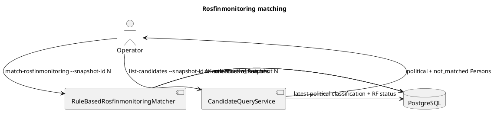

# Rosfinmonitoring

## Сверка людей (шаг 4 консоли)

Перечень террористов и экстремистов **никого не отсеивает**: то, что человек в
перечне, не значит, что его дело известно. Перечень подтверждает личность — у
каждой записи дата и место рождения. Люди из перечня проходят шаги 5 и 6 и
попадают в «Результат» наравне с остальными; в «Результате» и досье рядом с
именем — запись перечня.

«Сверить с Росфинмониторингом» (`check-entities-rosfin`, `src/entities/rf_check.py`):

1. Скачивает перечень с fedsfm.ru; если он изменился — сохраняет новый снимок. Если
   скачать не удалось, сверяет с последним сохранённым.
2. Сравнивает каждого человека с последним снимком по имени (ё = е, «ье» = «ие»):
   - `full` — имя, отчество и фамилия совпали: «в перечне РФМ»;
   - `name` — совпали имя и фамилия, отчества нет с одной стороны: «возможно в
     перечне», может быть тёзка;
   - разные отчества — разные люди.
3. Сливает спорные пары, где один человек однозначен (одна сторона в перечне или
   один регион), — решения с `source = rf` / `region`.

| Где видно | Что |
|---|---|
| «Результат» | метка «в перечне РФМ», столбец «Перечень РФМ» (ФИО, дата рождения, место); галочка скрывает только возможных тёзок |
| «Люди» | метки; галочки «Скрыть тех, кто в перечне», «Скрыть возможных» (по умолчанию выключены) |
| Досье | блок «Росфинмониторинг» в «Решении системы», дата последнего снимка |
| Безымянные | кандидаты из перечня по возрасту, полу, букве фамилии и месту рождения — [Unnamed Figurants](Unnamed-Figurants.md) |

Даты рождения в новостях нет: тёзку отличает только отчество. Даты включения в
перечень на сайте нет.

Ниже — описание старого пути (Person и кандидаты), где статус `not_matched`
был условием попадания в список кандидатов.

## Зачем это нужно

Rosfinmonitoring stage отвечает на вопрос: есть ли активная Person в выбранном
snapshot списка террористов и экстремистов. Для продукта важен статус
`not_matched`: политически преследуемый человек с подтверждённым отсутствием в
snapshot попадает в candidates.

## Быстрый сценарий

```bash
# посмотреть snapshots через API
curl http://127.0.0.1:8001/rosfinmonitoring/snapshots

# сматчить persons к конкретному snapshot
uv run python src/main.py match-rosfinmonitoring --snapshot-id 1 --limit 20000

# получить candidates после classification + RF match
uv run python src/main.py list-candidates --snapshot-id 1 --min-confidence 0.7
```

`snapshot-id 1` заменить на реальный id. Если snapshot отсутствует, RF stage и
candidate list пропускаются.

## Что происходит внутри



Match statuses:

- `matched` — уверенное совпадение с entry;
- `not_matched` — кандидатов в snapshot не найдено; это подтверждённое
  отсутствие для product query;
- `ambiguous` / `needs_review` — есть похожие entries, автоматического вывода нет;
- `insufficient_data` — имя Person слишком бедное для надежного поиска;
- no match record — matching для этой Person/snapshot не запускался.

## Пример

```json
{
  "person_id": 42,
  "snapshot_id": 7,
  "status": "not_matched",
  "confidence": 0.8,
  "matched_entry_id": null,
  "reasons": ["no plausible entries found"]
}
```

Смысл: Person была проверена против snapshot 7, совпадений не найдено. Если у
нее latest persecution classification = `political`, она может попасть в
`/ui/candidates`.

## Кодовые точки входа

| Сценарий | Код |
|---|---|
| parsing/import | `src/rosfinmonitoring/` |
| matching | `src/rosfinmonitoring/matcher.py` |
| snapshot lookup | `src/rosfinmonitoring/snapshot_lookup.py` |
| CLI | `src/rosfinmonitoring/cli.py` |
| candidate query | `src/candidates/service.py` |
| API | `src/web/routers/rosfinmonitoring.py` |

## Данные и артефакты

- `rosfinmonitoring_snapshots` — immutable snapshot metadata and raw content hash.
- `rosfinmonitoring_entries` — entries inside snapshot.
- `rosfin_matches` — result per Person + snapshot.
- `candidates` are not stored as a table; `CandidateQueryService` reads latest
  classification and `rosfin_matches`.

## Команды и API

```bash
uv run python src/main.py match-rosfinmonitoring --snapshot-id 1 --person-id 42
uv run python src/main.py match-rosfinmonitoring --snapshot-id 1 --limit 1000
uv run python src/main.py list-candidates --snapshot-id 1 --min-confidence 0.7
```

```bash
curl http://127.0.0.1:8001/rosfinmonitoring/snapshots
curl http://127.0.0.1:8001/rosfinmonitoring/snapshots/1
curl "http://127.0.0.1:8001/rosfinmonitoring/snapshots/1/entries?limit=100"
curl "http://127.0.0.1:8001/candidates?snapshot_id=1&min_confidence=0.7"
```

## Проверка

```bash
uv run pytest tests/rosfinmonitoring tests/candidates
```

Проверка на живой базе:

```sql
select status, count(*)
from rosfin_matches
where snapshot_id = 1
group by status
order by status;
```

## Ограничения и типичные ошибки

- `not_matched` означает “matching был выполнен и не нашёл кандидатов”, а не
  “в таблице нет записи”.
- `NO_MATCH_RECORD`/missing row не включается в candidates по умолчанию.
- `ambiguous`, `needs_review`, `insufficient_data` не считаются подтверждённым
  отсутствием.
- Match надо повторять для нового snapshot.
- Candidate page показывает выбранный snapshot; другой snapshot может дать
  другой результат.
