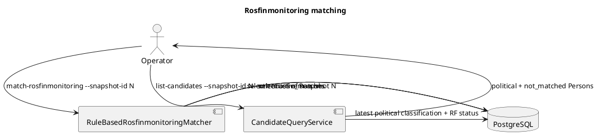

# Rosfinmonitoring

## Сверка людей (финальная часть шага 5 консоли)

Перечень террористов и экстремистов **никого не отсеивает**: то, что человек в
перечне, не значит, что его дело известно. Совпадение с перечнем подтверждает, что
описание человека совпало с записью списка — у каждой записи есть дата и место
рождения. Люди из перечня проходят шаги 4 и 5 и попадают в «Результат» наравне с
остальными; в «Результате» и досье рядом с именем — запись перечня.

Дата включения в перечень теперь известна (см. «Дата включения в перечень» ниже) и
показывается в «Результате», в Excel, в досье и на странице «Перечень». Она
описывает **запись** перечня; подтверждением личности она не является.

Сверка идёт в начале шага 5 «Отобрать политические дела и сверить с РФМ»
(`find-political`); отдельно, без оценки политичности, — CLI `check-entities-rosfin`.
Код — `src/entities/rf_check.py`. Если сверка упала, шаг всё равно оценивает
политичность, а карточка запуска говорит, почему перечень не сверен.

1. Скачивает перечень с fedsfm.ru; если он изменился — сохраняет новый снимок и
   проставляет даты включения из копии ОВД-Инфо. Если скачать не удалось, сверяет с
   последним сохранённым.
2. Сравнивает каждого человека с последним снимком по имени (ё = е, «ье» = «ие»):
   - `full` — имя, отчество и фамилия совпали: «в перечне РФМ»;
   - `name` — совпали имя и фамилия, отчества нет с одной стороны: «возможно в
     перечне», может быть тёзка;
   - разные отчества — разные люди.
3. Сливает спорные пары, где один человек однозначен (одна сторона в перечне или
   один регион), — решения с `source = rf` / `region`.

Сверяет он только с перечнем, опубликованным на fedsfm.ru, и скачивает его сам.
Обновить перечень и повторить сверку можно кнопкой «Обновить перечень и сверить с
РФМ» на странице «[Справочники](Airtable-Sync.md)»: она запускает ту же операцию
`check-entities-rosfin`, что и шаг 5, и открывает карточку запуска. Скачивание идёт в
фоне, поэтому страница возвращает сразу, а не ждёт сеть. Новый снимок создаётся
только если перечень изменился — список опознаётся по содержимому, и повторное
нажатие ничего не создаёт. Тот же путь доступен из командной строки:
`check-entities-rosfin`.

Ручной загрузки файла больше нет: список публикует fedsfm.ru, и второй способ
достать его — это второй источник правды о том, что считать перечнем.

| Где видно | Что |
|---|---|
| «Перечень» | сам список по снимку, фильтр «включены с … по …», файл с тем же фильтром |
| «Результат» | метка «в перечне РФМ», столбец «Перечень РФМ» (ФИО, дата рождения, место) и «запись перечня включена …»; галочка скрывает только возможных тёзок |
| «Люди» | метки; галочки «Скрыть тех, кто в перечне», «Скрыть возможных» (по умолчанию выключены) |
| Досье | блок «Росфинмониторинг» в «Решении системы», дата последнего снимка, «запись перечня включена …» |
| Безымянные | кандидаты из перечня по возрасту, полу, букве фамилии и месту рождения — [Unnamed Figurants](Unnamed-Figurants.md) |

Даты рождения в новостях нет: тёзку отличает только отчество. Дата включения — на
странице есть, но она **свойство записи перечня, а не человека**: см. следующий
раздел.

## Дата включения в перечень

fedsfm.ru публикует, кто в перечне, и не публикует, с какого дня: колонка
`inclusion_date` была пуста у всех записей. Даты берутся у [ОВД-Инфо][ovd], которые
пересобирают тот же список ежедневно и ведут историю по каждому человеку.

- **Источник.** Страница `repression.net/rosfinmonitoring` называет файл, из которого
  собрана (`rfm.<хэш>.parquet`, 1.5 МБ). Хэш в имени меняется при каждой сборке,
  поэтому адрес не зашит: он читается со страницы. `robots.txt` запретов не содержит,
  данные — CC BY 3.0, поэтому атрибуция едет вместе с датой на сайт и в оба файла.
- **Отказ при смене схемы.** Файл — артефакт чужой сборки, а не документированный API.
  Нужные колонки (`name`, `birth_date`, `added_date`) проверяются, и файл без них
  читается как ошибка, а не как «почти то же самое».
- **Сопоставление** строго по ФИО **и** дате рождения. Одного имени мало: это тёзка, и
  день из чужой записи встал бы на нашу запись безо всякого следа.
- **Переставленные день и месяц** (126 записей на снимке от 30.09.2026) даты не
  получают. Похоже на одного человека, записанного дважды, а может быть и два
  человека; ни список, ни мы это не решаем. Считаются отдельной строкой.
- **Уже записанная дата не переносится.** Файл пересобирают, и дата, которая была
  известна вчера, не должна меняться от запуска к запуску.

Код: `src/rosfinmonitoring/inclusion_dates.py` (чтение), `inclusion_store.py` (запись),
`membership.py` (что можно сказать о человеке). Даты пишутся при импорте снимка, в
`src/entities/rf_check.py`. Если файл недоступен, снимок и сверка не страдают: теряются
только даты, и карточка запуска говорит об этом.

### Правило, которое всё это держит

Дата включения описывает **запись перечня**, а не человека из новости. Совпадение имени
(и даже даты рождения) не делает человека подтверждённым: в новостях даты рождения нет,
и сверка установила только совпадение имён. Правило закреплено тестом
`tests/rosfinmonitoring/test_inclusion_date_confirms_nobody.py` — он выполняется, а не
пропускается.

Поэтому формулировка всюду «запись перечня включена 12.03.2024», а не «в перечне с
12.03.2024»; на тёзке (`name`, а не `full`) дата не показывается вовсе — там она
принадлежит другому человеку. `since` в `membership.py` — всегда наш собственный день,
когда мы впервые увидели запись, а не день из чужого файла.

### Страница «Перечень»

`/ui/rfm` — сам список по последнему снимку, строки по одной на запись, свежие сверху,
фильтр «включены с … по …» (кнопки 7/30/90 дней и год, либо две даты; обе границы
включаются). Оператор работает с файлами, а не с сайтом, поэтому `/ui/rfm/export.csv`
отдаёт те же строки под тем же фильтром и называется по периоду.

Количественно на снимке от 30.09.2026: записей 23 023, дата есть у 22 632 (98.3%).

[ovd]: https://repression.net/rosfinmonitoring

Ниже — описание старого пути (Person и кандидаты), где статус `not_matched`
был условием попадания в список кандидатов.

## Зачем это нужно

Rosfinmonitoring stage отвечает на вопрос: есть ли активная Person в выбранном
snapshot списка террористов и экстремистов. Для продукта важен статус
`not_matched`: политически преследуемый человек с подтверждённым отсутствием в
snapshot попадает в candidates.

## Быстрый сценарий

```bash
# посмотреть snapshots через API
curl http://127.0.0.1:8001/rosfinmonitoring/snapshots

# сматчить persons к конкретному snapshot
uv run python src/main.py match-rosfinmonitoring --snapshot-id 1 --limit 20000

# получить candidates после classification + RF match
uv run python src/main.py list-candidates --snapshot-id 1 --min-confidence 0.7
```

`snapshot-id 1` заменить на реальный id. Если snapshot отсутствует, RF stage и
candidate list пропускаются.

## Что происходит внутри


```plantuml
@startuml
title Rosfinmonitoring matching

actor Operator
database "PostgreSQL" as DB
component "RuleBasedRosfinmonitoringMatcher" as Matcher
component "CandidateQueryService" as Candidates

Operator -> Matcher : match-rosfinmonitoring --snapshot-id N
Matcher -> DB : select active Persons
Matcher -> DB : select entries of snapshot N
Matcher -> DB : write rosfin_matches
Operator -> Candidates : list-candidates --snapshot-id N
Candidates -> DB : latest political classification + RF status
Candidates --> Operator : political + not_matched Persons
@enduml
```

Match statuses:

- `matched` — уверенное совпадение с entry;
- `not_matched` — кандидатов в snapshot не найдено; это подтверждённое
  отсутствие для product query;
- `ambiguous` / `needs_review` — есть похожие entries, автоматического вывода нет;
- `insufficient_data` — имя Person слишком бедное для надежного поиска;
- no match record — matching для этой Person/snapshot не запускался.

## Пример

```json
{
  "person_id": 42,
  "snapshot_id": 7,
  "status": "not_matched",
  "confidence": 0.8,
  "matched_entry_id": null,
  "reasons": ["no plausible entries found"]
}
```

Смысл: Person была проверена против snapshot 7, совпадений не найдено. Если у
нее latest persecution classification = `political`, она может попасть в
`/ui/candidates`.

## Кодовые точки входа

| Сценарий | Код |
|---|---|
| parsing/import | `src/rosfinmonitoring/` |
| matching | `src/rosfinmonitoring/matcher.py` |
| даты включения | `src/rosfinmonitoring/inclusion_dates.py`, `inclusion_store.py` |
| что можно сказать о человеке | `src/rosfinmonitoring/membership.py` |
| страница списка и фильтр | `src/web/ui/rfm_list.py` |
| snapshot lookup | `src/rosfinmonitoring/snapshot_lookup.py` |
| CLI | `src/rosfinmonitoring/cli.py` |
| candidate query | `src/candidates/service.py` |
| API | `src/web/routers/rosfinmonitoring.py` |

## Данные и артефакты

- `rosfinmonitoring_snapshots` — immutable snapshot metadata and raw content hash.
- `rosfinmonitoring_entries` — entries inside snapshot. `inclusion_date` заполняется из
  копии ОВД-Инфо; `raw_data` хранит исходную строку публикации и прежние имена из
  скобок (`former_names`), которые пока никто не читает.
- `rosfin_matches` — result per Person + snapshot.
- `candidates` are not stored as a table; `CandidateQueryService` reads latest
  classification and `rosfin_matches`.

## Команды и API

```bash
uv run python src/main.py match-rosfinmonitoring --snapshot-id 1 --person-id 42
uv run python src/main.py match-rosfinmonitoring --snapshot-id 1 --limit 1000
uv run python src/main.py list-candidates --snapshot-id 1 --min-confidence 0.7
```

```bash
curl http://127.0.0.1:8001/rosfinmonitoring/snapshots
curl http://127.0.0.1:8001/rosfinmonitoring/snapshots/1
curl "http://127.0.0.1:8001/rosfinmonitoring/snapshots/1/entries?limit=100"
curl "http://127.0.0.1:8001/candidates?snapshot_id=1&min_confidence=0.7"
```

## Проверка

```bash
uv run pytest tests/rosfinmonitoring tests/candidates
```

Проверка на живой базе:

```sql
select status, count(*)
from rosfin_matches
where snapshot_id = 1
group by status
order by status;
```

## Ограничения и типичные ошибки

- `not_matched` означает “matching был выполнен и не нашёл кандидатов”, а не
  “в таблице нет записи”.
- `NO_MATCH_RECORD`/missing row не включается в candidates по умолчанию.
- `ambiguous`, `needs_review`, `insufficient_data` не считаются подтверждённым
  отсутствием.
- Match надо повторять для нового snapshot.
- Candidate page показывает выбранный snapshot; другой snapshot может дать
  другой результат.
- Дата включения не подтверждает личность. Совпадение имени и даты рождения означает,
  что два описания одного человека совпали, а не что в новости речь о том же человеке.
- На тёзке дата не показывается: запись нашлась без отчества и принадлежит кому-то
  другому.
- Файл ОВД-Инфо может в любой момент перестать читаться (смена схемы, смена формата).
  Тогда даты не обновляются, а снимок и сверка продолжают работать.
