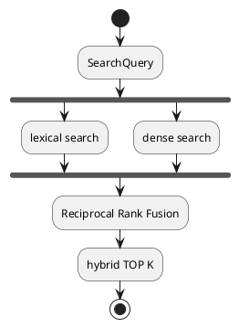
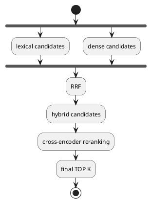

# Search

Общий контракт поиска — `SearchBackend` (`src/search_backend.py`):

```python
search(SearchQuery) -> list[SearchHit]
```

Все поисковые реализации удовлетворяют этому контракту и могут использоваться через общий CLI и `SearchEvaluator`.

Доступные backend'ы:

- `lexical`
- `dense`
- `hybrid`
- `reranked-hybrid`

Почему в проекте есть несколько backend'ов — [ADR 0001](../adr/0001-dual-search-backend.md).

## Lexical: `PostgresLexicalSearch`

`src/postgres_lexical_search.py`.

Использует generated-колонку `article_chunks.search_vector`:

```text
to_tsvector('russian', text)
```

Поиск строится через:

```text
websearch_to_tsquery('russian', query.text)
```

Матч выполняется через `search_vector @@ search_query`, ранжирование — через `ts_rank_cd(...)`. Результаты преобразуются в общий `SearchHit`.

Преимущество lexical backend — отсутствие отдельного поискового индекса вне PostgreSQL.

Ограничение — поиск зависит от лексического совпадения и может пропускать семантически близкие формулировки.

## Dense: `QdrantDenseSearch`

Основные компоненты:

```text
TextEmbedder
QdrantChunkIndexer
QdrantDenseSearch
```

`TextEmbedder` использует `sentence-transformers` и модель из:

```text
EMBEDDING_MODEL_ID
```

Для запросов используется префикс:

```text
query:
```

Для документов:

```text
passage:
```

Эмбеддинги нормализуются.

`QdrantChunkIndexer` читает chunks из PostgreSQL, вычисляет embeddings и сохраняет их в Qdrant.

`QdrantDenseSearch`:

1. вычисляет embedding запроса;
2. выполняет vector search в Qdrant;
3. возвращает результаты как `SearchHit`.

Dense score и lexical score имеют разные шкалы и напрямую не сравниваются.

## Hybrid: `HybridSearch`

`src/hybrid_search.py`.

Hybrid search объединяет lexical и dense retrieval.

Pipeline:



Для пользовательского:

```text
limit = K
```

`HybridSearch` запрашивает у каждого backend расширенный candidate pool:

```text
candidate_limit = min(K * 3, 100)
```

После этого результаты lexical и dense объединяются через Reciprocal Rank Fusion (RRF).

RRF использует позиции документов, а не их исходные scores, поэтому не требует приводить `ts_rank_cd` и cosine similarity к общей шкале.

После fusion `SearchHit.score` содержит RRF score.

## Reranked Hybrid: `RerankingSearch`

Cross-encoder reranking добавляется поверх hybrid retrieval:



Композиция backend'а:

```python
RerankingSearch(
    HybridSearch(
        lexical_backend,
        dense_backend,
    ),
    reranker,
)
```

`RerankingSearch` является обёрткой над обычным `SearchBackend`.

При пользовательском:

```text
limit = K
```

он запрашивает у base backend:

```text
min(K * candidate_multiplier, 100)
```

кандидатов.

Текущий `candidate_multiplier` по умолчанию:

```text
3
```

Таким образом при `limit=10`:

```text
RerankingSearch запрашивает 30 hybrid candidates
HybridSearch запрашивает до 90 lexical/dense candidates
RRF возвращает 30 candidates
cross-encoder возвращает финальные 10
```

## Cross-Encoder

Реализация находится в:

```text
src/cross_encoder_reranker.py
```

`CrossEncoderReranker` использует:

```python
sentence_transformers.CrossEncoder
```

ID модели задаётся переменной окружения:

```text
RERANKER_MODEL_ID
```

Текущий baseline:

```text
cross-encoder/mmarco-mMiniLMv2-L12-H384-v1
```

Для каждого candidate cross-encoder оценивает пару:

```text
(query, candidate.text)
```

После reranking `SearchHit.score` содержит уже cross-encoder score, а не исходный dense/lexical/RRF score.

При одинаковых cross-encoder scores сохраняется исходный порядок candidates.

Пустой список candidates возвращает пустой результат без вызова модели.

## Абстракция Reranker

Контракт определён в:

```text
src/reranker.py
```

```python
rerank(
    query: str,
    candidates: Sequence[SearchHit],
    *,
    limit: int,
) -> list[SearchHit]
```

`CrossEncoderReranker` — конкретная реализация этого протокола.

Модель передаётся в конструктор как зависимость. Поэтому unit-тесты используют fake model и не загружают реальные веса.

Для production существует фабричный путь:

```python
CrossEncoderReranker.from_model_id(...)
```

который загружает настоящую `sentence-transformers.CrossEncoder`.

## Синхронизация Dense-Индекса

Рабочая Qdrant-коллекция и evaluation-коллекция разделены:

```text
QDRANT_COLLECTION
QDRANT_EVALUATION_COLLECTION
```

Они не должны иметь одинаковые имена.

Обычный dense index перестраивается отдельной CLI-командой:

```bash
uv run python src/main.py rebuild-dense-index
```

Обычный поиск не пересоздаёт индекс.

`evaluate-search` использует отдельную evaluation-коллекцию и перестраивает её перед evaluation.
