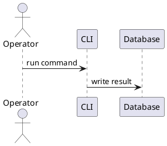

# Wiki Style Guide

Эта страница задает формат для `docs/wiki/`. Цель вики — объяснять систему двум
читателям одновременно:

- оператору: что запустить, где посмотреть результат, как понять ошибку;
- программисту: какой код отвечает за сценарий, какие данные меняются, где тесты.

Вики не заменяет ADR. ADR объясняет, почему решение принято. Вики объясняет, как
работать с уже принятой архитектурой.

## Шаблон страницы

Новая или переписанная страница должна идти сверху вниз от практики к деталям.
Не все разделы обязательны для короткой страницы, но отсутствие раздела должно
быть осознанным.

```text
# Название

## Зачем это нужно
## Быстрый сценарий
## Пример
## Что происходит внутри
## Кодовые точки входа
## Данные и артефакты
## Проверка
## Ограничения и типичные ошибки
```

Если страница описывает UI, раздел `Быстрый сценарий` должен говорить, куда
зайти и что нажать. Если страница описывает CLI, рядом должна быть команда,
которую можно выполнить после настройки окружения.

## Примеры

Команды должны быть реальными для текущего кода:

```bash
uv run python src/main.py monitoring-status
```

Данные в примерах должны быть безопасными: синтетические имена, `example.test`
URL, маленькие JSON-фрагменты. Для живых результатов, больших отчетов и спорных
метрик лучше дать ссылку на файл в `reports/`, `docs/adr/` или `var/`, чем
копировать чувствительный список в wiki.

Хороший пример показывает не только команду, но и смысл результата:

```text
status=completed processed=12 failed=0
```

Пояснение: run завершился, все 12 объектов обработаны, ручной разбор не нужен.

## Операторский слой

Операторские разделы отвечают на вопросы:

- когда запускать сценарий;
- какая команда, кнопка или endpoint нужны;
- где увидеть результат;
- что значит успешный результат;
- что делать при типичной ошибке.

Оператору не нужно читать весь код, чтобы понять, закончилось ли действие
успешно.

## Программистский слой

Программистские разделы отвечают на вопросы:

- какой модуль является точкой входа;
- какие сервисы и репозитории выполняют работу;
- какие таблицы, файлы или внешние сервисы участвуют;
- какие тесты защищают поведение;
- какие инварианты нельзя ломать.

Ссылки на код должны быть точными по пути, но без привязки к хрупким номерам
строк, если в этом нет необходимости.

## Текущий статус

Текущий статус проекта не надо дублировать по всем страницам. Для этого есть
[Implementation Status](Implementation-Status.md). Тематические страницы могут
писать локальные ограничения сценария, но не должны становиться вторым журналом
верификации всего проекта.

## Диаграммы

Диаграммы пишутся только в PlantUML:



Для retry/counter-логики использовать sequence diagram с явным `loop`, например
`loop retry_count < max_retry`.

## Что не писать

- Не пересказывать README или ADR целиком.
- Не обещать, что сценарий проверен, если это не запускалось.
- Не использовать вымышленные команды.
- Не вставлять персональные данные из живой базы.
- Не делать страницу только списком модулей без рабочего сценария.
